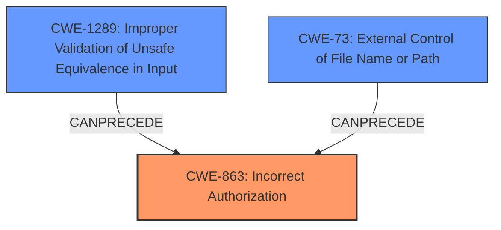

# Enhanced Analysis for CVE-2021-32779

# Summary
| CWE ID | CWE Name | Confidence | CWE Abstraction Level | CWE Vulnerability Mapping Label | CWE-Vulnerability Mapping Notes |
|---|---|---|---|---|---|
| CWE-863 | Incorrect Authorization | 0.9 | Class | Primary | Allowed-with-Review |
| CWE-1289 | Improper Validation of Unsafe Equivalence in Input | 0.7 | Base | Secondary | Allowed |
| CWE-73 | External Control of File Name or Path | 0.5 | Base | Secondary | Allowed |

## Evidence and Confidence

*   **Confidence Score:** 0.9
*   **Evidence Strength:** HIGH

## Relationship Analysis
The primary CWE is CWE-863, which represents an authorization bypass. While it is a Class-level CWE, the provided information does not allow for a more specific Base-level CWE to be selected. CWE-1289 and CWE-73 are related as they indicate the root causes that could lead to the authorization bypass. They were considered to a lesser degree because of the ambiguity in the description.



## Vulnerability Chain
The vulnerability chain starts with Envoy **incorrectly handling a URI #fragment element as part of the path element**. This **improper handling** leads to a mismatch in the configured path element during authorization checks, ultimately resulting in an **escalation of privileges**.
  - The root cause is the incorrect handling of the URI fragment.
  - The weakness is the authorization bypass.
  - The impact is the escalation of privileges.

## Summary of Analysis
The initial assessment focused on the **incorrect handling of the URI fragment**, leading to an authorization bypass. The retriever suggested several CWEs, including CWE-697 (Incorrect Comparison), CWE-863 (Incorrect Authorization), and CWE-22 (Improper Limitation of a Pathname to a Restricted Directory). The most relevant CWE is CWE-863 (Incorrect Authorization), as the core issue is the failure to properly authorize the request due to the mishandled URI fragment. The **CVE Reference Links Content Summary** confirms this by stating that the incorrect path interpretation allows attackers to bypass authorization rules.

CWE-1289 (Improper Validation of Unsafe Equivalence in Input) is considered as a secondary CWE, as the **incorrect handling** of the URI fragment can be seen as a failure to validate the input properly before using it for authorization.

CWE-73 (External Control of File Name or Path) is also a secondary consideration, as the attacker can influence the path used for authorization through the URI fragment.

The evidence clearly points to an authorization bypass, making CWE-863 the most appropriate primary CWE. The other CWEs are included as they highlight the underlying causes that lead to the bypass. The selection of CWE-863 is at the optimal level of specificity, given the available information.
The final decision is based on the evidence from the **Vulnerability Description** and the **CVE Reference Links Content Summary**, which emphasize the authorization bypass due to the **incorrect handling** of the URI fragment.

Relevant CWE Information:

# Enhanced Context (25 CWEs)

## CWE-41: Improper Resolution of Path Equivalence
**Abstraction Level**: Base
**Similarity Score**: 0.78
**Source**: dense

**Description**:
The product is vulnerable to file system contents disclosure through path equivalence. Path equivalence involves the use of special characters in file and directory names. The associated manipulations are intended to generate multiple names for the same object.

**Mapping Guidance**:
- Usage: Allowed
- Rationale: This CWE entry is at the Base level of abstraction, which is a preferred level of abstraction for mapping to the root causes of vulnerabilities.

Analysis: While path equivalence issues might be present, the core of this vulnerability is the authorization bypass. Therefore, this CWE is not as relevant.

## CWE-178: Improper Handling of Case Sensitivity
**Abstraction Level**: Base
**Similarity Score**: 0.78
**Source**: dense

**Description**:
The product does not properly account for differences in case sensitivity when accessing or determining the properties of a resource, leading to inconsistent results.

**Mapping Guidance**:
- Usage: Allowed
- Rationale: This CWE entry is at the Base level of abstraction, which is a preferred level of abstraction for mapping to the root causes of vulnerabilities.

Analysis: Case sensitivity is not explicitly mentioned as the root cause, so this CWE is not as relevant.

## CWE-23: Relative Path Traversal
**Abstraction Level**: Base
**Similarity Score**: 0.77
**Source**: dense

**Description**:
The product uses external input to construct a pathname that should be within a restricted directory, but it does not properly neutralize sequences such as ".." that can resolve to a location that is outside of that directory.

**Mapping Guidance**:
- Usage: Allowed
- Rationale: This CWE entry is at the Base level of abstraction, which is a preferred level of abstraction for mapping to the root causes of vulnerabilities.

Analysis: Path traversal is not the primary issue, as the vulnerability is related to authorization. Therefore, this CWE is not as relevant.

## CWE-59: Improper Link Resolution Before File Access ('Link Following')
**Abstraction Level**: Base
**Similarity Score**: 0.76
**Source**: dense

**Description**:
The product attempts to access a file based on the filename, but it does not properly prevent that filename from identifying a link or shortcut that resolves to an unintended resource.

**Mapping Guidance**:
- Usage: Allowed
- Rationale: This CWE entry is at the Base level of abstraction, which is a preferred level of abstraction for mapping to the root causes of vulnerabilities.

Analysis: This CWE does not apply since the issue is not related to link resolution.

## CWE-1289: Improper Validation of Unsafe Equivalence in Input
**Abstraction Level**: Base
**Similarity Score**: 0.76
**Source**: dense

**Description**:
The product receives an input value that is used as a resource identifier or other type of reference, but it does not validate or incorrectly validates that the input is equivalent to a potentially-unsafe value.

**Mapping Guidance**:
- Usage: Allowed
- Rationale: This CWE entry is at the Base level of abstraction, which is a preferred level of abstraction for mapping to the root causes of vulnerabilities.

Analysis: This CWE could be considered as a secondary CWE, as the **incorrect handling** of the URI fragment can be seen as a failure to validate the input properly before using it for authorization.

## CWE-427: Uncontrolled Search Path Element
**Abstraction Level**: Base
**Similarity Score**: 0.76
**Source**: dense

**Description**:
The product uses a fixed or controlled search path to find resources, but one or more locations in that path can be under the control of unintended actors.

**Mapping Guidance**:
- Usage: Allowed
- Rationale: This CWE entry is at the Base level of abstraction, which is a preferred level of abstraction for mapping to the root causes of vulnerabilities.

Analysis: This CWE does not apply since the issue is not related to search paths.

## CWE-668: Exposure of Resource to Wrong Sphere
**Abstraction Level**: Class
**Similarity Score**: 0.76
**Source**: dense

**Description**:
The product exposes a resource to the wrong control sphere, providing unintended actors with inappropriate access to the resource.

**Mapping Guidance**:
- Usage: Discouraged
- Rationale: CWE-668 is high-level and is often misused as a catch-all when lower-level CWE IDs might be applicable. It is sometimes used for low-information vulnerability reports [REF-1287]. It is a level-1 Class (i.e., a child of a Pillar). It is not useful for trend analysis.

Analysis: This CWE is too high-level and not specific enough for this vulnerability.

## CWE-73: External Control of File Name or Path
**Abstraction Level**: Base
**Similarity Score**: 0.76
**Source**: dense

**Description**:
The product allows user input to control or influence paths or file names that are used in filesystem operations.

**Mapping Guidance**:
- Usage: Allowed
- Rationale: This CWE entry is at the Base level of abstraction, which is a preferred level of abstraction for mapping to the root causes of vulnerabilities.

Analysis: This CWE is relevant because the attacker influences the path used for authorization through the URI fragment.

## CWE-184: Incomplete List of Disallowed Inputs
**Abstraction Level**: Base
**Similarity Score**: 0.75
**Source**: dense

**Description**:
The product implements a protection


## CWE Relationship Analysis

Current CWEs represent these abstraction levels: .


### Vulnerability Chain Analysis

**Chain starting from CWE-73:**
- 73 (External Control of File Name or Path) - ROOT


**Chain starting from CWE-41:**
- 41 (Improper Resolution of Path Equivalence) - ROOT


### CWE Relationship Diagram

```mermaid
graph TD
    classDef primary fill:#f96,stroke:#333,stroke-width:2px
    classDef secondary fill:#69f,stroke:#333
    classDef tertiary fill:#9e9,stroke:#333
```