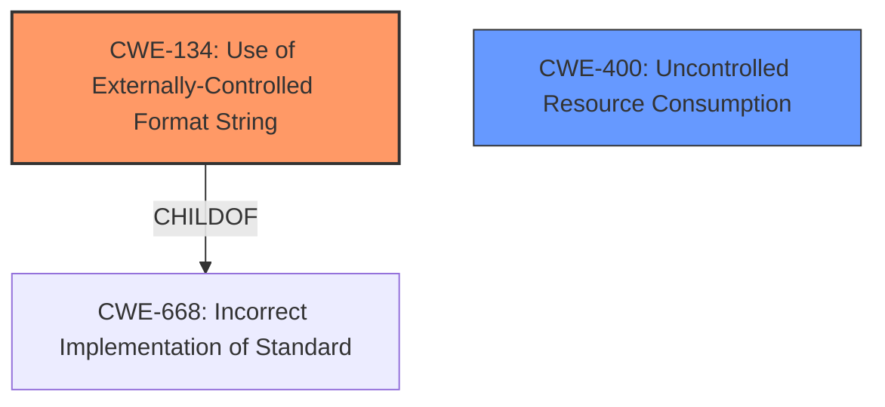

# Enhanced Analysis for CVE-2021-32785

# Summary
| CWE ID  | CWE Name                                                                 | Confidence | CWE Abstraction Level | CWE Vulnerability Mapping Label | CWE-Vulnerability Mapping Notes |
| :-------- | :----------------------------------------------------------------------- | :--------- | :---------------------- | :------------------------------ | :------------------------------ |
| CWE-134   | Use of Externally-Controlled Format String                            | 1          | Base                    | Primary                         | Allowed                       |
| CWE-400   | Uncontrolled Resource Consumption                                      | 0.7        | Class                   | Secondary                       | Allowed-with-Review           |

## Evidence and Confidence

*   **Confidence Score:** 0.85
*   **Evidence Strength:** HIGH

## Relationship Analysis
The primary relationship that influenced my decision was the parent-child relationship between CWE-668 (Incorrect Implementation of Standard) and CWE-134 (Use of Externally-Controlled Format String). This relationship emphasizes that the root cause is the **improper** handling of a format string, which is a specific type of incorrect implementation. While CWE-400 is related to the impact of the vulnerability (denial of service), it is a broader category and not the primary root cause.



## Vulnerability Chain
The vulnerability chain starts with the **improper** use of an externally-controlled format string (CWE-134). This leads to a denial of service (CWE-400) because an attacker can inject format specifiers that cause the application to crash.

## Summary of Analysis
The initial assessment, confirmed by the CVE description, clearly identifies an **uncontrolled format string bug** as the root cause.

The vulnerability description explicitly states: "When mod_auth_openidc versions prior to 2.4.9 are configured to use an unencrypted Redis cache, `mod_auth_openidc` wrongly performed argument interpolation before passing Redis requests to `hiredis`, which would perform it again and lead to an **uncontrolled format string bug**."

The **Vulnerability Description Key Phrases** also indicate:
*   **rootcause:** **uncontrolled format string bug**
*   **impact:** denial of service

The "CVE Reference Links Content Summary" also mentions a **Format String Vulnerability** as the primary weakness. The content also says "The vulnerability stems from an uncontrolled format string bug in the `mod_auth_openidc` module when configured to use an unencrypted Redis cache. The module was incorrectly performing argument interpolation on the cache key before passing it to Redis, which led to a crash when a crafted key was used."

Based on the vulnerability description, the primary weakness is the **improper** use of an externally-controlled format string (CWE-134). The format string originates from the redis cache key. This allows an attacker to inject format specifiers that are then processed by the `printf` family of functions, leading to a crash.

CWE-134 is at the optimal level of specificity because it directly addresses the root cause of the vulnerability, which is the **improper** handling of a format string. While CWE-400 (Uncontrolled Resource Consumption) is a valid secondary classification because the format string bug leads to a denial of service, it is a broader category and not the primary cause.

Relevant CWE Information:

# Enhanced Context (25 CWEs)
The following CWEs were identified as potentially relevant to this vulnerability:

## CWE-1289: Improper Validation of Unsafe Equivalence in Input
**Abstraction Level**: Base
**Similarity Score**: 0.76

## CWE-502: Deserialization of Untrusted Data
**Abstraction Level**: Base
**Similarity Score**: 0.75

## CWE-345: Insufficient Verification of Data Authenticity
**Abstraction Level**: Class
**Similarity Score**: 0.75

## CWE-74: Improper Neutralization of Special Elements in Output Used by a Downstream Component ('Injection')
**Abstraction Level**: Class
**Similarity Score**: 0.75

## CWE-407: Inefficient Algorithmic Complexity
**Abstraction Level**: Class
**Similarity Score**: 0.75

## CWE-138: Improper Neutralization of Special Elements
**Abstraction Level**: Class
**Similarity Score**: 0.75

## CWE-134: Use of Externally-Controlled Format String
**Abstraction Level**: Base
**Similarity Score**: 0.75

## CWE-41: Improper Resolution of Path Equivalence
**Abstraction Level**: Base
**Similarity Score**: 0.74

## CWE-252: Unchecked Return Value
**Abstraction Level**: Base
**Similarity Score**: 0.74

## CWE-667: Improper Locking
**Abstraction Level**: Class
**Similarity Score**: 0.74

## CWE-190: Integer Overflow or Wraparound
**Abstraction Level**: Base
**Similarity Score**: 6820.77

## CWE-1333: Inefficient Regular Expression Complexity
**Abstraction Level**: Base
**Similarity Score**: 6493.77

## CWE-125: Out-of-bounds Read
**Abstraction Level**: Base
**Similarity Score**: 6486.99

## CWE-1390: Weak Authentication
**Abstraction Level**: Class
**Similarity Score**: 6461.06

## CWE-502: Deserialization of Untrusted Data
**Abstraction Level**: Base
**Similarity Score**: 6425.12

## CWE-123: Write-what-where Condition
**Abstraction Level**: base
**Similarity Score**: 4.33

## CWE-190: Integer Overflow or Wraparound
**Abstraction Level**: base
**Similarity Score**: 4.33

## CWE-1284: Improper Validation of Specified Quantity in Input
**Abstraction Level**: base
**Similarity Score**: 4.33

## CWE-681: Incorrect Conversion between Numeric Types
**Abstraction Level**: base
**Similarity Score**: 4.33

## CWE-613: Insufficient Session Expiration
**Abstraction Level**: base
**Similarity Score**: 4.33

## CWE-178: Improper Handling of Case Sensitivity
**Abstraction Level**: base
**Similarity Score**: 3.64

## CWE-611: Improper Restriction of XML External Entity Reference
**Abstraction Level**: base
**Similarity Score**: 3.64

## CWE-915: Improperly Controlled Modification of Dynamically-Determined Object Attributes
**Abstraction Level**: base
**Similarity Score**: 3.64

## CWE-128: Wrap-around Error
**Abstraction Level**: base
**Similarity Score**: 3.57

## CWE-1339: Insufficient Precision or Accuracy of a Real Number
**Abstraction Level**: base
**Similarity Score**: 3.57

# Summary
| CWE ID  | CWE Name                                                                 | Confidence | CWE Abstraction Level | CWE Vulnerability Mapping Label | CWE-Vulnerability Mapping Notes |
| :-------- | :----------------------------------------------------------------------- | :--------- | :---------------------- | :------------------------------ | :------------------------------ |
| CWE-134   | Use of Externally-Controlled Format String                            | 1          | Base                    | Primary                         | Allowed                       |
| CWE-400   | Uncontrolled Resource Consumption                                      | 0.7        | Class                   | Secondary                       | Allowed-with-Review           |


## CWE Relationship Analysis

Current CWEs represent these abstraction levels: .


### Vulnerability Chain Analysis

**Chain starting from CWE-502:**
- 502 (Deserialization of Untrusted Data) - ROOT


**Chain starting from CWE-123:**
- 123 (Write-what-where Condition) - ROOT


### CWE Relationship Diagram

```mermaid
graph TD
    classDef primary fill:#f96,stroke:#333,stroke-width:2px
    classDef secondary fill:#69f,stroke:#333
    classDef tertiary fill:#9e9,stroke:#333
```