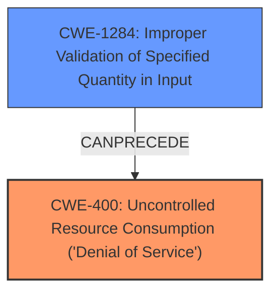

# Enhanced Analysis for CVE-2021-32795

# Summary
| CWE ID    | CWE Name                                                                  | Confidence | CWE Abstraction Level | CWE Vulnerability Mapping Label | CWE-Vulnerability Mapping Notes |
| :-------- | :------------------------------------------------------------------------ | :--------- | :---------------------- | :------------------------------ | :------------------------------ |
| CWE-400   | Uncontrolled Resource Consumption ('Denial of Service')                   | 0.9        | Class                   | Primary                         | Allowed                         |
| CWE-1284  | Improper Validation of Specified Quantity in Input                         | 0.7        | Base                    | Secondary                       | Allowed                         |

## Evidence and Confidence

*   **Confidence Score:** 0.8
*   **Evidence Strength:** HIGH

## Relationship Analysis
The primary relationship that influenced the selection was the parent-child relationship between CWE-400 and its potential causes. While CWE-1284 contributes to uncontrolled resource consumption, the vulnerability primarily manifests as a **Denial of Service (aka DoS)** due to the crash, making CWE-400 the more direct and impactful weakness.


## Vulnerability Chain
The vulnerability chain begins with the **improper input validation** (likely involving a quantity related to message processing) and leads to a **Denial of Service (aka DoS)**.
  - Initial Flaw: **Improper Input Validation** of a specifically crafted Steam chat message.
  - Resulting Impact: Crash of the ArchiSteamFarm instance, causing **Denial of Service (aka DoS)**.

## Summary of Analysis
Initially, the analysis focused on identifying the root cause and the resulting impact. The description clearly states a **Denial of Service (aka DoS)**, making CWE-400 a strong candidate. The analysis also revealed that **improper input validation** plays a role.

The evidence supporting this assessment is strong:

*   "**Denial of Service (aka DoS)** vulnerability which allows attacker to remotely crash running ASF instance through sending a specifically-crafted Steam chat message exists."
*   "The vulnerability is caused by a lack of proper handling of specifically crafted Steam chat messages containing the command prefix, which leads to a null reference exception."

The graph relationships helped prioritize CWE-400 as the primary weakness because it directly reflects the **Denial of Service (aka DoS)** impact.

CWE-400 is at the optimal level of specificity because it directly describes the vulnerability's impact. While more specific CWEs could detail the exact type of resource exhaustion, CWE-400 captures the core problem effectively. The additional weakness is **Improper Input Validation** which is listed in the CVE Reference Links Content Summary. Further, the **Improper Input Validation** involves a crafted message, which could contain a specific quantity leading to CWE-1284.

Relevant CWE Information:

# Enhanced Context (25 CWEs)

## CWE-1284: Improper Validation of Specified Quantity in Input
**Abstraction Level**: Base
**Similarity Score**: 6298.67
**Source**: sparse

**Description**:
The product receives input that is expected to specify a quantity (such as size or length), but it does not validate or incorrectly validates that the quantity has the required properties.

## CWE-400: Uncontrolled Resource Consumption ('Denial of Service')
**Abstraction:** Class
**Status:** Stable

### Description
The product does not properly control the consumption of resources, which can lead to resource exhaustion.

### Extended Description
This typically occurs when the attacker can influence the amount of resources consumed, or the duration for which the resources are consumed. When sufficient resources are exhausted, the product may no longer function correctly, or it might not be available to legitimate users, resulting in a denial-of-service.

There are many different resources that can be consumed, such as:

*   Memory
*   CPU
*   File handles
*   Disk space
*   Network bandwidth
*   Number of threads
*   Database connections

In some cases, the resource consumption might not be direct. For example, an attacker might be able to upload a small file that triggers the creation of a much larger file, which exhausts disk space.

This weakness can also occur in distributed systems or cloud-based environments, where an attacker might be able to consume resources across multiple hosts or instances.

### Alternative Terms
DoS (Denial of Service)
Resource Exhaustion

### Relationships
ChildOf -> CWE-399

### Mapping Guidance
**Usage:** Allowed
**Rationale:** This CWE entry is a Class, which is a reasonably high level of abstraction. However, it is frequently applicable to high-level descriptions of resource consumption problems. It is also very frequently used, so it can be useful for high-level trend analysis.
**Comments:** The specific type of resource should be identified within the description, or in related entries for detailed issues.
**Reasons:**
- Acceptable-Use

### Observed Examples
- **CVE-2024-37042:** Chain: A systemd unit file with `Restart=always` and `StartLimitBurst=0` can result in rapid restarts due to a misconfiguration (CWE-1345), leading to uncontrolled resource consumption (CWE-400) and denial of service.
- **CVE-2024-35184:** A web server, when configured to allow the OPTIONS method, allows remote attackers to cause a denial of service by sending a flood of OPTIONS requests.
- **CVE-2024-34343:** A network management application allows a denial of service by sending a flood of packets that have a small TTL (Time To Live) value.


## CWE Relationship Analysis

Current CWEs represent these abstraction levels: .


### Vulnerability Chain Analysis

**Chain starting from CWE-400:**
- 400 (Uncontrolled Resource Consumption) - ROOT


**Chain starting from CWE-1284:**
- 1284 (Improper Validation of Specified Quantity in Input) - ROOT


### CWE Relationship Diagram

```mermaid
graph TD
    classDef primary fill:#f96,stroke:#333,stroke-width:2px
    classDef secondary fill:#69f,stroke:#333
    classDef tertiary fill:#9e9,stroke:#333
```