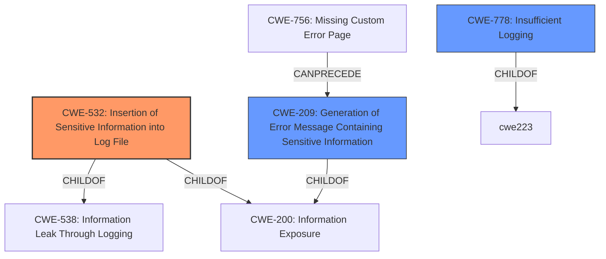

# Analysis Report for CVE-2021-32801

# Vulnerability Analysis Report: CVE-2021-32801

## Description


## Analysis (with Relationship Data)

# Summary
| CWE ID    | CWE Name                                                   | Confidence | CWE Abstraction Level | CWE Vulnerability Mapping Label | CWE-Vulnerability Mapping Notes |
| --------- | ---------------------------------------------------------- | ---------- | --------------------- | ------------------------------- | ----------------------------- |
| CWE-532   | Insertion of Sensitive Information into Log File           | 0.9        | Base                  | Primary CWE                     | Allowed                       |
| CWE-209   | Generation of Error Message Containing Sensitive Information | 0.7        | Base                  | Secondary Candidate             | Allowed                       |
| CWE-778   | Insufficient Logging                                        | 0.6        | Base                  | Secondary Candidate             | Allowed                       |

## Evidence and Confidence

*   **Confidence Score:** 0.8
*   **Evidence Strength:** HIGH

## Relationship Analysis
The primary relationship is between CWE-532, Insertion of Sensitive Information into Log File, and its parents, CWE-538 and CWE-200. CWE-209, Generation of Error Message Containing Sensitive Information, is also related as it shares the same parent, CWE-200, and can follow CWE-756, Missing Custom Error Page. The relationships guided the selection towards the most specific and relevant base-level CWE.



## Vulnerability Chain
The vulnerability chain starts with the **logging of exceptions** which leads to the **insertion of potentially sensitive key material** into the log file. The root cause is the **insufficient sanitization** of sensitive parameters before logging. This leads to **information disclosure** if an attacker gains access to the log files.

## Summary of Analysis
The initial analysis focused on the **weakness: logging of exceptions may have resulted in logging potentially sensitive key material**.

The retriever results pointed to CWE-532, CWE-209, and CWE-778. After reviewing the vulnerability description and the provided information, the following was determined:

*   CWE-532, Insertion of Sensitive Information into Log File, is the most appropriate primary CWE because the core issue is that sensitive information (encryption keys) is being written to a log file. This aligns directly with the CWE's description.
    *"The product writes sensitive information to a log file."*
*   CWE-209, Generation of Error Message Containing Sensitive Information, is a secondary CWE because the vulnerability involves exceptions being logged, which can be considered error messages. However, CWE-532 is more specific to the logging context.
    *"The product generates an error message that includes sensitive information about its environment, users, or associated data."*
*   CWE-778, Insufficient Logging, is another secondary CWE. While the vulnerability involves logging, the main problem isn't that logging is insufficient, but that the logging contains sensitive information.
    *"When a security-critical event occurs, the product either does not record the event or omits important details about the event when logging it."*

Therefore, CWE-532 is the primary CWE due to its direct alignment with the vulnerability, and CWE-209 and CWE-778 are secondary candidates.

Relevant CWE Information:

# Enhanced Context (25 CWEs)
The following CWEs were identified as potentially relevant to this vulnerability:

## CWE-295: Improper Certificate Validation
**Abstraction Level**: Base
**Similarity Score**: 0.79
**Source**: dense

**Description**:
The product does not validate, or incorrectly validates, a certificate.

**Mapping Guidance**:
- Usage: Allowed
- Rationale: This CWE entry is at the Base level of abstraction, which is a preferred level of abstraction for mapping to the root causes of vulnerabilities.

## CWE-345: Insufficient Verification of Data Authenticity
**Abstraction Level**: Class
**Similarity Score**: 0.79
**Source**: dense

**Description**:
The product does not sufficiently verify the origin or authenticity of data, in a way that causes it to accept invalid data.

**Mapping Guidance**:
- Usage: Discouraged
- Rationale: This CWE entry is a level-1 Class (i.e., a child of a Pillar). It might have lower-level children that would be more appropriate

## CWE-74: Improper Neutralization of Special Elements in Output Used by a Downstream Component ('Injection')
**Abstraction Level**: Class
**Similarity Score**: 0.79
**Source**: dense

**Description**:
The product constructs all or part of a command, data structure, or record using externally-influenced input from an upstream component, but it does not neutralize or incorrectly neutralizes special elements that could modify how it is parsed or interpreted when it is sent to a downstream component.

**Mapping Guidance**:
- Usage: Discouraged
- Rationale: CWE-74 is high-level and often misused when lower-level weaknesses are more appropriate.

## CWE-1289: Improper Validation of Unsafe Equivalence in Input
**Abstraction Level**: Base
**Similarity Score**: 0.79
**Source**: dense

**Description**:
The product receives an input value that is used as a resource identifier or other type of reference, but it does not validate or incorrectly validates that the input is equivalent to a potentially-unsafe value.

**Mapping Guidance**:
- Usage: Allowed
- Rationale: This CWE entry is at the Base level of abstraction, which is a preferred level of abstraction for mapping to the root causes of vulnerabilities.

## CWE-319: Cleartext Transmission of Sensitive Information
**Abstraction Level**: Base
**Similarity Score**: 0.79
**Source**: dense

**Description**:
The product transmits sensitive or security-critical data in cleartext in a communication channel that can be sniffed by unauthorized actors.

**Mapping Guidance**:
- Usage: Allowed
- Rationale: This CWE entry is at the Base level of abstraction, which is a preferred level of abstraction for mapping to the root causes of vulnerabilities.

## CWE-212: Improper Removal of Sensitive Information Before Storage or Transfer
**Abstraction Level**: Base
**Similarity Score**: 0.78
**Source**: dense

**Description**:
The product stores, transfers, or shares a resource that contains sensitive information, but it does not properly remove that information before the product makes the resource available to unauthorized actors.

**Mapping Guidance**:
- Usage: Allowed
- Rationale: This CWE entry is at the Base level of abstraction, which is a preferred level of abstraction for mapping to the root causes of vulnerabilities.

## CWE-203: Observable Discrepancy
**Abstraction Level**: Base
**Similarity Score**: 0.78
**Source**: dense

**Description**:
The product behaves differently or sends different responses under different circumstances in a way that is observable to an unauthorized actor, which exposes security-relevant information about the state of the product, such as whether a particular operation was successful or not.

**Mapping Guidance**:
- Usage: Allowed
- Rationale: This CWE entry is at the Base level of abstraction, which is a preferred level of abstraction for mapping to the root causes of vulnerabilities.

## CWE-303: Incorrect Implementation of Authentication Algorithm
**Abstraction Level**: Base
**Similarity Score**: 0.78
**Source**: dense

**Description**:
The requirements for the product dictate the use of an established authentication algorithm, but the implementation of the algorithm is incorrect.

**Mapping Guidance**:
- Usage: Allowed
- Rationale: This CWE entry is at the Base level of abstraction, which is a preferred level of abstraction for mapping to the root causes of vulnerabilities.

## CWE-668: Exposure of Resource to Wrong Sphere
**Abstraction Level**: Class
**Similarity Score**: 0.78
**Source**: dense

**Description**:
The product exposes a resource to the wrong control sphere, providing unintended actors with inappropriate access to the resource.

**Mapping Guidance**:
- Usage: Discouraged
- Rationale: CWE-668 is high-level and is often misused as a catch-all when lower-level CWE IDs might be applicable. It is sometimes used for low-information vulnerability reports [


## CWE Relationship Analysis

Current CWEs represent these abstraction levels: .


### Vulnerability Chain Analysis

**Chain starting from CWE-303:**
- 303 (Incorrect Implementation of Authentication Algorithm) - ROOT


**Chain starting from CWE-756:**
- 756 (Missing Custom Error Page) - ROOT


### CWE Relationship Diagram

```mermaid
graph TD
    classDef primary fill:#f96,stroke:#333,stroke-width:2px
    classDef secondary fill:#69f,stroke:#333
    classDef tertiary fill:#9e9,stroke:#333
```


*Report generated on 2025-04-01 20:24:28*
