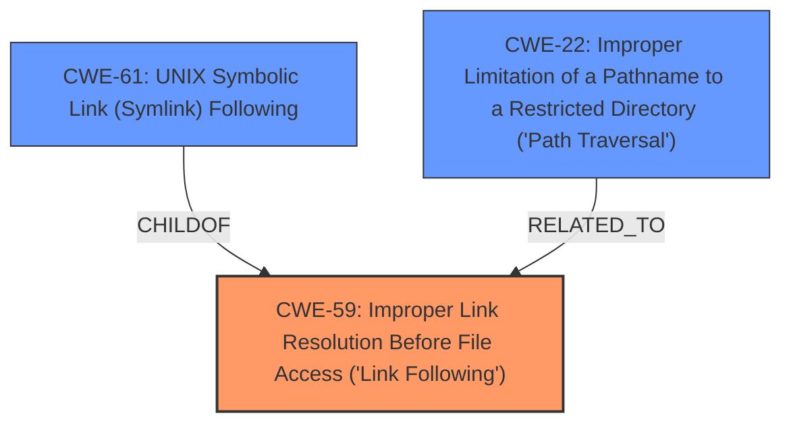

# Enhanced Analysis for CVE-2021-32803

# Summary
| CWE ID | CWE Name | Confidence | CWE Abstraction Level | CWE Vulnerability Mapping Label | CWE-Vulnerability Mapping Notes |
|---|---|---|---|---|---|
| CWE-59 | Improper Link Resolution Before File Access ('Link Following') | 0.9 | Base | Allowed | Primary CWE |
| CWE-61 | UNIX Symbolic Link (Symlink) Following | 0.7 | Compound | Allowed | Secondary Candidate |
| CWE-22 | Improper Limitation of a Pathname to a Restricted Directory ('Path Traversal') | 0.6 | Base | Allowed | Secondary Candidate |

## Evidence and Confidence

*   **Confidence Score:** 0.8
*   **Evidence Strength:** HIGH

## Relationship Analysis
The primary CWE, CWE-59, is a base-level weakness describing improper handling of symlinks. CWE-61 is a compound weakness representing a specific instance of symlink following in UNIX-like systems. CWE-22 relates to path traversal, which could be a consequence of successful symlink exploitation. CWE-61 is a ChildOf CWE-59. The abstraction levels influenced the decision to prioritize CWE-59 as the base weakness, with CWE-61 providing a more specific context.



## Vulnerability Chain
The vulnerability chain starts with **insufficient symlink protection** (CWE-59), leading to a bypass of symlink checks. This allows for arbitrary file creation/overwrite. The chain is: **Insufficient symlink protection** (CWE-59) -> Bypass of symlink checks -> Arbitrary file creation/overwrite.

## Summary of Analysis
The analysis is based on the provided vulnerability description and the CVE Reference Links Content Summary. The **root cause** is **insufficient symlink protection** which directly aligns with CWE-59 (Improper Link Resolution Before File Access). The description states that `node-tar` **fails to** properly prevent filenames from identifying a link that resolves to an unintended resource. The CVE Reference Links Content Summary confirms that the root cause is a flaw in how `node-tar` handles directory caching during tar extraction, leading to bypassed symlink checks. The graph relationships influenced the selection of CWE-59 as the primary CWE, with CWE-61 and CWE-22 as secondary candidates due to their relatedness to symlink handling and path traversal.

The selected CWEs are at the optimal level of specificity. CWE-59 accurately represents the core weakness, while CWE-61 provides a more specific context for UNIX-like systems. CWE-22 is a potential consequence of the vulnerability.

Relevant CWE Information:

# Enhanced Context (25 CWEs)
The following CWEs were identified as potentially relevant to this vulnerability:

## CWE-59: Improper Link Resolution Before File Access ('Link Following')
**Abstraction Level**: Base
**Similarity Score**: 0.80
**Source**: dense

**Description**:
The product attempts to access a file based on the filename, but it does not properly prevent that filename from identifying a link or shortcut that resolves to an unintended resource.

**Mapping Guidance**:
- Usage: Allowed
- Rationale: This CWE entry is at the Base level of abstraction, which is a preferred level of abstraction for mapping to the root causes of vulnerabilities.

## CWE-61: UNIX Symbolic Link (Symlink) Following
**Abstraction Level**: Compound
**Similarity Score**: 0.75
**Source**: dense

**Description**:
The product, when opening a file or directory, does not sufficiently account for when the file is a symbolic link that resolves to a target outside of the intended control sphere. This could allow an attacker to cause the product to operate on unauthorized files.

**Mapping Guidance**:
- Usage: Allowed
- Rationale: This is a well-known Composite of multiple weaknesses that must all occur simultaneously, although it is attack-oriented in nature.

## CWE-22: Improper Limitation of a Pathname to a Restricted Directory ('Path Traversal')
**Abstraction Level**: Base
**Similarity Score**: 0.79
**Source**: dense

**Description**:
The product uses external input to construct a pathname that is intended to identify a file or directory that is located underneath a restricted parent directory, but the product does not properly neutralize special elements within the pathname that can cause the pathname to resolve to a location that is outside of the restricted directory.

**Mapping Guidance**:
- Usage: Allowed
- Rationale: This CWE entry is at the Base level of abstraction, which is a preferred level of abstraction for mapping to the root causes of vulnerabilities.

## CWE-23: Relative Path Traversal
**Abstraction Level**: Base
**Similarity Score**: 0.79
**Source**: dense

**Description**:
The product uses external input to construct a pathname that should be within a restricted directory, but it does not properly neutralize sequences such as ".." that can resolve to a location that is outside of that directory.

**Mapping Guidance**:
- Usage: Allowed
- Rationale: This CWE entry is at the Base level of abstraction, which is a preferred level of abstraction for mapping to the root causes of vulnerabilities.

## CWE-427: Uncontrolled Search Path Element
**Abstraction Level**: Base
**Similarity Score**: 0.75
**Source**: dense

**Description**:
The product uses a fixed or controlled search path to find resources, but one or more locations in that path can be under the control of unintended actors.

**Mapping Guidance**:
- Usage: Allowed
- Rationale: This CWE entry is at the Base level of abstraction, which is a preferred level of abstraction for mapping to the root causes of vulnerabilities.

**CWE-552:** Files or Directories Accessible to External Parties, **CWE-41:** Improper Resolution of Path Equivalence, **CWE-73:** External Control of File Name or Path, **CWE-668:** Exposure of Resource to Wrong Sphere, **CWE-36:** Absolute Path Traversal, **CWE-538:** Insertion of Sensitive Information into Externally-Accessible File or Directory, **CWE-386:** Symbolic Name not Mapping to Correct Object, **CWE-363:** Race Condition Enabling Link Following, **CWE-426:** Untrusted Search Path, **CWE-184:** Incomplete List of Disallowed Inputs, **CWE-98:** Improper Control of Filename for Include/Require Statement in PHP Program ('PHP Remote File Inclusion'), **CWE-182:** Collapse of Data into Unsafe Value, **CWE-732:** Incorrect Permission Assignment for Critical Resource, **CWE-379:** Creation of Temporary File in Directory with Insecure Permissions, were considered but not selected. They do not directly describe the core weakness of **insufficient symlink protection**.

**CWE-363** and **CWE-367** relate to Time-of-check Time-of-use (TOCTOU) Race Condition, which is a potential factor, but not the primary weakness.

**CWE-427:** Uncontrolled Search Path Element, could be relevant if the symlink leads to a location within an uncontrolled search path, but the primary issue is the symlink handling itself.

**CWE-552** Files or Directories Accessible to External Parties describes that the product makes files or directories accessible to unauthorized actors, even though they should not be which is an impact of the symlink following and not the primary rootcause.


## CWE Relationship Analysis

Current CWEs represent these abstraction levels: .


### Vulnerability Chain Analysis

**Chain starting from CWE-36:**
- 36 (Absolute Path Traversal) - ROOT


**Chain starting from CWE-379:**
- 379 (Creation of Temporary File in Directory with Insecure Permissions) - ROOT


### CWE Relationship Diagram

```mermaid
graph TD
    classDef primary fill:#f96,stroke:#333,stroke-width:2px
    classDef secondary fill:#69f,stroke:#333
    classDef tertiary fill:#9e9,stroke:#333
```