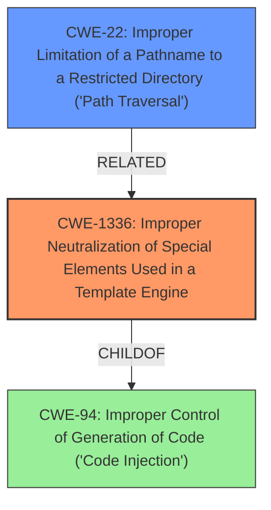

# Analysis for CVE-2021-32817

# Summary
| CWE ID | CWE Name | Confidence | CWE Abstraction Level | CWE Vulnerability Mapping Label | CWE-Vulnerability Mapping Notes |
|---|---|---|---|---|---|
| CWE-1336 | Improper Neutralization of Special Elements Used in a Template Engine | 0.9 | Base | Allowed | Primary CWE. The vulnerability involves the use of a template engine (`express-hbs`) where user-controlled input in the `layout` parameter is not properly neutralized, leading to potential file disclosure. |
| CWE-22 | Improper Limitation of a Pathname to a Restricted Directory ('Path Traversal') | 0.6 | Base | Allowed | Secondary CWE. The file inclusion caused by improper neutralization leads to path traversal. |

## Evidence and Confidence

*   **Confidence Score:** 0.75
*   **Evidence Strength:** MEDIUM

## Relationship Analysis
The primary CWE is CWE-1336 (Improper Neutralization of Special Elements Used in a Template Engine), which is a base-level CWE. It describes the fundamental weakness of not neutralizing special elements in a template engine. CWE-22 (Improper Limitation of a Pathname to a Restricted Directory ('Path Traversal')) is also relevant since the improper neutralization allows for path traversal to occur, enabling file disclosure. CWE-1336 is a child of CWE-94 (Improper Control of Generation of Code ('Code Injection')).

## Vulnerability Chain
The vulnerability chain starts with the **improper input sanitization** (as stated in the vulnerability description key phrases) of the `layout` parameter in `express-hbs`. This leads to CWE-1336 (Improper Neutralization of Special Elements Used in a Template Engine), which allows an attacker to include arbitrary files. This arbitrary file inclusion leads to CWE-22 (Improper Limitation of a Pathname to a Restricted Directory ('Path Traversal')), enabling file disclosure, which is the impact mentioned in the vulnerability description.

## Summary of Analysis
The initial assessment identified the **improper input sanitization** of the `layout` parameter in the `express-hbs` library as the root cause. The vulnerability description and CVE reference links content summary confirm this.

The evidence from the CVE Reference Links Content Summary includes the following:
- "The vulnerability stems from the `express-hbs` library mixing template data with engine configuration options within the Express `res.render` API. Specifically, the `layout` parameter, when passed user-controlled input, allows for arbitrary file inclusion."
- "When the `layout` parameter is controlled by user input (e.g., via `req.query`), an attacker can specify an arbitrary file path. This path is then used by `express-hbs` to read the file and use it as a layout template."
- "The vulnerability is mitigated by using the `restrictLayoutsTo` option in the `express-hbs` configuration, or by not using user-provided input for the `layout` parameter."

This evidence supports the selection of CWE-1336 as the primary weakness, with CWE-22 as a secondary weakness related to path traversal.

Other CWEs considered but not used:

*   CWE-917 (Improper Neutralization of Special Elements used in an Expression Language Statement ('Expression Language Injection')): While related to injection, this CWE is more specific to expression language statements. CWE-1336 is a better fit because it directly addresses template engine vulnerabilities.
*   CWE-74 (Improper Neutralization of Special Elements in Output Used by a Downstream Component ('Injection')): This is a class-level CWE and is too general.
*   CWE-20 (Improper Input Validation): While input validation is related, CWE-1336 more specifically describes the weakness related to template engines.

CWE-1336 is the optimal level of specificity as it directly addresses the template engine vulnerability, and it is a base-level CWE as recommended. The confidence in the mapping is high, based on the detailed information provided in the vulnerability description and CVE reference links.