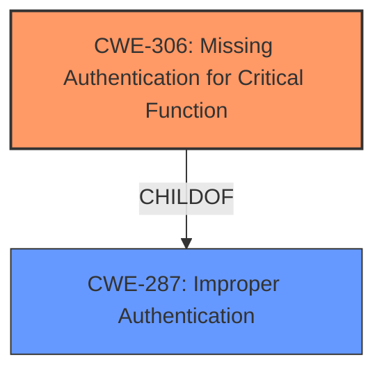

# Analysis for CVE-2021-3282

# Summary
| CWE ID | CWE Name | Confidence | CWE Abstraction Level | CWE Vulnerability Mapping Label | CWE-Vulnerability Mapping Notes |
|---|---|---|---|---|---|
| CWE-306 | Missing Authentication for Critical Function | 1.0 | Base | Primary | Allowed |

## Evidence and Confidence

*   **Confidence Score:** 1.0
*   **Evidence Strength:** HIGH

## Relationship Analysis
The primary CWE identified is CWE-306 (Missing Authentication for Critical Function), which is a Base level CWE and a child of CWE-287 (Improper Authentication). This relationship highlights that the **lack of authentication** is a specific type of improper authentication. There were no other relationships that directly influenced the selection.

## Vulnerability Chain
The vulnerability chain starts with the **missing authentication** for the `remove-peer` Raft operator command, leading to potential compromise of cluster availability.
  - **Root Cause:** **Missing authentication** (CWE-306)
  - **Impact:** Potential compromise of cluster availability.

## Summary of Analysis
The analysis indicates a clear case of **missing authentication** for a critical function, the `remove-peer` Raft operator command in HashiCorp Vault Enterprise. This allows unauthenticated users to execute this command against DR secondaries.

Evidence:
- Vulnerability Description: "...allowed the `remove-peer` raft operator command to be executed against DR secondaries **without authentication**."
- CVE Reference Links Content Summary: "The `remove-peer` Raft operator command could be executed against Disaster Recovery (DR) secondaries **without authentication**."

The Retriever Results also support this, with CWE-306 (Missing Authentication for Critical Function) being the top candidate.

CWE-306 is at the Base level of abstraction, which is preferred. The description of CWE-306 directly matches the vulnerability: "The product does not perform any authentication for functionality that requires a provable user identity or consumes a significant amount of resources."

Other CWEs Considered:

*   CWE-502 (Deserialization of Untrusted Data): While listed in the Retriever Results, this CWE is not relevant as the vulnerability does not involve deserialization of untrusted data.
*   CWE-1336 (Improper Neutralization of Special Elements Used in a Template Engine): This CWE is also not relevant as the vulnerability has nothing to do with template engines or injection.
*   CWE-863 (Incorrect Authorization): This CWE is a Class-level CWE. CWE-306 (Missing Authentication) is more specific and directly applicable.
*   CWE-285 (Improper Authorization): Similar to CWE-863, this is a higher-level CWE and less specific than CWE-306.
*   CWE-327 (Use of a Broken or Risky Cryptographic Algorithm): This CWE is not relevant because cryptography is not a factor in this vulnerability.
*   CWE-347 (Improper Verification of Cryptographic Signature): The issue is **lack of authentication**, not improper cryptographic signature verification.
*   CWE-201 (Insertion of Sensitive Information Into Sent Data): The vulnerability is about missing authentication, not about insertion of sensitive information.

Therefore, CWE-306 is the most appropriate and specific CWE for this vulnerability.