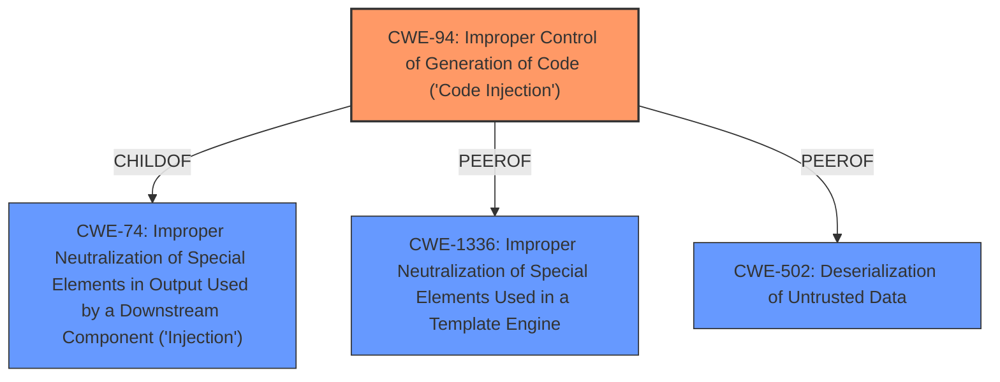

# Enhanced Analysis for CVE-2021-32829

# Summary
| CWE ID | CWE Name | Confidence | CWE Abstraction Level | CWE Vulnerability Mapping Label | CWE-Vulnerability Mapping Notes |
|---|---|---|---|---|---|
| **CWE-94** | Improper Control of Generation of Code ('Code Injection') | 0.9 | Base | Primary | Allowed-with-Review |
| CWE-1336 | Improper Neutralization of Special Elements Used in a Template Engine | 0.7 | Base | Secondary | Allowed |
| CWE-502 | Deserialization of Untrusted Data | 0.6 | Base | Secondary | Allowed |

## Evidence and Confidence

*   **Confidence Score:** 0.8
*   **Evidence Strength:** HIGH

## Relationship Analysis
The primary CWE, CWE-94, is a base-level CWE which accurately describes the **code injection** vulnerability due to the **bypass of the Groovy shell sandbox** using **meta-programming escapes**. It's related to CWE-74 (Improper Neutralization of Special Elements in Output Used by a Downstream Component ('Injection')) as a child, indicating it's a specific type of injection. CWE-1336 (Improper Neutralization of Special Elements Used in a Template Engine) and CWE-502 (Deserialization of Untrusted Data) are considered as secondary because the vulnerability involves evaluating a script but is not directly related to a template engine or deserialization process in the traditional sense.



## Vulnerability Chain
The vulnerability chain starts with the lack of proper input sanitization, leading to the **bypass of the Groovy shell sandbox** due to ineffective restrictions on Java annotations (**meta-programming escapes**), which results in post-authentication Remote Code Execution (RCE).

## Summary of Analysis
Initially, several CWEs were considered based on the descriptions and retriever results, including CWE-863 (Incorrect Authorization) and CWE-917 (Improper Neutralization of Special Elements used in an Expression Language Statement ('Expression Language Injection')). However, the core issue is that the system generates and executes code based on user-supplied input without proper **neutralization** of special elements that could modify the code's behavior. The vulnerability involves a **bypass of the Groovy shell sandbox** due to **meta-programming escapes**. The `script` parameter is evaluated as a Groovy script, but the sandbox is ineffective at controlling code placed in Java annotations. This aligns strongly with CWE-94 (Improper Control of Generation of Code ('Code Injection')).

The evidence from the vulnerability description includes:
- "Affected versions of ZStack REST API are vulnerable to post-authentication Remote Code Execution (RCE) via **bypass of the Groovy shell sandbox**."
- "Even though the sandbox heavily restricts the receiver types to a small set of allowed types, the sandbox is non effective at controlling any code placed in Java annotations and therefore vulnerable to **meta-programming escapes**."
- "The HTTP request parameter script is mapped to the APIBatchQueryMsg.script property and evaluated as a Groovy script in BatchQuery.query"

The selection of CWE-94 is based on the fact that the vulnerability involves generating code (Groovy script) from user-controlled input (`script` parameter) and executing it, leading to RCE. While other CWEs like CWE-1336 and CWE-502 were considered, they do not fully capture the essence of the vulnerability, which is the **improper control of code generation**. CWE-94 is at the optimal level of specificity as it directly addresses the root cause, which is the **improper** handling of user-controlled input during code generation. While there are various types of injections, this one specifically leads to generating code and therefore CWE-94 is the best fit.

Relevant CWE Information:

# Enhanced Context (25 CWEs)
The following CWEs were identified as potentially relevant to this vulnerability:

## CWE-74: Improper Neutralization of Special Elements in Output Used by a Downstream Component ('Injection')
**Abstraction Level**: Class
**Similarity Score**: 0.77
**Source**: dense

**Description**:
The product constructs all or part of a command, data structure, or record using externally-influenced input from an upstream component, but it does not neutralize or incorrectly neutralizes special elements that could modify how it is parsed or interpreted when it is sent to a downstream component.

**Mapping Guidance**:
- Usage: Discouraged
- Rationale: CWE-74 is high-level and often misused when lower-level weaknesses are more appropriate.

## CWE-184: Incomplete List of Disallowed Inputs
**Abstraction Level**: Base
**Similarity Score**: 0.77
**Source**: dense

**Description**:
The product implements a protection mechanism that relies on a list of inputs (or properties of inputs) that are not allowed by policy or otherwise require other action to neutralize before additional processing takes place, but the list is incomplete.

**Mapping Guidance**:
- Usage: Allowed
- Rationale: This CWE entry is at the Base level of abstraction, which is a preferred level of abstraction for mapping to the root causes of vulnerabilities.

## CWE-807: Reliance on Untrusted Inputs in a Security Decision
**Abstraction Level**: Base
**Similarity Score**: 0.77
**Source**: dense

**Description**:
The product uses a protection mechanism that relies on the existence or values of an input, but the input can be modified by an untrusted actor in a way that bypasses the protection mechanism.

**Mapping Guidance**:
- Usage: Allowed
- Rationale: This CWE entry is at the Base level of abstraction, which is a preferred level of abstraction for mapping to the root causes of vulnerabilities.

## CWE-138: Improper Neutralization of Special Elements
**Abstraction Level**: Class
**Similarity Score**: 0.76
**Source**: dense

**Description**:
The product receives input from an upstream component, but it does not neutralize or incorrectly neutralizes special elements that could be interpreted as control elements or syntactic markers when they are sent to a downstream component.

**Mapping Guidance**:
- Usage: Discouraged
- Rationale: This CWE entry is a level-1 Class (i.e., a child of a Pillar). It might have lower-level children that would be more appropriate

## CWE-1289: Improper Validation of Unsafe Equivalence in Input
**Abstraction Level**: Base
**Similarity Score**: 0.76
**Source**: dense

**Description**:
The product receives an input value that is used as a resource identifier or other type of reference, but it does not validate or incorrectly validates that the input is equivalent to a potentially-unsafe value.

**Mapping Guidance**:
- Usage: Allowed
- Rationale: This CWE entry is at the Base level of abstraction, which is a preferred level of abstraction for mapping to the root causes of vulnerabilities.

## CWE-303: Incorrect Implementation of Authentication Algorithm
**Abstraction Level**: Base
**Similarity Score**: 0.76
**Source**: dense

**Description**:
The requirements for the product dictate the use of an established authentication algorithm, but the implementation of the algorithm is incorrect.

**Mapping Guidance**:
- Usage: Allowed
- Rationale: This CWE entry is at the Base level of abstraction, which is a preferred level of abstraction for mapping to the root causes of vulnerabilities.

## CWE-116: Improper Encoding or Escaping of Output
**Abstraction Level**: Class
**Similarity Score**: 0.75
**Source**: dense

**Description**:
The product prepares a structured message for communication with another component, but encoding or escaping of the data is either missing or done incorrectly. As a result, the intended structure of the message is not preserved.

**Mapping Guidance**:
- Usage: Allowed-with-Review
- Rationale: This CWE entry is a Class and might have Base-level children that would be more appropriate

## CWE-639: Authorization Bypass Through User-Controlled Key
**Abstraction Level**: Base
**Similarity Score**: 0.75
**Source**: dense

**Description**:
The system's authorization functionality does not prevent one user from gaining access to another user's data or record by modifying the key value identifying the data.

**Mapping Guidance**:
- Usage: Allowed
- Rationale: This CWE entry is at the Base level of abstraction, which is a preferred level of abstraction for mapping to the root causes of vulnerabilities.

## CWE-1390: Weak Authentication


## CWE Relationship Analysis

Current CWEs represent these abstraction levels: .


### Vulnerability Chain Analysis

**Chain starting from CWE-502:**
- 502 (Deserialization of Untrusted Data) - ROOT


**Chain starting from CWE-1336:**
- 1336 (Improper Neutralization of Special Elements Used in a Template Engine) - ROOT


### CWE Relationship Diagram

```mermaid
graph TD
    classDef primary fill:#f96,stroke:#333,stroke-width:2px
    classDef secondary fill:#69f,stroke:#333
    classDef tertiary fill:#9e9,stroke:#333
```