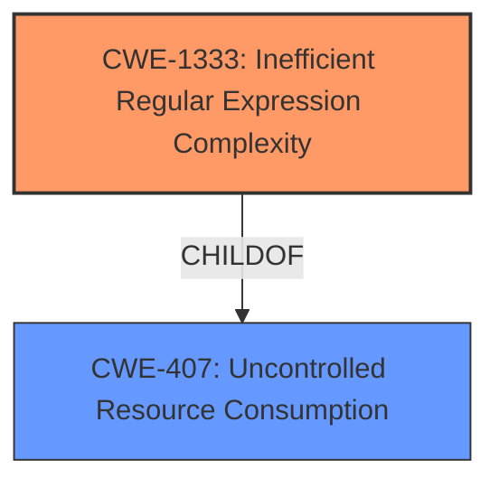

# Enhanced Analysis for CVE-2021-32832

# Summary
| CWE ID | CWE Name | Confidence | CWE Abstraction Level | CWE Vulnerability Mapping Label | CWE-Vulnerability Mapping Notes |
|---|---|---|---|---|---|
| CWE-1333 | Inefficient Regular Expression Complexity | 1.0 | Base | Allowed | Primary CWE |

## Evidence and Confidence

*   **Confidence Score:** 1.0
*   **Evidence Strength:** HIGH

## Relationship Analysis
The primary relationship that influenced the decision was the parent-child relationship between CWE-1333 and CWE-407 (Uncontrolled Resource Consumption). The vulnerability directly involves a regular expression (**issue with certain regular expressions**) that consumes excessive CPU cycles, which aligns perfectly with CWE-1333. Other CWEs considered were related to injection, which is not the case here, or were at higher levels of abstraction.



## Vulnerability Chain
The vulnerability chain consists of:
1.  **Root Cause:** **Issue with certain regular expressions** (CWE-1333) having inefficient complexity.
2.  **Impact:** Denial of Service.

## Summary of Analysis
The initial assessment strongly indicates that CWE-1333 (Inefficient Regular Expression Complexity) is the most appropriate CWE for this vulnerability. The vulnerability description explicitly mentions an **issue with certain regular expressions** that could lead to Denial of Service, and the CVE Reference Links Content Summary confirms that the root cause is indeed inefficient regular expressions leading to excessive CPU consumption (ReDoS).

The analysis is based on the provided evidence, specifically:
*   **Vulnerability Description Key Phrases:** "**issue with certain regular expressions**"
*   **CVE Reference Links Content Summary:** "The vulnerability stems from the use of poorly constructed regular expressions within the Rocket.Chat application. These regexes exhibit inefficient behavior due to ambiguity and overlapping clauses, leading to exponential backtracking."
*   **CVE Reference Links Content Summary:** "ReDoS in Mailer API: A regular expression used in `app/mailer/server/api.js` for translating strings is vulnerable to ReDoS."
*   **CVE Reference Links Content Summary:** "ReDoS in Custom Fields Validation: A regular expression in `ee/client/omnichannel/additionalForms/CustomFieldsAdditionalForm.js` used for validating custom field options is vulnerable to ReDoS."
*   **CVE Reference Links Content Summary:** "The exploitation of these ReDoS vulnerabilities can lead to a Denial of Service (DoS). By providing crafted input strings, an attacker can force the server to spend excessive time processing the regex, potentially causing performance degradation or even complete unavailability of the service."

The hierarchical relationships confirm this by placing CWE-1333 as a child of CWE-407 (Uncontrolled Resource Consumption), which aligns with the observed impact of Denial of Service.

The selected CWE is at the optimal level of specificity because it directly addresses the root cause of the vulnerability (inefficient regular expressions) rather than a more general category like input validation or resource management.

Relevant CWE Information:

# Enhanced Context (25 CWEs)
The following CWEs were identified as potentially relevant to this vulnerability:

## CWE-917: Improper Neutralization of Special Elements used in an Expression Language Statement ('Expression Language Injection')
**Abstraction Level**: Base
**Similarity Score**: 0.78
**Source**: dense

**Description**:
The product constructs all or part of an expression language (EL) statement in a framework such as a Java Server Page (JSP) using externally-influenced input from an upstream component, but it does not neutralize or incorrectly neutralizes special elements that could modify the intended EL statement before it is executed.

**Why it was not selected:** This CWE is related to expression language injection, which is not the root cause of this vulnerability. The issue is related to inefficient regular expressions.

## CWE-74: Improper Neutralization of Special Elements in Output Used by a Downstream Component ('Injection')
**Abstraction Level**: Class
**Similarity Score**: 0.76
**Source**: dense

**Description**:
The product constructs all or part of a command, data structure, or record using externally-influenced input from an upstream component, but it does not neutralize or incorrectly neutralizes special elements that could modify how it is parsed or interpreted when it is sent to a downstream component.

**Why it was not selected:** This CWE is too generic and doesn't accurately represent the root cause, which is inefficient regular expression complexity.

## CWE-1289: Improper Validation of Unsafe Equivalence in Input
**Abstraction Level**: Base
**Similarity Score**: 0.75
**Source**: dense

**Description**:
The product receives an input value that is used as a resource identifier or other type of reference, but it does not validate or incorrectly validates that the input is equivalent to a potentially-unsafe value.

**Why it was not selected:** This CWE focuses on validating equivalence to unsafe values, which isn't the primary issue. The core problem is the complexity of the regular expression itself.

## CWE-943: Improper Neutralization of Special Elements in Data Query Logic
**Abstraction Level**: Class
**Similarity Score**: 0.74
**Source**: dense

**Description**:
The product generates a query intended to access or manipulate data in a data store such as a database, but it does not neutralize or incorrectly neutralizes special elements that can modify the intended logic of the query.

**Why it was not selected:** This is specific to data query logic, not general regular expression usage.

## CWE-184: Incomplete List of Disallowed Inputs
**Abstraction Level**: Base
**Similarity Score**: 0.74
**Source**: dense

**Description**:
The product implements a protection mechanism that relies on a list of inputs (or properties of inputs) that are not allowed by policy or otherwise require other action to neutralize before additional processing takes place, but the list is incomplete.

**Why it was not selected:** The issue is not related to a list of disallowed inputs.

## CWE-799: Improper Control of Interaction Frequency
**Abstraction Level**: Class
**Similarity Score**: 0.73
**Source**: dense

**Description**:
The product does not properly limit the number or frequency of interactions that it has with an actor, such as the number of incoming requests.

**Why it was not selected:** The vulnerability is not about limiting interaction frequency.

## CWE-915: Improperly Controlled Modification of Dynamically-Determined Object Attributes
**Abstraction Level**: Base
**Similarity Score**: 0.73
**Source**: dense

**Description**:
The product receives input from an upstream component that specifies multiple attributes, properties, or fields that are to be initialized or updated in an object, but it does not properly control which attributes can be modified.

**Why it was not selected:** The issue is not related to modifying object attributes.

## CWE-138: Improper Neutralization of Special Elements
**Abstraction Level**: Class
**Similarity Score**: 0.73
**Source**: dense

**Description**:
The product receives input from an upstream component, but it does not neutralize or incorrectly neutralizes special elements that could be interpreted as control elements or syntactic markers when they are sent to a downstream component.

**Why it was not selected:** This CWE is too broad. The specific weakness is in the regular expression's complexity.

## CWE-470: Use of Externally-Controlled Input to Select Classes or Code ('Unsafe Reflection')
**Abstraction Level**: Base
**Similarity Score**: 0.73
**Source**: dense

**Description**:
The product uses external input with reflection to select which classes or code to use, but it does not sufficiently prevent the input from selecting improper classes or code.

**Why it was not selected:** The vulnerability has nothing to do with reflection.

## CWE-80: Improper Neutralization of Script-Related HTML Tags in a Web Page (Basic XSS)
**Abstraction Level**: Variant
**Similarity Score**: 0.73
**Source**: dense

**Description**:
The product receives input from an upstream component, but it does not neutralize or incorrectly neutralizes special characters such as "<", ">", and "&" that could be interpreted as web-scripting elements when they are sent to a downstream component that processes web pages.

**Why it was not selected:** This CWE is specific to XSS, which is not the issue here.

## CWE-1336: Improper Neutralization of Special Elements Used in a Template Engine
**Abstraction Level**: Base
**Similarity Score**: 5752.22
**Source**: sparse

**Description**:
The product uses a template engine to insert or process externally-influenced input, but it does not neutralize or incorrectly neutralizes special elements or syntax that can be interpreted as template expressions or other code directives when processed by the engine.

**Why it was not selected:** While template engines might use regular expressions, the core issue here


## CWE Relationship Analysis

Current CWEs represent these abstraction levels: .


### Vulnerability Chain Analysis

**Chain starting from CWE-1336:**
- 1336 (Improper Neutralization of Special Elements Used in a Template Engine) - ROOT


**Chain starting from CWE-943:**
- 943 (Improper Neutralization of Special Elements in Data Query Logic) - ROOT


### CWE Relationship Diagram

```mermaid
graph TD
    classDef primary fill:#f96,stroke:#333,stroke-width:2px
    classDef secondary fill:#69f,stroke:#333
    classDef tertiary fill:#9e9,stroke:#333
```