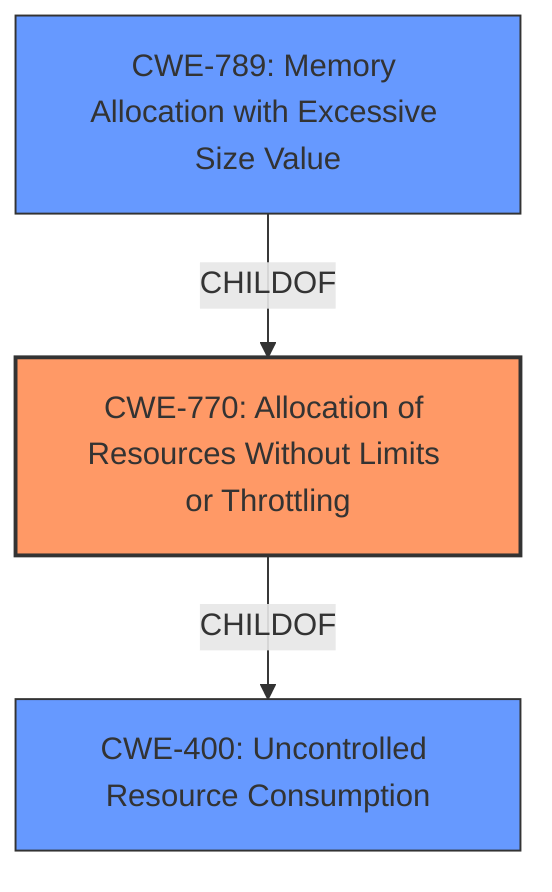

# Analysis Report for CVE-2021-32918

# Vulnerability Analysis Report: CVE-2021-32918

## Description


## Analysis (with Relationship Data)

# Summary
| CWE ID | CWE Name | Confidence | CWE Abstraction Level | CWE Vulnerability Mapping Label | CWE-Vulnerability Mapping Notes |
|---|---|---|---|---|---|
| CWE-770 | Allocation of Resources Without Limits or Throttling | 0.9 | Base | Allowed | Primary CWE |
| CWE-789 | Memory Allocation with Excessive Size Value | 0.8 | Variant | Allowed | Secondary Candidate |
| CWE-400 | Uncontrolled Resource Consumption | 0.6 | Class | Discouraged | Secondary Candidate |

## Evidence and Confidence

*   **Confidence Score:** 0.8
*   **Evidence Strength:** HIGH

## Relationship Analysis
The primary CWE selected is CWE-770, which is a base-level CWE. It has parent-child relationships with CWE-400 (Uncontrolled Resource Consumption) and CWE-789 (Memory Allocation with Excessive Size Value). CWE-770 is a child of CWE-400, but CWE-770 is more specific. CWE-789 is a child of CWE-770, providing a more specific variant. Given the details of the vulnerability, CWE-770 is the most fitting base CWE, with CWE-789 as a possible contributing factor. CWE-400 is too general.



## Vulnerability Chain
The vulnerability chain starts with the **insufficient memory management** due to default garbage collection settings in Lua 5.2 and 5.3. This leads to **permissive stanza size limits** and **lack of rate limiting**, which further exacerbates the issue. The root cause is the **allocation of resources without limits or throttling** (CWE-770), leading to **memory exhaustion** and ultimately a **denial-of-service (DoS)**.

## Summary of Analysis
The analysis indicates that the vulnerability is primarily due to **allocation of resources without limits or throttling** (CWE-770). The provided evidence from the CVE Reference Links Content Summary highlights the **insufficient memory management** in Prosody when running under Lua 5.2 or 5.3 due to the default garbage collection settings. The vulnerability description key phrases point towards **memory exhaustion** leading to a denial-of-service.

The retriever results suggest CWE-400, CWE-674, CWE-770, CWE-126, and CWE-789 as potential candidates. However, based on the detailed analysis and the provided information, CWE-770 is the most appropriate as it directly addresses the **lack of limits on resource allocation**. CWE-789 (Memory Allocation with Excessive Size Value) could be a contributing factor, especially considering the permissive stanza size limits, but CWE-770 is the broader and more encompassing issue.

CWE-400 (Uncontrolled Resource Consumption) is a class-level CWE and is too general. CWE-674 (Uncontrolled Recursion) does not apply as there is no evidence of uncontrolled recursion. CWE-126 (Buffer Over-read) does not apply as the issue is not related to reading beyond buffer boundaries.

The selected CWEs are at the optimal level of specificity, with CWE-770 being the primary root cause and CWE-789 as a possible contributing factor. The evidence supports the conclusion that the vulnerability is due to **uncontrolled resource allocation**, leading to **memory exhaustion** and **denial of service**.

Relevant CWE Information:

# Enhanced Context (25 CWEs)

## CWE-770: Allocation of Resources Without Limits or Throttling
**Abstraction:** Base
**Status:** Incomplete

### Description
The product allocates a reusable resource or group of resources on behalf of an actor without imposing any restrictions on the size or number of resources that can be allocated, in violation of the intended security policy for that actor.

**How the Vulnerability Matches:** The vulnerability description and CVE summary indicate that Prosody, by default, does not impose sufficient limits on memory allocation, particularly with respect to stanza sizes and garbage collection settings under Lua 5.2 and 5.3. This allows attackers to exhaust memory resources, leading to a denial-of-service.
**Security Implications and Potential Impact:** The primary impact is denial-of-service, as the server becomes unresponsive due to memory exhaustion.
**Parent-Child Relationships and Chain Patterns:** CWE-770 is a child of CWE-400 (Uncontrolled Resource Consumption) but is more specific. It can also lead to CWE-476 (NULL Pointer Dereference) in certain scenarios.
**Whether the Weakness is Primary or Secondary:** CWE-770 is the primary weakness.
**How the Official MITRE Mapping Guidance Influenced Your Decision:** The MITRE mapping guidance suggests that CWE-770 is at the Base level of abstraction, which is preferred. The description of CWE-770 aligns well with the vulnerability, as it involves allocating resources without appropriate limits.

## CWE-789: Memory Allocation with Excessive Size Value
**Abstraction:** Variant
**Status:** Draft

### Description
The product allocates memory based on an untrusted, large size value, but it does not ensure that the size is within expected limits, allowing arbitrary amounts of memory to be allocated.

**How the Vulnerability Matches:** The vulnerability description mentions permissive stanza size limits, suggesting that the system allows very large stanzas (up to 10MB) by default, which can be exploited for memory exhaustion.
**Security Implications and Potential Impact:** This can lead to excessive memory consumption, contributing to denial-of-service.
**Parent-Child Relationships and Chain Patterns:** CWE-789 is a child of CWE-770. It can also precede CWE-476 (NULL Pointer Dereference).
**Whether the Weakness is Primary or Secondary:** CWE-789 is a secondary weakness that exacerbates the primary weakness (CWE-770).
**How the Official MITRE Mapping Guidance Influenced Your Decision:** The MITRE mapping guidance suggests that CWE-789 is at the Variant level of abstraction, which is preferred. The description aligns with the permissive stanza size limits contributing to memory exhaustion.

## CWE-400: Uncontrolled Resource Consumption
**Abstraction:** Class
**Status:** Draft

### Description
The product does not properly control the allocation and maintenance of a limited resource, thereby enabling an actor to influence the amount of resources consumed, eventually leading to the exhaustion of available resources.

**How the Vulnerability Matches:** This CWE broadly matches the vulnerability as it describes a scenario where resources are not properly controlled, leading to exhaustion.
**Security Implications and Potential Impact:** The primary impact is denial-of-service.
**Parent-Child Relationships and Chain Patterns:** CWE-400 is a class-level CWE and has several child CWEs, including CWE-770.
**Whether the Weakness is Primary or Secondary:** While applicable, CWE-400 is too general. CWE-770 provides a more precise classification.
**How the Official MITRE Mapping Guidance Influenced Your Decision:** The MITRE mapping guidance discourages the use of CWE-400 when more specific mappings are available.

## Considered but Not Used:
- CWE-674 (Uncontrolled Recursion): This CWE was considered but not used because there is no evidence of uncontrolled recursion in the vulnerability description.
- CWE-126 (Buffer Over-read): This CWE was considered but not used because the issue is not related to reading beyond buffer boundaries.
- CWE-401 (Missing Release of Memory after Effective Lifetime): While a memory leak could contribute to resource exhaustion, the primary issue is the lack of limits on allocation, not the failure to release memory.
- CWE-476 (NULL Pointer Dereference): This CWE was considered but not used because there is no evidence of null pointer dereference.
- CWE-306 (Missing Authentication for Critical Function): This CWE was considered but not used because, while the attack is unauthenticated, the primary weakness is not the missing authentication but the lack of resource limits.
- CWE-1284 (Improper Validation of Specified Quantity in Input): This CWE was considered, and it could be related to the stanza sizes. However, the main problem is the lack of overall limits, making CWE-770 more relevant.
- CWE-121 (Stack-based Buffer Overflow): This CWE was considered but not used because there is no evidence of stack-based buffer overflows.


## CWE Relationship Analysis

Current CWEs represent these abstraction levels: .


### Vulnerability Chain Analysis

**Chain starting from CWE-476:**
- 476 (NULL Pointer Dereference) - ROOT


**Chain starting from CWE-121:**
- 121 (Stack-based Buffer Overflow) - ROOT


### CWE Relationship Diagram

```mermaid
graph TD
    classDef primary fill:#f96,stroke:#333,stroke-width:2px
    classDef secondary fill:#69f,stroke:#333
    classDef tertiary fill:#9e9,stroke:#333
```


*Report generated on 2025-04-02 05:59:01*
