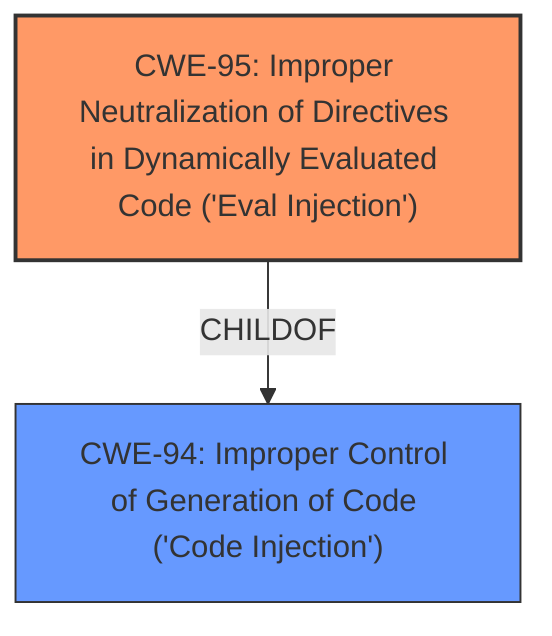

# Raw Analyzer Response for CVE-2021-32924

# Summary
| CWE ID | CWE Name | Confidence | CWE Abstraction Level | CWE Vulnerability Mapping Label | CWE-Vulnerability Mapping Notes |
|---|---|---|---|---|---|
| CWE-95 | Improper Neutralization of Directives in Dynamically Evaluated Code ('Eval Injection') | 1.0 | Variant | Allowed | Primary CWE |
| CWE-94 | Improper Control of Generation of Code ('Code Injection') | 0.7 | Base | Allowed-with-Review | Secondary Candidate |

## Evidence and Confidence

*   **Confidence Score:** 0.9
*   **Evidence Strength:** HIGH

## Relationship Analysis
The primary CWE is CWE-95, a **Variant** of CWE-94.
CWE-95 is a more specific case of CWE-94 where the code is dynamically evaluated.
CWE-94 is a **Base** CWE that describes the broader category of code injection.

## Vulnerability Chain
The vulnerability chain starts with the **unsafe interaction with IPS_ThemerunProcessFunction method**.
This leads to the use of user-controlled input in a dynamically evaluated code segment (`eval()` function).
This results in PHP code injection and potential remote code execution.

## Summary of Analysis
The initial assessment, based on the vulnerability description and CVE details, indicates that the root cause is the **unsafe interaction with the `IPS\_ThemerunProcessFunction` method**, which leads to eval-based PHP code injection.

The evidence supporting this includes:

*   The vulnerability description explicitly mentions "eval-based PHP code injection".
*   The CVE reference links content summary states: "This method passes arbitrary user-supplied content to the `IPS\_Theme::runProcessFunction()` method. This content is then used within a call to the `eval()` PHP function, leading to arbitrary code execution."

The retriever results strongly suggest CWE-95 (Improper Neutralization of Directives in Dynamically Evaluated Code ('Eval Injection')) as the primary candidate, with a high score. CWE-94 (Improper Control of Generation of Code ('Code Injection')) is also a potential candidate, as it's the parent of CWE-95.

CWE-95 is a **Variant** of CWE-94, representing a specific type of code injection where the code is dynamically evaluated. Given the explicit use of `eval()` in the vulnerability, CWE-95 is a more precise fit.

The MITRE mapping guidance for CWE-95 recommends its use, stating: "This CWE entry is at the Variant level of abstraction, which is a preferred level of abstraction for mapping to the root causes of vulnerabilities."

Therefore, the final selection is CWE-95 as the primary CWE, with CWE-94 considered as a broader, less specific alternative.

Other CWEs Considered and Rejected:

*   CWE-79 (Improper Neutralization of Input During Web Page Generation ('Cross-site Scripting')): While XSS could be a consequence of code injection, it's not the direct root cause in this scenario. The vulnerability allows execution of arbitrary code due to the **unsafe** use of `eval()`.
*   CWE-352 (Cross-Site Request Forgery (CSRF)): This is unrelated to the code injection aspect of the vulnerability.
*   CWE-1336 (Improper Neutralization of Special Elements Used in a Template Engine): While this might seem relevant, the root cause is the use of `eval()` on unsanitized input, not a template engine vulnerability per se.
*   CWE-917 (Improper Neutralization of Special Elements used in an Expression Language Statement ('Expression Language Injection')): Similarly, the vulnerability doesn't directly involve an expression language statement but rather dynamic code evaluation.

Relevant CWE Information:

## CWE-74: Improper Neutralization of Special Elements in Output Used by a Downstream Component ('Injection')
**Abstraction Level**: Class
**Similarity Score**: 0.77
**Source**: dense

**Description**:
The product constructs all or part of a command, data structure, or record using externally-influenced input from an upstream component, but it does not neutralize or incorrectly neutralizes special elements that could modify how it is parsed or interpreted when it is sent to a downstream component.

**Mapping Guidance**:
- Usage: Discouraged
- Rationale: CWE-74 is high-level and often misused when lower-level weaknesses are more appropriate.

## CWE-266: Incorrect Privilege Assignment
**Abstraction Level**: Base
**Similarity Score**: 0.77
**Source**: dense

**Description**:
A product incorrectly assigns a privilege to a particular actor, creating an unintended sphere of control for that actor.

**Mapping Guidance**:
- Usage: Allowed
- Rationale: This CWE entry is at the Base level of abstraction, which is a preferred level of abstraction for mapping to the root causes of vulnerabilities.

## CWE-639: Authorization Bypass Through User-Controlled Key
**Abstraction Level**: Base
**Similarity Score**: 0.76
**Source**: dense

**Description**:
The system's authorization functionality does not prevent one user from gaining access to another user's data or record by modifying the key value identifying the data.

**Mapping Guidance**:
- Usage: Allowed
- Rationale: This CWE entry is at the Base level of abstraction, which is a preferred level of abstraction for mapping to the root causes of vulnerabilities.

## CWE-668: Exposure of Resource to Wrong Sphere
**Abstraction Level**: Class
**Similarity Score**: 0.76
**Source**: dense

**Description**:
The product exposes a resource to the wrong control sphere, providing unintended actors with inappropriate access to the resource.

**Mapping Guidance**:
- Usage: Discouraged
- Rationale: CWE-668 is high-level and is often misused as a catch-all when lower-level CWE IDs might be applicable. It is sometimes used for low-information vulnerability reports [REF-1287]. It is a level-1 Class (i.e., a child of a Pillar). It is not useful for trend analysis.

## CWE-472: External Control of Assumed-Immutable Web Parameter
**Abstraction Level**: Base
**Similarity Score**: 0.76
**Source**: dense

**Description**:
The web application does not sufficiently verify inputs that are assumed to be immutable but are actually externally controllable, such as hidden form fields.

**Mapping Guidance**:
- Usage: Allowed
- Rationale: This CWE entry is at the Base level of abstraction, which is a preferred level of abstraction for mapping to the root causes of vulnerabilities.

## CWE-41: Improper Resolution of Path Equivalence
**Abstraction Level**: Base
**Similarity Score**: 0.76
**Source**: dense

**Description**:
The product is vulnerable to file system contents disclosure through path equivalence. Path equivalence involves the use of special characters in file and directory names. The associated manipulations are intended to generate multiple names for the same object.

**Mapping Guidance**:
- Usage: Allowed
- Rationale: This CWE entry is at the Base level of abstraction, which is a preferred level of abstraction for mapping to the root causes of vulnerabilities.

## CWE-267: Privilege Defined With Unsafe Actions
**Abstraction Level**: Base
**Similarity Score**: 0.76
**Source**: dense

**Description**:
A particular privilege, role, capability, or right can be used to perform unsafe actions that were not intended, even when it is assigned to the correct entity.

**Mapping Guidance**:
- Usage: Allowed
- Rationale: This CWE entry is at the Base level of abstraction, which is a preferred level of abstraction for mapping to the root causes of vulnerabilities.

## CWE-184: Incomplete List of Disallowed Inputs
**Abstraction Level**: Base
**Similarity Score**: 0.76
**Source**: dense

**Description**:
The product implements a protection mechanism that relies on a list of inputs (or properties of inputs) that are not allowed by policy or otherwise require other action to neutralize before additional processing takes place, but the list is incomplete.

**Mapping Guidance**:
- Usage: Allowed
- Rationale: This CWE entry is at the Base level of abstraction, which is a preferred level of abstraction for mapping to the root causes of vulnerabilities.

## CWE-653: Improper Isolation or Compartmentalization
**Abstraction Level**: Class
**Similarity Score**: 0.76
**Source**: dense

**Description**:
The product does not properly compartmentalize or isolate functionality, processes, or resources that require different privilege levels, rights, or permissions.

**Mapping Guidance**:
- Usage: Allowed
- Rationale: This CWE entry is at the Base level of abstraction, which is a preferred level of abstraction for mapping to the root causes of vulnerabilities.

## CWE-425: Direct Request ('Forced Browsing')
**Abstraction Level