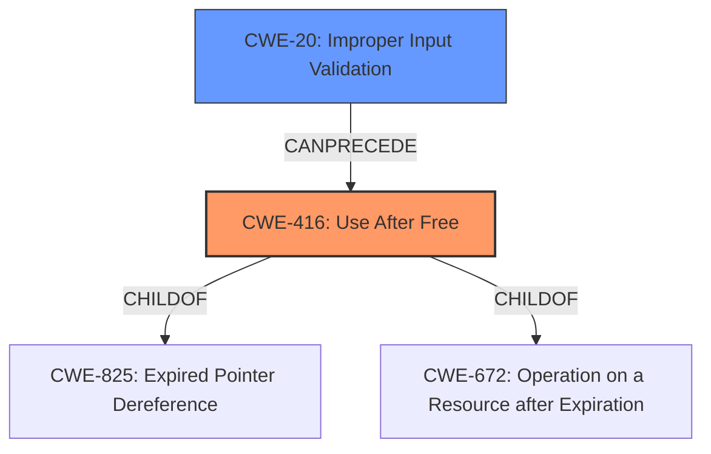

# Analysis for CVE-2021-32944

# Summary
| CWE ID | CWE Name | Confidence | CWE Abstraction Level | CWE Vulnerability Mapping Label | CWE-Vulnerability Mapping Notes |
|---|---|---|---|---|---|
| CWE-416 | Use After Free | 1.0 | Variant | Allowed | Primary CWE |
| CWE-20 | Improper Input Validation | 0.7 | Class | Discouraged | Secondary CWE |

## Evidence and Confidence

*   **Confidence Score:** 0.9
*   **Evidence Strength:** HIGH

## Relationship Analysis
The primary weakness is CWE-416 **Use After Free**, which is a Variant level CWE. The vulnerability description explicitly states a **use-after-free** issue. CWE-416 is a child of CWE-825 **Expired Pointer Dereference** and CWE-672 **Operation on a Resource after Expiration**.

CWE-20 **Improper Input Validation** is a secondary consideration, as the **root cause** is a **lack of proper validation of user-supplied data**. While CWE-20 is a Class level CWE and is discouraged, it is still relevant because it describes the **root cause** that led to the **use-after-free**.

## Vulnerability Chain
The vulnerability chain starts with the **lack of proper validation of user-supplied data** (CWE-20), which leads to a **use-after-free** condition (CWE-416). This **use-after-free** can then lead to memory corruption or arbitrary code execution.

## Summary of Analysis
The primary CWE is CWE-416 **Use After Free**, as the vulnerability description explicitly mentions a **use-after-free** issue. The **root cause** of the vulnerability is a **lack of proper validation of user-supplied data**, which is represented by CWE-20 **Improper Input Validation**.

The vulnerability description states: "A **use-after-free** issue exists in the DGN file-reading procedure in the Drawings SDK (All versions prior to 2022.4) resulting from the **lack of proper validation of user-supplied data**."

The retriever results also list CWE-416 as the top candidate.

CWE-20 is included because of the root cause: "**lack of proper validation of user-supplied data**".

The selected CWEs are at the optimal level of specificity, as CWE-416 is a Variant and CWE-20 is a Class. While a more specific child of CWE-20 could be considered, the information provided does not give sufficient information to select a more specific CWE. For example, it could be CWE-1284, but there is no mention of quantity. It could also be CWE-1285, but there is no mention of index. It could also be CWE-1287, but there is no mention of type. It could also be CWE-1286, but there is no mention of syntax.

Relevant CWE Information: