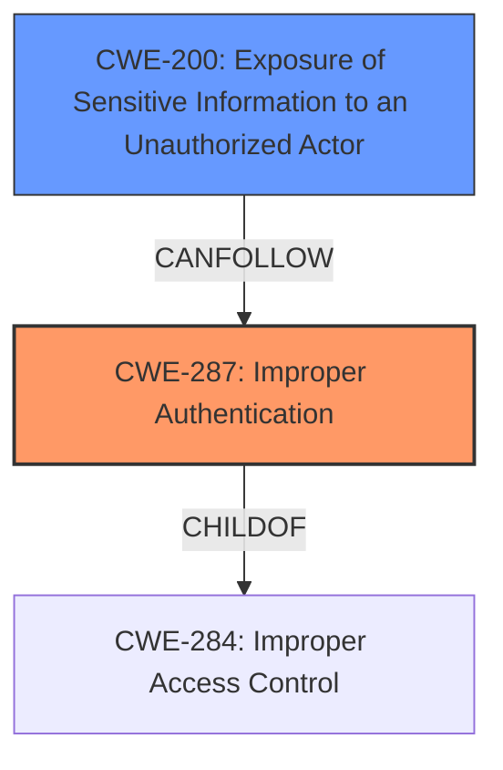

# Raw Analyzer Response for CVE-2021-32951

# Summary
| CWE ID | CWE Name | Confidence | CWE Abstraction Level | CWE Vulnerability Mapping Label | CWE-Vulnerability Mapping Notes |
|---|---|---|---|---|---|
| CWE-287 | Improper Authentication | 1.0 | Class | Primary | Discouraged |
| CWE-200 | Exposure of Sensitive Information to an Unauthorized Actor | 0.7 | Class | Secondary | Discouraged |

## Evidence and Confidence

*   **Confidence Score:** 0.9
*   **Evidence Strength:** HIGH

## Relationship Analysis
The primary relationship influencing the CWE selection is the hierarchical structure, specifically the parent-child relationship between CWE-284 (Improper Access Control) and CWE-287 (Improper Authentication). Although CWE-287 is a Class, it is a more direct match for the **improper authentication** root cause. CWE-200 (Exposure of Sensitive Information to an Unauthorized Actor) is a Class and represents the impact of the **improper authentication**, which resulted in unauthorized access to sensitive data. This relationship indicates a clear progression from the initial authentication failure to the subsequent data exposure.

## Vulnerability Chain
The vulnerability chain begins with **improper authentication** (CWE-287), which is the root cause. This leads directly to the impact of unauthorized users gaining access to resources and sensitive information, represented by CWE-200 (Exposure of Sensitive Information to an Unauthorized Actor).

## Summary of Analysis
Initially, the description points strongly to **improper authentication** as the root cause, which aligns with CWE-287. The "**improper authentication** vulnerability, which may allow unauthorized users to view resources monitored and controlled by the WebAccess/NMS, as well as IP addresses and names of all the devices managed via WebAccess/NMS" directly supports this. The reference links further confirm this with "The vulnerability is due to an improper authentication mechanism in Advantech WebAccess/NMS" and "Improper Authentication (CWE-287): The software fails to adequately verify user identity, allowing unauthorized access."

The impact of this **improper authentication** is the exposure of sensitive information, which is well-represented by CWE-200. The description explicitly states that unauthorized users can "view resources monitored and controlled by the WebAccess/NMS, as well as IP addresses and names of all the devices managed." This clear connection between the root cause and the resulting data exposure solidifies the selection of CWE-287 as the primary weakness and CWE-200 as a secondary impact.

The selected CWEs are at the optimal level of specificity, accurately capturing both the root cause and the direct impact of the vulnerability. CWE-287 is a Class, but the suggested alternatives like CWE-306 (Missing Authentication for Critical Function) and CWE-1390 (Weak Authentication) were considered, but CWE-287 is more appropriate since it generically covers **improper authentication**.

Relevant CWE Information:

# Enhanced Context (25 CWEs)
The following CWEs were identified as potentially relevant to this vulnerability:

## CWE-807: Reliance on Untrusted Inputs in a Security Decision
**Abstraction Level**: Base
**Similarity Score**: 0.76
**Source**: dense

**Description**:
The product uses a protection mechanism that relies on the existence or values of an input, but the input can be modified by an untrusted actor in a way that bypasses the protection mechanism.

**Mapping Guidance**:
- Usage: Allowed
- Rationale: This CWE entry is at the Base level of abstraction, which is a preferred level of abstraction for mapping to the root causes of vulnerabilities.

**Why Not Used**: This CWE is not directly applicable as the vulnerability is related to **improper authentication**, not specifically a reliance on untrusted inputs.

## CWE-41: Improper Resolution of Path Equivalence
**Abstraction Level**: Base
**Similarity Score**: 0.76
**Source**: dense

**Description**:
The product is vulnerable to file system contents disclosure through path equivalence. Path equivalence involves the use of special characters in file and directory names. The associated manipulations are intended to generate multiple names for the same object.

**Mapping Guidance**:
- Usage: Allowed
- Rationale: This CWE entry is at the Base level of abstraction, which is a preferred level of abstraction for mapping to the root causes of vulnerabilities.

**Why Not Used**: This CWE is not relevant as the vulnerability does not involve path equivalence or special characters in file names.

## CWE-668: Exposure of Resource to Wrong Sphere
**Abstraction Level**: Class
**Similarity Score**: 0.76
**Source**: dense

**Description**:
The product exposes a resource to the wrong control sphere, providing unintended actors with inappropriate access to the resource.

**Mapping Guidance**:
- Usage: Discouraged
- Rationale: CWE-668 is high-level and is often misused as a catch-all when lower-level CWE IDs might be applicable. It is sometimes used for low-information vulnerability reports [REF-1287]. It is a level-1 Class (i.e., a child of a Pillar). It is not useful for trend analysis.

**Why Not Used**: While the impact involves exposure of resources, the root cause is specifically **improper authentication**, making CWE-287 a more precise fit.

## CWE-23: Relative Path Traversal
**Abstraction Level**: Base
**Similarity Score**: 0.75
**Source**: dense

**Description**:
The product uses external input to construct a pathname that should be within a restricted directory, but it does not properly neutralize sequences such as ".." that can resolve to a location that is outside of that directory.

**Mapping Guidance**:
- Usage: Allowed
- Rationale: This CWE entry is at the Base level of abstraction, which is a preferred level of abstraction for mapping to the root causes of vulnerabilities.

**Why Not Used**: This CWE is not applicable as the vulnerability does not involve path traversal.

## CWE-639: Authorization Bypass Through User-Controlled Key
**Abstraction Level**: Base
**Similarity Score**: 0.75
**Source**: dense

**Description**:
The system's authorization functionality does not prevent one user from gaining access to another user's data or record by modifying the key value identifying the data.

**Mapping Guidance**:
- Usage: Allowed
- Rationale: This CWE entry is at the Base level of abstraction, which is a preferred level of abstraction for mapping to the root causes of vulnerabilities.

**Why Not Used**: While it could be argued that there's an authorization bypass, the root cause is at the authentication level, which is more accurately described by CWE-287.

## CWE-1390: Weak Authentication
**Abstraction Level**: Class
**Similarity Score**: 0.75
**Source**: dense

**Description**:
The product uses an authentication mechanism to restrict access to specific users or identities, but the mechanism does not sufficiently prove that the claimed identity is correct.

**Mapping Guidance**:
- Usage: Allowed-with-Review
- Rationale: This CWE entry is a Class and might have Base-level children that would be more appropriate

**Why Not Used**: Although this is a child of CWE-287: Improper Authentication, there isn't enough information to confirm the authentication is weak.

## CWE-274: Improper Handling of Insufficient Privileges
**Abstraction Level**: Base
**Similarity Score**: 0.75
**Source**: dense

**Description**:
The product does not handle or incorrectly handles when it has insufficient privileges to perform an operation, leading to resultant weaknesses.

**Mapping Guidance**:
- Usage: Discouraged
- Rationale: This CWE entry could be deprecated in a future version of CWE.

**Why Not Used**: This CWE does not apply because the vulnerability is not related to handling insufficient privileges.

## CWE-552: Files or Directories Accessible to External Parties
**Abstraction Level**: Base
**Similarity Score**: 0.74
**Source**: dense

**Description**:
The product makes files or directories accessible to unauthorized actors, even though they should not be.

**Mapping Guidance**:
- Usage: Allowed
- Rationale: This CWE entry is at the Base level of abstraction, which is a preferred level of abstraction for mapping to the root causes of vulnerabilities.

**Why Not Used**: This CWE is not as precise as CWE-200.

## CWE-280: Improper Handling of Insufficient Permissions or Privileges
**Abstraction Level**: Base
**Similarity Score**: 0.74
**Source**: dense

**Description**:
The product does not handle or incorrectly handles when it has insufficient