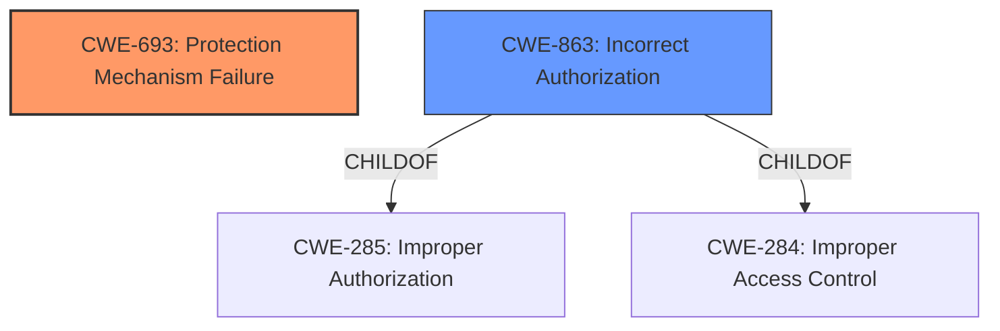

# Analysis Report for CVE-2021-32960

# Vulnerability Analysis Report: CVE-2021-32960

## Description


## Analysis (with Relationship Data)

# Summary
| CWE ID | CWE Name | Confidence | CWE Abstraction Level | CWE Vulnerability Mapping Label | CWE-Vulnerability Mapping Notes |
|---|---|---|---|---|---|
| CWE-693 | Protection Mechanism Failure | 0.8 | Pillar | Primary | Allowed |
| CWE-863 | Incorrect Authorization | 0.6 | Class | Secondary | Allowed-with-Review |

## Evidence and Confidence

*   **Confidence Score:** 0.7
*   **Evidence Strength:** MEDIUM

## Relationship Analysis
The primary CWE is CWE-693, which is a high-level Pillar. While not ideal, it's the most directly supported by the vulnerability description and "CVE Reference Links Content Summary". CWE-863 is a Class-level CWE and a potential child of CWE-285 (Improper Authorization) or CWE-284 (Improper Access Control), but the evidence does not strongly support a specific authorization flaw. The relationship between these CWEs is hierarchical, with CWE-693 being a broader category that can encompass authorization issues.



## Vulnerability Chain
The vulnerability chain starts with a **failure** in the FactoryTalk Security's protection mechanism. This **failure** leads to the potential **bypass** of security policies, ultimately granting an attacker unauthorized privileges.
  - **Root Cause:** CWE-693 Protection Mechanism Failure
  - **Impact:** Bypass of security policies, leading to unauthorized access

## Summary of Analysis
Initial Assessment:
The vulnerability description indicates that a remote, authenticated attacker can **bypass** FactoryTalk Security policies based on the computer name. The "CVE Reference Links Content Summary" confirms the **root cause** as a "Protection Mechanism Failure" and lists CWE-693. This directly supports the selection of CWE-693.

Criticism:
CWE-693 is a high-level "Pillar" and the mapping guidance discourages its use, recommending more specific children. However, the available evidence does not provide enough detail to pinpoint a more specific weakness. While the vulnerability involves **bypassing** security policies, suggesting an authorization issue, the root cause is explicitly identified as a "Protection Mechanism Failure." Without more details on *how* the protection mechanism fails, selecting a more specific CWE would be speculative.

Final Conclusion:
Based on the available evidence, CWE-693 is the most appropriate primary CWE. CWE-863 is a secondary candidate because the description notes the **bypass** of security policies.

Relevant Evidence:
- Vulnerability Description Key Phrases: "bypass FactoryTalk Security policies"
- CVE Reference Links Content Summary: "root_cause": "Protection Mechanism Failure", "weaknesses": ["CWE-693: Protection Mechanism Failure"]

The selection is based heavily on the "CVE Reference Links Content Summary," which explicitly states the **root cause** and associated CWE. While a more specific CWE might be ideal, the current evidence doesn't support it. The provided data points directly to a high-level **failure** in the protection mechanism. The confidence score reflects this limitation.

# Enhanced Context (25 CWEs)
The following CWEs were identified as potentially relevant to this vulnerability:

## CWE-807: Reliance on Untrusted Inputs in a Security Decision
**Abstraction Level**: Base
**Similarity Score**: 0.77

**Description**:
The product uses a protection mechanism that relies on the existence or values of an input, but the input can be modified by an untrusted actor in a way that bypasses the protection mechanism.

**Mapping Guidance**:
- Usage: Allowed
- Rationale: This CWE entry is at the Base level of abstraction, which is a preferred level of abstraction for mapping to the root causes of vulnerabilities.
**Analysis:** This CWE could be applicable if the computer name is the untrusted input, but the description does not elaborate enough to make that determination. It is not selected due to lack of evidence.

## CWE-1391: Use of Weak Credentials
**Abstraction Level**: Class
**Similarity Score**: 0.76

**Description**:
The product uses weak credentials (such as a default key or hard-coded password) that can be calculated, derived, reused, or guessed by an attacker.

**Mapping Guidance**:
- Usage: Allowed-with-Review
- Rationale: This CWE entry is a Class and might have Base-level children that would be more appropriate
**Analysis:** This CWE is not applicable because the **bypass** is based on the computer name, not the credentials themselves.

## CWE-668: Exposure of Resource to Wrong Sphere
**Abstraction Level**: Class
**Similarity Score**: 0.76

**Description**:
The product exposes a resource to the wrong control sphere, providing unintended actors with inappropriate access to the resource.

**Mapping Guidance**:
- Usage: Discouraged
- Rationale: CWE-668 is high-level and is often misused as a catch-all when lower-level CWE IDs might be applicable. It is sometimes used for low-information vulnerability reports [REF-1287]. It is a level-1 Class (i.e., a child of a Pillar). It is not useful for trend analysis.
**Analysis:** This CWE is too general and is discouraged.

## CWE-538: Insertion of Sensitive Information into Externally-Accessible File or Directory
**Abstraction Level**: Base
**Similarity Score**: 0.76

**Description**:
The product places sensitive information into files or directories that are accessible to actors who are allowed to have access to the files, but not to the sensitive information.

**Mapping Guidance**:
- Usage: Allowed
- Rationale: This CWE entry is at the Base level of abstraction, which is a preferred level of abstraction for mapping to the root causes of vulnerabilities.
**Analysis:** This CWE is not applicable because there is no mention of placing sensitive information into files or directories.

## CWE-1390: Weak Authentication
**Abstraction Level**: Class
**Similarity Score**: 0.76

**Description**:
The product uses an authentication mechanism to restrict access to specific users or identities, but the mechanism does not sufficiently prove that the claimed identity is correct.

**Mapping Guidance**:
- Usage: Allowed-with-Review
- Rationale: This CWE entry is a Class and might have Base-level children that would be more appropriate
**Analysis:** This CWE is not applicable because the attacker is authenticated. The issue arises after authentication, when the security policies are **bypassed**.

## CWE-303: Incorrect Implementation of Authentication Algorithm
**Abstraction Level**: Base
**Similarity Score**: 0.75

**Description**:
The requirements for the product dictate the use of an established authentication algorithm, but the implementation of the algorithm is incorrect.

**Mapping Guidance**:
- Usage: Allowed
- Rationale: This CWE entry is at the Base level of abstraction, which is a preferred level of abstraction for mapping to the root causes of vulnerabilities.
**Analysis:** This CWE is not applicable because the attacker is authenticated. The issue arises after authentication, when the security policies are **bypassed**.

## CWE-497: Exposure of Sensitive System Information to an Unauthorized Control Sphere
**Abstraction Level**: Base
**Similarity Score**: 0.75

**Description**:
The product does not properly prevent sensitive system-level information from being accessed by unauthorized actors who do not have the same level of access to the underlying system as the product does.

**Mapping Guidance**:
- Usage: Allowed
- Rationale: This CWE entry is at the Base level of abstraction, which is a preferred level of abstraction for mapping to the root causes of vulnerabilities.
**Analysis:** This CWE is not applicable because the vulnerability is related to **bypassing** security policies, not directly exposing sensitive system information.

## CWE-212: Improper Removal of Sensitive Information Before Storage or Transfer
**Abstraction Level**: Base
**Similarity Score**: 0.75

**Description**:
The product stores, transfers, or shares a resource that contains sensitive information, but it does not properly remove that information before the product makes the resource available to unauthorized actors.

**Mapping Guidance**:
- Usage: Allowed
- Rationale: This CWE entry is at the Base level of abstraction, which is a preferred level of abstraction for mapping to the root causes of vulnerabilities.
**Analysis:** This CWE is not applicable because there is no evidence that sensitive information is being stored or transferred without proper removal.

## CWE-319: Cleartext Transmission of Sensitive Information
**Abstraction Level**: Base
**Similarity Score**: 0.75

**Description**:
The product transmits sensitive or security-critical data in cleartext in a communication channel that can be sniffed by unauthorized actors.

**Mapping Guidance


## CWE Relationship Analysis

Current CWEs represent these abstraction levels: .


### Vulnerability Chain Analysis

**Chain starting from CWE-303:**
- 303 (Incorrect Implementation of Authentication Algorithm) - ROOT


**Chain starting from CWE-497:**
- 497 (Exposure of Sensitive System Information to an Unauthorized Control Sphere) - ROOT


### CWE Relationship Diagram

```mermaid
graph TD
    classDef primary fill:#f96,stroke:#333,stroke-width:2px
    classDef secondary fill:#69f,stroke:#333
    classDef tertiary fill:#9e9,stroke:#333
```


*Report generated on 2025-04-02 01:55:26*
