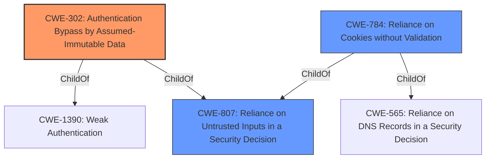

# Analysis Report for CVE-2021-3297

# Vulnerability Analysis Report: CVE-2021-3297

## Description


## Analysis (with Relationship Data)

# Summary
| CWE ID | CWE Name | Confidence | CWE Abstraction Level | CWE Vulnerability Mapping Label | CWE-Vulnerability Mapping Notes |
|---|---|---|---|---|---|
| CWE-302 | Authentication Bypass by Assumed-Immutable Data | 0.9 | Base | Allowed | Primary CWE |
| CWE-807 | Reliance on Untrusted Inputs in a Security Decision | 0.7 | Base | Allowed | Secondary Candidate |
| CWE-784 | Reliance on Cookies without Validation and Integrity Checking in a Security Decision | 0.6 | Variant | Allowed | Secondary Candidate |

## Evidence and Confidence

*   **Confidence Score:** 0.9
*   **Evidence Strength:** MEDIUM

## Relationship Analysis
The primary CWE is CWE-302, which represents the core issue of bypassing authentication by manipulating assumed-immutable data. This is directly related to CWE-807, as the cookie is an untrusted input used in a security decision. CWE-784 is a more specific variant of CWE-807, focusing on cookies, and could be considered if the reliance on cookies is a prominent aspect.



## Vulnerability Chain
The vulnerability chain starts with the **incorrect assumption** that the cookie value is immutable and trustworthy. By setting the login cookie to 1, an attacker gains administrator access, bypassing the intended authentication mechanism.

## Summary of Analysis
The initial analysis identified CWE-302 as the most relevant CWE because the vulnerability hinges on manipulating a cookie (assumed-immutable data) to bypass authentication. This is supported by the vulnerability description: "setting the login cookie to 1 provides administrator access."

CWE-807 is also relevant as it describes reliance on untrusted inputs in security decisions, and the cookie is an untrusted input. However, CWE-302 is a more precise description of the vulnerability. CWE-784 is more specific to cookies, but lacks complete evidence to support its use. The evidence points to the bypass and not the cookie validation.

I am prioritizing CWE-302 because it directly addresses the **authentication bypass** mechanism. The relationship graph shows how CWE-302 is a child of CWE-1390 (Weak Authentication) and CWE-807.

Relevant CWE Information:

# Enhanced Context (25 CWEs)
The following CWEs were identified as potentially relevant to this vulnerability:

## CWE-807: Reliance on Untrusted Inputs in a Security Decision
**Abstraction Level**: Base
**Similarity Score**: 0.79
**Source**: dense

**Description**:
The product uses a protection mechanism that relies on the existence or values of an input, but the input can be modified by an untrusted actor in a way that bypasses the protection mechanism.

**Mapping Guidance**:
- Usage: Allowed
- Rationale: This CWE entry is at the Base level of abstraction, which is a preferred level of abstraction for mapping to the root causes of vulnerabilities.

## CWE-302: Authentication Bypass by Assumed-Immutable Data
**Abstraction:** Base
**Similarity Score**: 0.75
**Source**: dense

**Description**:
The authentication scheme or implementation uses key data elements that are assumed to be immutable, but can be controlled or modified by the attacker.

**Mapping Guidance**:
**Usage:** Allowed
**Rationale:** This CWE entry is at the Base level of abstraction, which is a preferred level of abstraction for mapping to the root causes of vulnerabilities.

## CWE-784: Reliance on Cookies without Validation and Integrity Checking in a Security Decision
**Abstraction:** Variant
**Similarity Score**: 0.036
**Source**: sparse

**Description**:
The product uses a protection mechanism that relies on the existence or values of a cookie, but it does not properly ensure that the cookie is valid for the associated user.

**Mapping Guidance**:
**Usage:** Allowed
**Rationale:** This CWE entry is at the Variant level of abstraction, which is a preferred level of abstraction for mapping to the root causes of vulnerabilities.


## CWE Relationship Analysis

Current CWEs represent these abstraction levels: .


### Vulnerability Chain Analysis

**Chain starting from CWE-784:**
- 784 (Reliance on Cookies without Validation and Integrity Checking in a Security Decision) - ROOT


**Chain starting from CWE-807:**
- 807 (Reliance on Untrusted Inputs in a Security Decision) - ROOT


### CWE Relationship Diagram

```mermaid
graph TD
    classDef primary fill:#f96,stroke:#333,stroke-width:2px
    classDef secondary fill:#69f,stroke:#333
    classDef tertiary fill:#9e9,stroke:#333
```


*Report generated on 2025-04-02 14:25:48*
