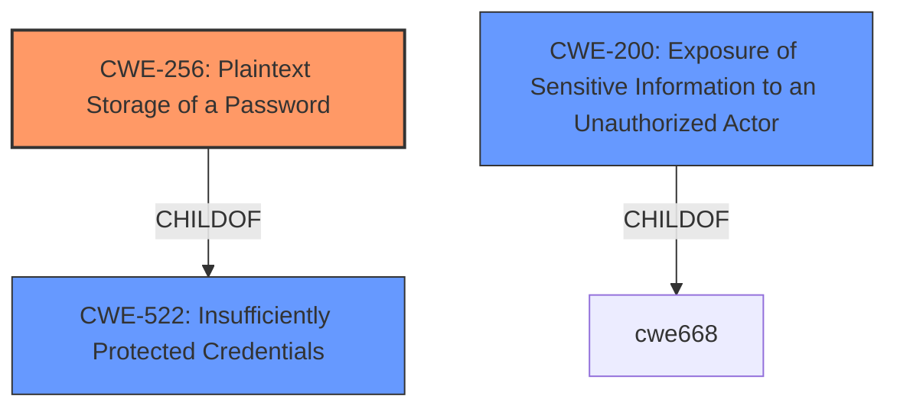

# Enhanced Analysis for CVE-2021-32978

# Summary
| CWE ID  | CWE Name                                          | Confidence | CWE Abstraction Level | CWE Vulnerability Mapping Label | CWE-Vulnerability Mapping Notes |
| :-------- | :------------------------------------------------ | :--------- | :-------------------- | :------------------------------ | :------------------------------ |
| CWE-256   | Plaintext Storage of a Password                   | 0.9        | Base                  | Primary                         | Allowed                       |
| CWE-200   | Exposure of Sensitive Information to an Unauthorized Actor | 0.6        | Class                 | Secondary                       | Discouraged                   |

## Evidence and Confidence

*   **Confidence Score:** 0.75
*   **Evidence Strength:** HIGH

## Relationship Analysis
The primary relationship influencing the selection was the ChildOf relationship between CWE-256 and CWE-522 (Insufficiently Protected Credentials), and also the high retriever score for CWE-256, which is the more specific Base level CWE. CWE-200 was considered a possible consequence, which is why it was included.



## Vulnerability Chain
The vulnerability chain starts with the **weakness** of storing the password in a way that it can be read, leading to the impact of unlocking the PLC.
  - **Root Cause:** CWE-256 Plaintext Storage of a Password
  - **Impact:** CWE-200 Exposure of Sensitive Information to an Unauthorized Actor

## Summary of Analysis
The initial analysis focused on identifying the root cause of the vulnerability, which is the **weakness** of storing a password in plaintext. The provided evidence explicitly states that "The programming protocol allows an attacker to **read a previously entered password** and the lock state of the PLC" and "The PLC **stores the previously entered password** in a way that is accessible to an attacker via the programming protocol". This clearly indicates **CWE-256 Plaintext Storage of a Password** as the most appropriate CWE. The retriever results also ranked CWE-256 as the top combined result with a score of 0.405.

The relationship analysis further supports this selection, as CWE-256 is a child of CWE-522 (Insufficiently Protected Credentials), providing a more specific classification. While CWE-522 could be considered, CWE-256 is preferred due to its greater specificity.

CWE-200 Exposure of Sensitive Information to an Unauthorized Actor was considered as a potential CWE, given that the password can be read by an attacker. However, it is a class-level CWE and is often misused to represent the impact rather than the root cause. It's included as a secondary candidate as it represents the direct impact of the plaintext storage.

The decision to use CWE-256 is based on the explicit evidence of plaintext password storage and its alignment with the CWE's description and mapping guidance.

Relevant CWE Information:

# Enhanced Context (25 CWEs)
The following CWEs were identified as potentially relevant to this vulnerability:

## CWE-256: Plaintext Storage of a Password
**Abstraction Level**: Base
**Similarity Score**: 0.405 (sparse)

**Description**:
Storing a password in plaintext may result in a system compromise.

**Mapping Guidance**:
- Usage: Allowed
- Rationale: This CWE entry is at the Base level of abstraction, which is a preferred level of abstraction for mapping to the root causes of vulnerabilities.

## CWE-200: Exposure of Sensitive Information to an Unauthorized Actor
**Abstraction Level**: Class
**Similarity Score**: 0.255 (sparse)

**Description**:
The product exposes sensitive information to an actor that is not explicitly authorized to have access to that information.

**Mapping Guidance**:
- Usage: Discouraged
- Rationale: CWE-200 is commonly misused to represent the loss of confidentiality in a vulnerability, but confidentiality loss is a technical impact - not a root cause error.


## CWE Relationship Analysis

Current CWEs represent these abstraction levels: .


### Vulnerability Chain Analysis

**Chain starting from CWE-256:**
- 256 (Plaintext Storage of a Password) - ROOT


**Chain starting from CWE-200:**
- 200 (Exposure of Sensitive Information to an Unauthorized Actor) - ROOT


### CWE Relationship Diagram

```mermaid
graph TD
    classDef primary fill:#f96,stroke:#333,stroke-width:2px
    classDef secondary fill:#69f,stroke:#333
    classDef tertiary fill:#9e9,stroke:#333
```