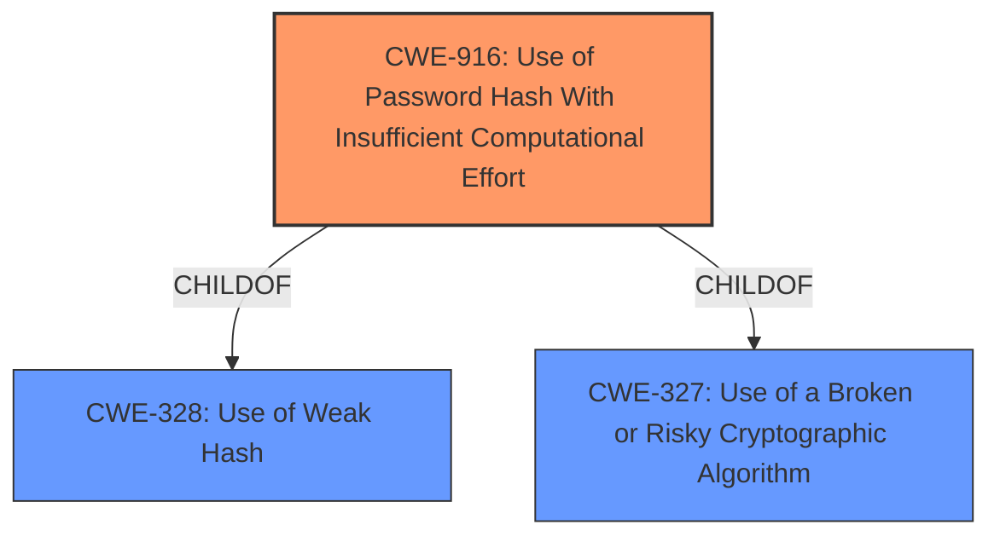

# Raw Analyzer Response for CVE-2021-33003

# Summary
| CWE ID | CWE Name | Confidence | CWE Abstraction Level | CWE Vulnerability Mapping Label | CWE-Vulnerability Mapping Notes |
|---|---|---|---|---|---|
| CWE-916 | Use of Password Hash With Insufficient Computational Effort | 1.0 | Base | Allowed | Primary CWE |
| CWE-328 | Use of Weak Hash | 0.8 | Base | Allowed | Secondary Candidate |
| CWE-327 | Use of a Broken or Risky Cryptographic Algorithm | 0.6 | Class | Allowed-with-Review | Secondary Candidate |

## Evidence and Confidence

*   **Confidence Score:** 0.9
*   **Evidence Strength:** HIGH

## Relationship Analysis
The primary CWE, CWE-916, is a child of both CWE-328 and CWE-327. This indicates a hierarchical relationship where using a password hash with insufficient computational effort (CWE-916) is a specific type of using a weak hash (CWE-328) or a broken/risky cryptographic algorithm (CWE-327). The abstraction levels also influenced the selection, favoring the more specific Base level CWE-916 over the more general Class level CWE-327.

## Vulnerability Chain
The vulnerability chain starts with the root cause, which is the **use of a weak hashing algorithm**. This leads directly to the impact, which is that an attacker can **retrieve passwords in cleartext**.
  - The chain is: **Weak Hashing Algorithm** -> **Passwords Retrievable in Cleartext**

## Summary of Analysis
The initial analysis identified the **weak hashing algorithm** as the root cause, leading to the possibility of retrieving passwords in cleartext. The Retriever Results and the CVE reference link content summary pointed strongly towards CWE-916 (Use of Password Hash With Insufficient Computational Effort) and CWE-328 (Use of Weak Hash).

The evidence from the "CVE Reference Links Content Summary" states: "The vulnerability stems from the **use of a weak hashing algorithm** for password storage" and "Weaknesses/vulnerabilities present: Use of Password Hash with Insufficient Computational Effort (CWE-916)." The "Vulnerability Description Key Phrases" also highlight the "**weak hashing algorithm**" as the root cause.

CWE-916 is the most specific and accurate representation of the vulnerability, as it explicitly addresses the use of password hashes with insufficient computational effort, which aligns perfectly with the vulnerability description and the CVE details. CWE-328 is a more general case of using a weak hash, and while applicable, CWE-916 provides a more precise classification. CWE-327, Use of a Broken or Risky Cryptographic Algorithm, is even more general and less specific to password hashing, making it a less suitable choice.

The graph relationships reinforce the choice of CWE-916, as it is a child of both CWE-328 and CWE-327, indicating that it is a more specialized form of these weaknesses. The MITRE mapping guidance also supports this decision, as CWE-916 is at the Base level of abstraction, which is the preferred level for mapping root causes. The mapping guidance for CWE-916 indicates "Allowed" usage.

The selected CWEs are at the optimal level of specificity because they directly address the root cause of the vulnerability (insufficient computational effort in password hashing) and avoid more general classifications that would not capture the specific nature of the weakness.

Relevant CWE Information:

# Enhanced Context (25 CWEs)
The following CWEs were identified as potentially relevant to this vulnerability:

## CWE-330: Use of Insufficiently Random Values
**Abstraction Level**: Class
**Similarity Score**: 0.79
**Source**: dense

**Description**:
The product uses insufficiently random numbers or values in a security context that depends on unpredictable numbers.

**Mapping Guidance**:
- Usage: Discouraged
- Rationale: This CWE entry is a level-1 Class (i.e., a child of a Pillar). It might have lower-level children that would be more appropriate

*Rationale for not selecting*: This vulnerability is related to hashing rather than randomness, making CWE-330 unsuitable.

## CWE-1240: Use of a Cryptographic Primitive with a Risky Implementation
**Abstraction Level**: Base
**Similarity Score**: 0.79
**Source**: dense

**Description**:
To fulfill the need for a cryptographic primitive, the product implements a cryptographic algorithm using a non-standard, unproven, or disallowed/non-compliant cryptographic implementation.

**Mapping Guidance**:
- Usage: Allowed
- Rationale: This CWE entry is at the Base level of abstraction, which is a preferred level of abstraction for mapping to the root causes of vulnerabilities.

*Rationale for not selecting*: While the vulnerability does involve a cryptographic primitive (hashing), the issue is not with the implementation being risky, but rather with the algorithm itself being weak.

## CWE-335: Incorrect Usage of Seeds in Pseudo-Random Number Generator (PRNG)
**Abstraction Level**: Base
**Similarity Score**: 0.79
**Source**: dense

**Description**:
The product uses a Pseudo-Random Number Generator (PRNG) but does not correctly manage seeds.

**Mapping Guidance**:
- Usage: Allowed
- Rationale: This CWE entry is at the Base level of abstraction, which is a preferred level of abstraction for mapping to the root causes of vulnerabilities.

*Rationale for not selecting*: This vulnerability is related to hashing rather than randomness, making CWE-335 unsuitable.

## CWE-331: Insufficient Entropy
**Abstraction Level**: Base
**Similarity Score**: 0.78
**Source**: dense

**Description**:
The product uses an algorithm or scheme that produces insufficient entropy, leaving patterns or clusters of values that are more likely to occur than others.

**Mapping Guidance**:
- Usage: Allowed
- Rationale: This CWE entry is at the Base level of abstraction, which is a preferred level of abstraction for mapping to the root causes of vulnerabilities.

*Rationale for not selecting*: This vulnerability is related to hashing rather than randomness, making CWE-331 unsuitable.

## CWE-328: Use of Weak Hash
**Abstraction Level**: Base
**Similarity Score**: 0.78
**Source**: dense

**Description**:
The product uses an algorithm that produces a digest (output value) that does not meet security expectations for a hash function that allows an adversary to reasonably determine the original input (preimage attack), find another input that can produce the same hash (2nd preimage attack), or find multiple inputs that evaluate to the same hash (birthday attack).

**Mapping Guidance**:
- Usage: Allowed
- Rationale: This CWE entry is at the Base level of abstraction, which is a preferred level of abstraction for mapping to the root causes of vulnerabilities.

*Rationale for selecting as Secondary Candidate*: While CWE-916 is more specific, CWE-328 also applies as it describes the use of a weak hash function.

## CWE-338: Use of Cryptographically Weak Pseudo-Random Number Generator (PRNG)
**Abstraction Level**: Base
**Similarity Score**: 0.78
**Source**: dense

**Description**:
The product uses a Pseudo-Random Number Generator (PRNG) in a security context, but the PRNG's algorithm is not cryptographically strong.

**Mapping Guidance**:
- Usage: Allowed
- Rationale: This CWE entry is at the Base level of abstraction, which is a preferred level of abstraction for mapping to the root causes of vulnerabilities.

*Rationale for not selecting*: This vulnerability is related to hashing rather than randomness, making CWE-338 unsuitable.

## CWE-916: Use of Password Hash With Insufficient Computational Effort
**Abstraction Level**: Base
**Similarity Score**: 0.77
**Source**: dense

**Description**:
The product generates a hash for a password, but it uses a scheme that does not provide a sufficient level of computational effort that would make password cracking attacks infeasible or expensive.

**Mapping Guidance**:
- Usage: Allowed
- Rationale: This CWE entry is at the Base level of abstraction, which is a preferred level of abstraction for mapping to the root causes of vulnerabilities.

*Rationale for selecting as Primary CWE*: This CWE directly addresses the **weakness** described in the vulnerability description, which is the **use of a password hash with insufficient computational effort.**

## CWE-1391: Use of Weak Credentials
**Abstraction Level**: Class
**Similarity Score**: 0.77
**