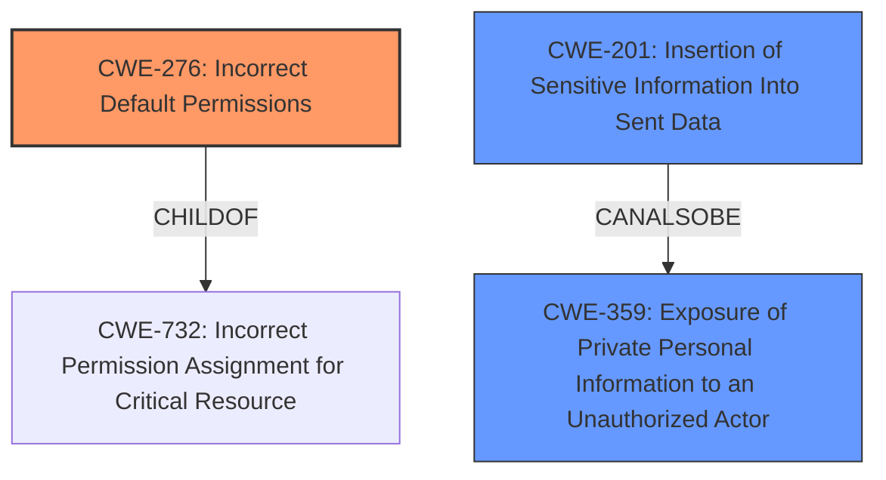

# Raw Analyzer Response for CVE-2021-33038

# Summary
| CWE ID | CWE Name | Confidence | CWE Abstraction Level | CWE Vulnerability Mapping Label | CWE-Vulnerability Mapping Notes |
|---|---|---|---|---|---|
| CWE-276 | Incorrect Default Permissions | 0.75 | Base | Allowed | Primary CWE |
| CWE-201 | Insertion of Sensitive Information Into Sent Data | 0.6 | Base | Allowed | Secondary Candidate |
| CWE-359 | Exposure of Private Personal Information to an Unauthorized Actor | 0.6 | Base | Allowed | Secondary Candidate |

## Evidence and Confidence

*   **Confidence Score:** 0.7
*   **Evidence Strength:** HIGH

## Relationship Analysis
The primary CWE, **CWE-276 (Incorrect Default Permissions)**, is related to the broader issue of **CWE-732 (Incorrect Permission Assignment for Critical Resource)**, indicating a hierarchical parent-child relationship. The other considered CWEs, such as **CWE-201 (Insertion of Sensitive Information Into Sent Data)** and **CWE-359 (Exposure of Private Personal Information to an Unauthorized Actor)**, are related to the overall impact of the vulnerability. These relationships help to contextualize the specific flaw within a broader security landscape.

## Vulnerability Chain
The vulnerability chain starts with the **incorrect default setting** of "public" for archive visibility (**CWE-276**). This leads to the **exposure of private mailing list archives** during the import process (**CWE-201**, **CWE-359**), ultimately resulting in a **privacy violation** and potential **data leakage**.

## Summary of Analysis
Initially, the analysis considered several CWEs, including those related to sensitive information exposure. However, the root cause evidence clearly pointed to an **incorrect default permission** being the primary issue. The "CVE Reference Links Content Summary" explicitly mentions that "Hyperkitty created a new `hyperkitty_mailinglist` database entry with a default setting of `archive_policy = 'public'`." This evidence strongly supports the selection of **CWE-276 (Incorrect Default Permissions)** as the primary CWE. While **CWE-201 (Insertion of Sensitive Information Into Sent Data)** and **CWE-359 (Exposure of Private Personal Information to an Unauthorized Actor)** are relevant due to the sensitive information being exposed, they represent the impact of the vulnerability rather than the root cause. The selection of **CWE-276** is at the optimal level of specificity, as it directly addresses the coding error that led to the vulnerability. The retriever result gives **CWE-276** a sparse score of 0.162.

Relevant CWE Information:

# Enhanced Context (25 CWEs)
The following CWEs were identified as potentially relevant to this vulnerability:

## CWE-276: Incorrect Default Permissions
**Abstraction Level**: Base
**Similarity Score**: 0.78
**Source**: dense

**Description**:
During installation, installed file permissions are set to allow anyone to modify those files.

**Mapping Guidance**:
- Usage: Allowed
- Rationale: This CWE entry is at the Base level of abstraction, which is a preferred level of abstraction for mapping to the root causes of vulnerabilities.

### Technical Explanation for Selected CWE(s):

*   **CWE-276: Incorrect Default Permissions**
    *   **How the vulnerability's details match the CWE's characteristics:** The vulnerability arises because the default archive policy for new mailing lists is set to "public" instead of "private." This **incorrect default** directly aligns with the description of **CWE-276**, which focuses on misconfigured default permissions during installation or setup.
    *   **The security implications and potential impact:** The incorrect default setting leads to private mailing list archives being publicly accessible during the import process, resulting in potential data leakage and privacy violations.
    *   **Any parent-child relationships or chain patterns that influenced your mapping:** **CWE-276** is a child of **CWE-732 (Incorrect Permission Assignment for Critical Resource)**, indicating a broader category of permission-related issues.
    *   **Whether the weakness is primary or secondary in the vulnerability:** This is the **primary** weakness, as the entire vulnerability stems from this misconfiguration.
    *   **How the official MITRE mapping guidance influenced your decision:** The mapping guidance for **CWE-276** states that it is at the Base level of abstraction, making it a preferred level for mapping root causes. The guidance also advises carefully reading the name and description to ensure an appropriate fit, which is confirmed in this analysis.
*   **CWE-201: Insertion of Sensitive Information Into Sent Data**
    *   **How the vulnerability's details match the CWE's characteristics:** The exposure of private mailing list archives to the public means that sensitive information is being sent to an unauthorized actor.
    *   **The security implications and potential impact:** Data Leakage.
    *   **Any parent-child relationships or chain patterns that influenced your mapping:** This is a consequence of CWE-276, where sensitive data is exposed because of the initial misconfiguration.
    *   **Whether the weakness is primary or secondary in the vulnerability:** This is a secondary weakness.
    *   **How the official MITRE mapping guidance influenced your decision:** The mapping guidance for **CWE-201** states that it is at the Base level of abstraction, making it a preferred level for mapping.
*   **CWE-359: Exposure of Private Personal Information to an Unauthorized Actor**
    *   **How the vulnerability's details match the CWE's characteristics:** The exposure of private mailing list archives to the public means that personal information is being sent to an unauthorized actor.
    *   **The security implications and potential impact:** Privacy violation.
    *   **Any parent-child relationships or chain patterns that influenced your mapping:** This is a consequence of CWE-276, where private information is exposed because of the initial misconfiguration.
    *   **Whether the weakness is primary or secondary in the vulnerability:** This is a secondary weakness.
    *   **How the official MITRE mapping guidance influenced your decision:** The mapping guidance for **CWE-359** states that it is at the Base level of abstraction, making it a preferred level for mapping.

### Other CWEs Considered But Not Used:

*   **CWE-226 (Sensitive Information in Resource Not Removed Before Reuse):** While sensitive information is exposed, the core issue is not the failure to remove information before reuse but the initial incorrect setting.
*   **CWE-532 (Insertion of Sensitive Information into Log File):** The sensitive information is not being written to a log file.
*   **CWE-770 (Allocation of Resources Without Limits or Throttling):** This CWE is related to resource management, which is not directly related to this vulnerability.