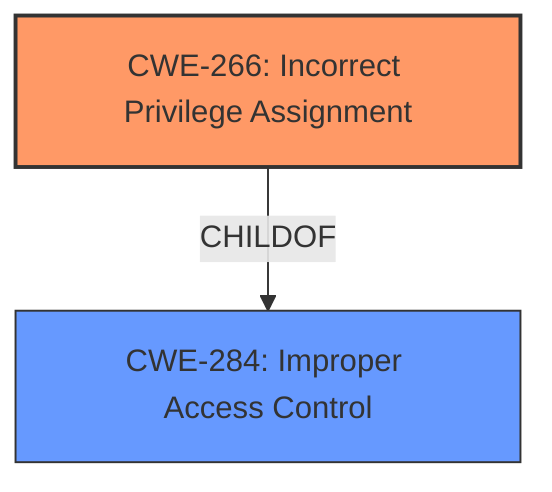

# Raw Analyzer Response for CVE-2021-33058

# Summary
| CWE ID | CWE Name | Confidence | CWE Abstraction Level | CWE Vulnerability Mapping Label | CWE-Vulnerability Mapping Notes |
|---|---|---|---|---|---|
| CWE-266 | Incorrect Privilege Assignment | 0.8 | Base | Allowed | Primary CWE |
| CWE-284 | Improper Access Control | 0.5 | Pillar | Discouraged | Secondary Candidate |

## Evidence and Confidence

*   **Confidence Score:** 0.8
*   **Evidence Strength:** HIGH

## Relationship Analysis
The primary CWE is CWE-266, a base-level CWE which is a child of the pillar CWE-284. The vulnerability involves **improper access control** leading to privilege escalation, which aligns with the concept of assigning incorrect privileges. The analysis considered the hierarchical relationship where CWE-266 is more specific than its parent, CWE-284, hence it was preferred.

## Vulnerability Chain
The chain of events is:
1.  **Root Cause:** **Incorrect Privilege Assignment** (CWE-266)
2.  **Impact:** Escalation of privilege

## Summary of Analysis
The initial analysis and criticism focused on identifying the root cause of the vulnerability. The vulnerability description clearly states **"Improper access control"** in the installer, leading to privilege escalation. The CVE reference summary confirms this by mentioning **"Improper access control in the installer"** as the root cause and **"Escalation of privilege"** as the impact.

The retriever results suggested CWE-284 (Improper Access Control) as a potential match. However, CWE-284 is a high-level Pillar CWE, and the description mentions privilege escalation. CWE-266 (Incorrect Privilege Assignment) is a base-level CWE and a child of CWE-284, and it more accurately describes the root cause where the installer **incorrectly assigns privileges**, thus leading to privilege escalation.

Therefore, the final decision is to select CWE-266 (Incorrect Privilege Assignment) as the primary CWE. This decision is based on the evidence from the vulnerability description and CVE reference links, the hierarchical relationship between CWE-266 and CWE-284, and the MITRE mapping guidance to prefer more specific base-level CWEs.

Relevant CWE Information:

# Enhanced Context (25 CWEs)

## CWE-266: Incorrect Privilege Assignment
**Abstraction:** Base
**Similarity Score**: 3.64
**Source**: graph

**Description**:
CWE-266: Incorrect Privilege Assignment

**Mapping Guidance**:
- Usage: Allowed
- Rationale: This CWE entry is at the Base level of abstraction, which is a preferred level of abstraction for mapping to the root causes of vulnerabilities.

**Relationships**:
- PARENTOF -> CWE-9
- PARENTOF -> CWE-556
- PARENTOF -> CWE-520
- PARENTOF -> CWE-1022
- CANALSOBE -> CWE-286

CWE-284 was considered but not selected as the primary CWE because it is a high-level Pillar CWE, and CWE-266, a child of CWE-284, is a more specific base-level CWE that better describes the root cause of the vulnerability. CWE-284 is retained as a secondary candidate due to the presence of **Improper access control** in the vulnerability description.