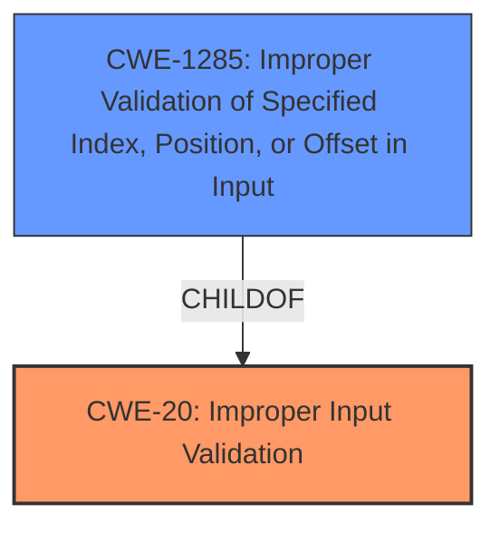

# Analysis Report for CVE-2021-33059

# Vulnerability Analysis Report: CVE-2021-33059

## Description


## Analysis (with Relationship Data)

# Summary
| CWE ID | CWE Name | Confidence | CWE Abstraction Level | CWE Vulnerability Mapping Label | CWE-Vulnerability Mapping Notes |
|---|---|---|---|---|---|
| CWE-20 ([CWE-20: Improper Input Validation](https://cwe.mitre.org/data/definitions/20.html)) | Improper Input Validation | 0.9 | Class | Discouraged | The root cause is **improper input validation**. Consider more specific child CWEs. |
| CWE-1285 ([CWE-1285: Improper Validation of Specified Index, Position, or Offset in Input](https://cwe.mitre.org/data/definitions/1285.html)) | Improper Validation of Specified Index, Position, or Offset in Input | 0.7 | Base | Allowed | A more specific child of CWE-20 that may be applicable if the input is related to index, position, or offset. |

## Evidence and Confidence

*   **Confidence Score:** 0.8
*   **Evidence Strength:** HIGH

## Relationship Analysis
The primary CWE is CWE-20 ([CWE-20: Improper Input Validation](https://cwe.mitre.org/data/definitions/20.html)), which is a class-level CWE. While it directly matches the **root cause** of the vulnerability, it is generally recommended to use more specific base or variant-level CWEs when available. CWE-1285 ([CWE-1285: Improper Validation of Specified Index, Position, or Offset in Input](https://cwe.mitre.org/data/definitions/1285.html)) is a base-level CWE and a child of CWE-20. If the **improper input validation** specifically involves an index, position, or offset, CWE-1285 would be a more appropriate choice.



## Vulnerability Chain
The vulnerability chain starts with **improper input validation** (CWE-20), which leads to a potential escalation of privilege. The specific mechanism by which the **improper input validation** enables privilege escalation isn't detailed in the provided description, representing a missing link in the chain.

## Summary of Analysis
The initial assessment identified CWE-20 ([CWE-20: Improper Input Validation](https://cwe.mitre.org/data/definitions/20.html)) as the primary weakness, based on the description stating "**Improper input validation**". The "CVE Reference Links Content Summary" also confirms this **root cause**: "**Root Cause of Vulnerability:** * Improper input validation in the Intel(R) Administrative Tools for Intel(R) Network Adapters driver for Windows."

CWE-20 ([CWE-20: Improper Input Validation](https://cwe.mitre.org/data/definitions/20.html)) is a class-level CWE and the mapping guidance discourages its use when more specific CWEs are available. Several child CWEs of CWE-20 were considered, with CWE-1285 ([CWE-1285: Improper Validation of Specified Index, Position, or Offset in Input](https://cwe.mitre.org/data/definitions/1285.html)) being a potential candidate if the input relates to an index, position or offset. However, since the vulnerability description doesn't specify the type of input that's improperly validated, CWE-20 ([CWE-20: Improper Input Validation](https://cwe.mitre.org/data/definitions/20.html)) remains the most accurate classification based solely on the available evidence.

If more information were available indicating the nature of the **improperly validated input**, a more specific CWE could be assigned.

Relevant CWE Information:


## CWE Relationship Analysis

Current CWEs represent these abstraction levels: .


### Vulnerability Chain Analysis

**Chain starting from CWE-1285:**
- 1285 (Improper Validation of Specified Index, Position, or Offset in Input) - ROOT


**Chain starting from CWE-20:**
- 20 (Improper Input Validation) - ROOT


### CWE Relationship Diagram

```mermaid
graph TD
    classDef primary fill:#f96,stroke:#333,stroke-width:2px
    classDef secondary fill:#69f,stroke:#333
    classDef tertiary fill:#9e9,stroke:#333
```


*Report generated on 2025-04-02 00:37:24*
