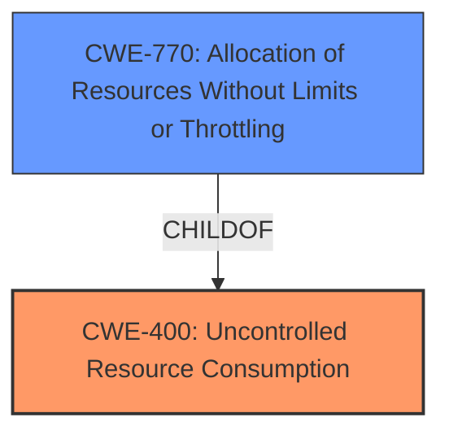

# Enhanced Analysis for CVE-2021-33073

# Summary
| CWE ID | CWE Name | Confidence | CWE Abstraction Level | CWE Vulnerability Mapping Label | CWE-Vulnerability Mapping Notes |
|---|---|---|---|---|---|
| CWE-400 | Uncontrolled Resource Consumption | 0.9 | Class | Primary | Discouraged |
| CWE-770 | Allocation of Resources Without Limits or Throttling | 0.7 | Base | Secondary | Allowed |

## Evidence and Confidence

*   **Confidence Score:** 0.9
*   **Evidence Strength:** HIGH

## Relationship Analysis
The primary CWE selected is CWE-400 **Uncontrolled Resource Consumption**, a Class-level CWE. Although it is generally discouraged, the available evidence strongly supports this classification due to the described **uncontrolled resource consumption** leading to a denial of service. CWE-400 is the parent of CWE-770 **Allocation of Resources Without Limits or Throttling**, which is a Base-level CWE. CWE-770 was considered as a more specific alternative but was determined to be less appropriate since the vulnerability is described as a general uncontrolled resource consumption issue, rather than specifically related to allocation.



## Vulnerability Chain
The chain of events is straightforward: **uncontrolled resource consumption** leads directly to a denial of service.

## Summary of Analysis
The analysis is primarily based on the provided vulnerability description and the "CVE Reference Links Content Summary", which both highlight **uncontrolled resource consumption** as the root cause, leading to a denial-of-service condition. The **Vulnerability Description Key Phrases** also highlight the rootcause of **uncontrolled resource consumption**.

The choice of CWE-400 is supported by the evidence: "Uncontrolled resource consumption in the Intel(R) Distribution of OpenVINO Toolkit before version 2021.4 may allow an unauthenticated user to potentially enable denial of service via local access." and "Root cause of vulnerability: Uncontrolled resource consumption in the Intel® Distribution of OpenVINO™ Toolkit."

While CWE-400 is a Class-level CWE and discouraged, the evidence points directly to this weakness. A more specific Base-level CWE might be preferable in other contexts, but in this case, the provided details do not allow for further refinement. The alternative CWE-770, while relevant, focuses more specifically on allocation, which is not explicitly mentioned in the vulnerability description. Therefore, CWE-400 is chosen as the most accurate representation of the vulnerability based on the available information.

Relevant CWE Information:

# Enhanced Context (25 CWEs)
The following CWEs were identified as potentially relevant to this vulnerability:

## CWE-404: Improper Resource Shutdown or Release
**Abstraction Level**: Class
**Similarity Score**: 0.79
**Source**: dense

**Description**:
The product does not release or incorrectly releases a resource before it is made available for re-use.

**Mapping Guidance**:
- Usage: Allowed-with-Review
- Rationale: This CWE entry is a Class and might have Base-level children that would be more appropriate

*   Not Selected: This CWE was not selected because the vulnerability description does not specify that a resource is not being released, only that resource consumption is uncontrolled.

## CWE-664: Improper Control of a Resource Through its Lifetime
**Abstraction Level**: Pillar
**Similarity Score**: 0.78
**Source**: dense

**Description**:
The product does not maintain or incorrectly maintains control over a resource throughout its lifetime of creation, use, and release.

**Mapping Guidance**:
- Usage: Discouraged
- Rationale: This CWE entry is high-level when lower-level children are available.

*   Not Selected: This CWE was not selected because it is too high-level and more specific CWEs are available.

## CWE-226: Sensitive Information in Resource Not Removed Before Reuse
**Abstraction Level**: Base
**Similarity Score**: 0.77
**Source**: dense

**Description**:
The product releases a resource such as memory or a file so that it can be made available for reuse, but it does not clear or "zeroize" the information contained in the resource before the product performs a critical state transition or makes the resource available for reuse by other entities.

**Mapping Guidance**:
- Usage: Allowed
- Rationale: This CWE entry is at the Base level of abstraction, which is a preferred level of abstraction for mapping to the root causes of vulnerabilities.

*   Not Selected: This CWE was not selected because the vulnerability description does not indicate that sensitive information is involved or that the resource is being reused.

## CWE-772: Missing Release of Resource after Effective Lifetime
**Abstraction Level**: Base
**Similarity Score**: 0.77
**Source**: dense

**Description**:
The product does not release a resource after its effective lifetime has ended, i.e., after the resource is no longer needed.

**Mapping Guidance**:
- Usage: Allowed
- Rationale: This CWE entry is at the Base level of abstraction, which is a preferred level of abstraction for mapping to the root causes of vulnerabilities.

*   Not Selected: This CWE was not selected because the vulnerability description does not explicitly state that the resources are not being released.

## CWE-405: Asymmetric Resource Consumption (Amplification)
**Abstraction Level**: Class
**Similarity Score**: 0.76
**Source**: dense

**Description**:
The product does not properly control situations in which an adversary can cause the product to consume or produce excessive resources without requiring the adversary to invest equivalent work or otherwise prove authorization, i.e., the adversary's influence is "asymmetric."

**Mapping Guidance**:
- Usage: Allowed-with-Review
- Rationale: This CWE entry is a Class and might have Base-level children that would be more appropriate

*   Not Selected: This CWE was not selected because the description does not mention anything about asymmetric resource consumption, only uncontrolled consumption.

## CWE-799: Improper Control of Interaction Frequency
**Abstraction Level**: Class
**Similarity Score**: 0.75
**Source**: dense

**Description**:
The product does not properly limit the number or frequency of interactions that it has with an actor, such as the number of incoming requests.

**Mapping Guidance**:
- Usage: Allowed-with-Review
- Rationale: This CWE entry is a Class and might have Base-level children that would be more appropriate

*   Not Selected: This CWE was not selected because the description does not refer to frequency of interactions being the issue, but instead to general uncontrolled consumption of resources.

## CWE-667: Improper Locking
**Abstraction Level**: Class
**Similarity Score**: 0.75
**Source**: dense

**Description**:
The product does not properly acquire or release a lock on a resource, leading to unexpected resource state changes and behaviors.

**Mapping Guidance**:
- Usage: Allowed-with-Review
- Rationale: This CWE entry is a Class and might have Base-level children that would be more appropriate

*   Not Selected: This CWE was not selected because the description doesn't mention any locking issues.

## CWE-668: Exposure of Resource to Wrong Sphere
**Abstraction Level**: Class
**Similarity Score**: 0.75
**Source**: dense

**Description**:
The product exposes a resource to the wrong control sphere, providing unintended actors with inappropriate access to the resource.

**Mapping Guidance**:
- Usage: Discouraged
- Rationale: CWE-668 is high-level and is often misused as a catch-all when lower-level CWE IDs might be applicable. It is sometimes used for low-information vulnerability reports [REF-1287]. It is a level-1 Class (i.e., a child of a Pillar). It is not useful for trend analysis.

*   Not Selected: This CWE was not selected because the description doesn't mention anything about a resource being exposed to the wrong sphere.

## CWE-691: Insufficient Control Flow Management
**Abstraction Level**: Pillar
**Similarity Score**: 0.75
**Source**: dense

**Description**:
The code does not sufficiently manage its control flow during execution, creating conditions in which the control flow can be modified in unexpected ways.

**Mapping Guidance**:
- Usage: Discouraged
- Rationale: This CWE entry is extremely high-level, a Pillar. However, classification research is limited for weaknesses of this type, so there can be gaps or organizational difficulties within CWE that force use of this weakness, even at such a high level of abstraction.

*   Not Selected: This CWE was not selected because it is too high-level and the vulnerability description doesn't point to control flow problems.

## CWE-754: Improper Check for Unusual or Exceptional Conditions
**Abstraction Level**: Class
**Similarity Score**: 0.74
**Source**: dense

**Description**:
The product does not check or incorrectly checks for unusual or


## CWE Relationship Analysis

Current CWEs represent these abstraction levels: .


### Vulnerability Chain Analysis

**Chain starting from CWE-667:**
- 667 (Improper Locking) - ROOT


**Chain starting from CWE-691:**
- 691 (Insufficient Control Flow Management) - ROOT


### CWE Relationship Diagram

```mermaid
graph TD
    classDef primary fill:#f96,stroke:#333,stroke-width:2px
    classDef secondary fill:#69f,stroke:#333
    classDef tertiary fill:#9e9,stroke:#333
```