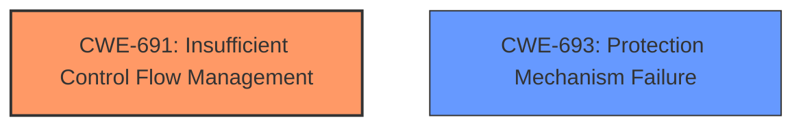

# Analysis for CVE-2021-33077

# Summary
| CWE ID | CWE Name | Confidence | CWE Abstraction Level | CWE Vulnerability Mapping Label | CWE-Vulnerability Mapping Notes |
|---|---|---|---|---|---|
| CWE-691 | Insufficient Control Flow Management | 0.8 | Pillar | Primary | Allowed |
| CWE-693 | Protection Mechanism Failure | 0.6 | Pillar | Secondary | Discouraged |

## Evidence and Confidence

*   **Confidence Score:** 0.8
*   **Evidence Strength:** MEDIUM

## Relationship Analysis
The primary CWE selected is CWE-691, which is a Pillar-level CWE. There aren't any specific parent-child relationships to consider as guidance. However, the very high-level nature of CWE-691 suggests that it might be a good starting point, but there may be a lower-level CWE that can be used, such as one of its descendants. The secondary CWE is CWE-693, also a Pillar, and should be considered as a general area.

## Vulnerability Chain
The vulnerability chain starts with **insufficient control flow management**, leading to a potential escalation of privilege via physical access. The provided description doesn't give enough detail to fully map out the vulnerability chain.

## Summary of Analysis
The initial analysis identified CWE-691 as the primary candidate due to the **rootcause** explicitly mentioning **insufficient control flow management**.

The statement from the "Vulnerability Description Key Phrases" section is:
- **rootcause:** **insufficient control flow management**

The retriever results also listed this as the top match.

The description matches the CWE-691 description, since the vulnerability is due to "**insufficient control flow management** in firmware".

Although CWE-691 is a high-level "Pillar" CWE, there isn't enough information to narrow it down to a more specific "Base" or "Variant" CWE. Therefore, it is the most appropriate choice given the available information.

CWE-693 was considered as a secondary CWE, since the vulnerability involves a failure in a protection mechanism that should prevent unauthorized privilege escalation. However, the **rootcause** is specifically related to control flow, so CWE-691 is more accurate.

I am using the provided evidence only to make the assessment. I am not overriding the general mapping guidance.

Relevant CWE Information:

# Enhanced Context (25 CWEs)
The following CWEs were identified as potentially relevant to this vulnerability:

## CWE-691: Insufficient Control Flow Management
**Abstraction Level**: Pillar
**Similarity Score**: 0.78

**Description**:
The code does not sufficiently manage its control flow during execution, creating conditions in which the control flow can be modified in unexpected ways.

## CWE-693: Protection Mechanism Failure
**Abstraction Level**: Pillar
**Similarity Score**: 0.75

**Description**:
The product does not use or incorrectly uses a protection mechanism that provides sufficient defense against directed attacks against the product.