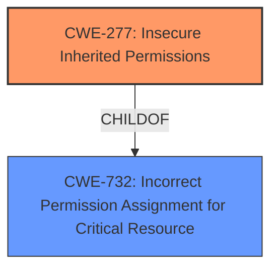

# Enhanced Analysis for CVE-2021-33094

# Summary
| CWE ID | CWE Name | Confidence | CWE Abstraction Level | CWE Vulnerability Mapping Label | CWE-Vulnerability Mapping Notes |
|---|---|---|---|---|---|
| CWE-277 | Insecure Inherited Permissions | 1.0 | Variant | Allowed | Primary CWE |
| CWE-732 | Incorrect Permission Assignment for Critical Resource | 0.7 | Class | Allowed-with-Review | Secondary Candidate |

## Evidence and Confidence

*   **Confidence Score:** 1.0
*   **Evidence Strength:** HIGH

## Relationship Analysis
The primary relationship is that CWE-277 (Insecure Inherited Permissions) is a child of CWE-732 (Incorrect Permission Assignment for Critical Resource). This indicates a hierarchical structure where CWE-277 is a more specific case of the broader CWE-732. Since the vulnerability description specifically mentions "insecure inherited permissions," choosing the more specific CWE-277 is appropriate.



## Vulnerability Chain
The vulnerability chain is straightforward:
1.  **Root Cause:** **Insecure inherited permissions** (CWE-277) are present in the installer.
2.  **Impact:** An authenticated user can escalate privileges.

## Summary of Analysis
The analysis is primarily based on the explicit description of the vulnerability.

The "Vulnerability Description Key Phrases" section states:
- **rootcause:** **Insecure inherited permissions**

The "CVE Reference Links Content Summary" section confirms:
- Insecure inherited permissions in the installer for the Intel(R) NUC M15 Laptop Kit Keyboard LED Service driver pack.

The retriever results list CWE-277 as the top candidate.

CWE-277 is chosen because it directly and accurately represents the **root cause** described in the vulnerability. While CWE-732 is a parent CWE, CWE-277 is more specific. The mapping guidance for CWE-277 allows its use and indicates it is at a preferred level of abstraction (Variant).

Relevant CWE Information:

# Enhanced Context (25 CWEs)
The following CWEs were identified as potentially relevant to this vulnerability:

## CWE-691: Insufficient Control Flow Management
**Abstraction Level**: Pillar
**Similarity Score**: 0.80
**Source**: dense

## CWE-664: Improper Control of a Resource Through its Lifetime
**Abstraction Level**: Pillar
**Similarity Score**: 0.78
**Source**: dense

## CWE-653: Improper Isolation or Compartmentalization
**Abstraction Level**: Class
**Similarity Score**: 0.77
**Source**: dense

## CWE-667: Improper Locking
**Abstraction Level**: Class
**Similarity Score**: 0.77
**Source**: dense

## CWE-274: Improper Handling of Insufficient Privileges
**Abstraction Level**: Base
**Similarity Score**: 0.76
**Source**: dense

## CWE-73: External Control of File Name or Path
**Abstraction Level**: Base
**Similarity Score**: 0.76
**Source**: dense

## CWE-41: Improper Resolution of Path Equivalence
**Abstraction Level**: Base
**Similarity Score**: 0.76
**Source**: dense

## CWE-1220: Insufficient Granularity of Access Control
**Abstraction Level**: Base
**Similarity Score**: 0.76
**Source**: dense

## CWE-280: Improper Handling of Insufficient Permissions or Privileges
**Abstraction Level**: Base
**Similarity Score**: 0.76
**Source**: dense

## CWE-668: Exposure of Resource to Wrong Sphere
**Abstraction Level**: Class
**Similarity Score**: 0.76
**Source**: dense

## CWE-119: Improper Restriction of Operations within the Bounds of a Memory Buffer
**Abstraction Level**: Class
**Similarity Score**: 5286.56
**Source**: sparse

## CWE-732: Incorrect Permission Assignment for Critical Resource
**Abstraction Level**: Class
**Similarity Score**: 5195.15
**Source**: sparse

## CWE-863: Incorrect Authorization
**Abstraction Level**: Class
**Similarity Score**: 5189.75
**Source**: sparse

## CWE-277: Insecure Inherited Permissions
**Abstraction Level**: Variant
**Similarity Score**: 5157.44
**Source**: sparse

## CWE-367: Time-of-check Time-of-use (TOCTOU) Race Condition
**Abstraction Level**: Base
**Similarity Score**: 5148.48
**Source**: sparse

## CWE-1257: Improper Access Control Applied to Mirrored or Aliased Memory Regions
**Abstraction Level**: base
**Similarity Score**: 4.33
**Source**: graph

## CWE-193: Off-by-one Error
**Abstraction Level**: base
**Similarity Score**: 4.33
**Source**: graph

## CWE-125: Out-of-bounds Read
**Abstraction Level**: base
**Similarity Score**: 3.89
**Source**: graph

## CWE-322: Key Exchange without Entity Authentication
**Abstraction Level**: base
**Similarity Score**: 3.57
**Source**: graph

## CWE-787: Out-of-bounds Write
**Abstraction Level**: base
**Similarity Score**: 3.30
**Source**: graph

## CWE-386: Symbolic Name not Mapping to Correct Object
**Abstraction Level**: base
**Similarity Score**: 2.90
**Source**: graph

## CWE-22: Improper Limitation of a Pathname to a Restricted Directory ('Path Traversal')
**Abstraction Level**: base
**Similarity Score**: 2.87
**Source**: graph

## CWE-1260: Improper Handling of Overlap Between Protected Memory Ranges
**Abstraction Level**: base
**Similarity Score**: 2.87
**Source**: graph

## CWE-190: Integer Overflow or Wraparound
**Abstraction Level**: base
**Similarity Score**: 2.87
**Source**: graph

## CWE-170: Improper Null Termination
**Abstraction Level**: base
**Similarity Score**: 2.87
**Source**: graph


## CWE Relationship Analysis

Current CWEs represent these abstraction levels: .


### Vulnerability Chain Analysis

**Chain starting from CWE-691:**
- 691 (Insufficient Control Flow Management) - ROOT


**Chain starting from CWE-787:**
- 787 (Out-of-bounds Write) - ROOT


### CWE Relationship Diagram

```mermaid
graph TD
    classDef primary fill:#f96,stroke:#333,stroke-width:2px
    classDef secondary fill:#69f,stroke:#333
    classDef tertiary fill:#9e9,stroke:#333
```