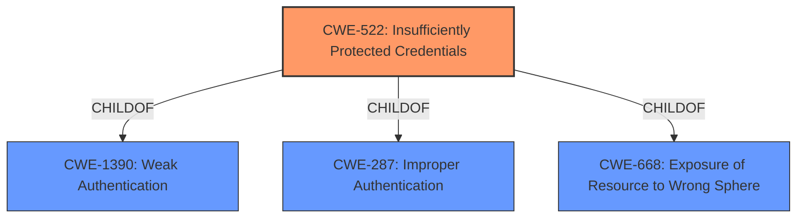

# Raw Analyzer Response for CVE-2021-33107

# Summary
| CWE ID | CWE Name | Confidence | CWE Abstraction Level | CWE Vulnerability Mapping Label | CWE-Vulnerability Mapping Notes |
|---|---|---|---|---|---|
| CWE-522 | Insufficiently Protected Credentials | 1.0 | Class | Allowed-with-Review | The primary weakness is that credentials are not adequately protected during USB provisioning. |

## Evidence and Confidence

*   **Confidence Score:** 1.0
*   **Evidence Strength:** HIGH

## Relationship Analysis
The primary CWE is CWE-522, which is a Class-level weakness. It is related to other authentication and credential management weaknesses. Specifically, it is a child of CWE-1390 (Weak Authentication) and CWE-287 (Improper Authentication), indicating a problem related to authentication and how credentials are handled. This indicates a problem where credentials are not stored or transmitted securely, leading to potential compromise.

## Vulnerability Chain
The vulnerability chain starts with **insufficiently protected credentials** (CWE-522) during USB provisioning, leading to potential information disclosure (impact). An unauthenticated user with physical access can exploit this weakness.

## Summary of Analysis
The vulnerability description clearly states that the root cause is **insufficiently protected credentials** in USB provisioning. The CVE Reference Links Content Summary reinforces this by stating: "Insufficiently protected credentials during USB provisioning" and "Credentials are not adequately protected." This directly aligns with the description of CWE-522: "The product transmits or stores authentication credentials, but it uses an insecure method that is susceptible to unauthorized interception and/or retrieval."

The retriever results also list CWE-522 as the top candidate, with a score of 0.430.

While CWE-522 is a Class-level weakness, the available information does not point to a more specific Base or Variant CWE. The description focuses on the general lack of protection for credentials, without specifying the exact method of insecure storage or transmission. Therefore, CWE-522 is the most appropriate and specific CWE based on the provided evidence.

Other CWEs considered:

*   CWE-277 (Insecure Inherited Permissions): While permissions could be related, the core issue is the protection of the credentials themselves, not the permissions assigned to them.
*   CWE-287 (Improper Authentication): This is a more general authentication issue. The problem is not failing authentication in general, but failing to protect the credentials.
*   CWE-284 (Improper Access Control): Access control is a broader category. While it could be argued that this applies, the more specific issue is the protection of credentials.
*   CWE-691 (Insufficient Control Flow Management): This is too abstract and doesn't fit the specific vulnerability.
*   CWE-269 (Improper Privilege Management): Similar to CWE-284, this is a broader category and less specific than CWE-522.
*   CWE-613 (Insufficient Session Expiration): This is specific to session management, which is not the focus of this vulnerability.
*   CWE-693 (Protection Mechanism Failure): This is a high-level category and not as specific as CWE-522.
*   CWE-248 (Uncaught Exception): This is not relevant to the vulnerability.
*   CWE-119 (Improper Restriction of Operations within the Bounds of a Memory Buffer): This is a memory-related issue and not applicable here.