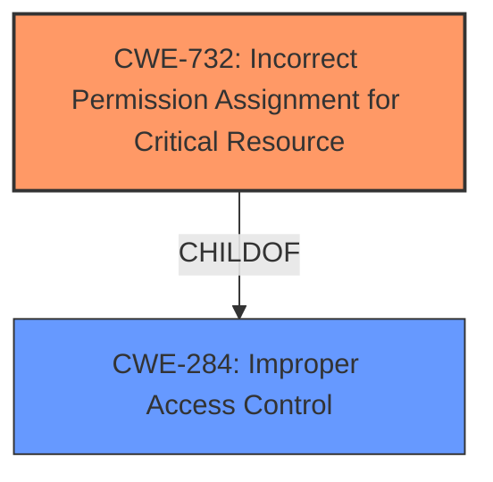

# Enhanced Analysis for CVE-2021-33118

# Summary
| CWE ID | CWE Name | Confidence | CWE Abstraction Level | CWE Vulnerability Mapping Label | CWE-Vulnerability Mapping Notes |
|---|---|---|---|---|---|
| **CWE-732** | Incorrect Permission Assignment for Critical Resource | 0.9 | Base | Primary | Allowed |
| CWE-284 | Improper Access Control | 0.4 | Pillar | Secondary | Discouraged |

## Evidence and Confidence

*   **Confidence Score:** 0.9
*   **Evidence Strength:** HIGH

## Relationship Analysis
The primary CWE, CWE-732 (Incorrect Permission Assignment for Critical Resource), is a child of CWE-284 (Improper Access Control). Selecting CWE-732 provides a more specific classification of the **improper access control** issue, focusing on the root cause related to incorrect permission assignments rather than a broader access control failure. While CWE-284 is relevant, it is a high-level categorization that is discouraged when more specific options exist.



## Vulnerability Chain
The vulnerability chain starts with an **incorrect permission assignment** in the software installer, leading to a potential **escalation of privilege**.

## Summary of Analysis
The initial analysis focused on the **improper access control** reported in the vulnerability description, which led to considering general access control CWEs like CWE-284. However, further investigation revealed that the root cause was specifically related to **incorrect permission assignments** within the software installer, making CWE-732 a more accurate and specific classification.

The selection of CWE-732 is strongly supported by the vulnerability description's key phrases: "**rootcause:** **Improper access control**" and "impact: escalation of privilege". The CVE Reference Links Content Summary confirms "**Improper access control** in the software installer" as the root cause.

CWE-284 was considered but deemed too general. Its usage is discouraged by MITRE when more specific options exist. CWE-732, a child of CWE-284, directly addresses the **incorrect permission assignment** aspect, making it the optimal choice. The abstraction level of CWE-732 (Base) is also preferred over the Pillar level of CWE-284.

Relevant CWE Information:

# Enhanced Context (25 CWEs)

## CWE-732: Incorrect Permission Assignment for Critical Resource
**Abstraction Level**: Base

**Description**:
The product assigns permissions for a critical resource in a way that allows unintended actors to gain access.

**Mapping Guidance**:
- Usage: Allowed
- Rationale: This CWE entry is at the Base level of abstraction, which is a preferred level of abstraction for mapping to the root causes of vulnerabilities.

**Relationships**:
- CHILDOF -> CWE-284
- CANPRECEDE -> CWE-266
- CANPRECEDE -> CWE-272

# Detailed Analysis

## CWE-732: Incorrect Permission Assignment for Critical Resource

*   **How the vulnerability's details match the CWE's characteristics:** The vulnerability description clearly states that the root cause is **improper access control** in the software installer, leading to an **escalation of privilege**. This directly aligns with CWE-732, which addresses situations where permissions for critical resources are assigned incorrectly, allowing unintended access.
*   **The security implications and potential impact:** The incorrect permission assignment can allow an authenticated user to escalate their privileges, potentially gaining administrative or system-level access. This could lead to unauthorized modification of system settings, data theft, or denial-of-service attacks.
*   **Any parent-child relationships or chain patterns that influenced your mapping:** CWE-732 is a child of CWE-284 (Improper Access Control). This relationship indicates that the vulnerability is a specific type of access control issue.
*   **Whether the weakness is primary or secondary in the vulnerability:** This is the primary weakness, as the **incorrect permission assignment** is the direct cause of the vulnerability.
*   **How the official MITRE mapping guidance influenced your decision:** MITRE's mapping guidance recommends using the most specific CWE available. Since CWE-732 directly addresses the root cause (**incorrect permission assignment**), it is the preferred choice over the more general CWE-284.

## CWE-284: Improper Access Control

*   **Why it was considered but not used as the primary CWE:** While CWE-284 is relevant because the vulnerability involves **improper access control**, it is a high-level category. The vulnerability description provides enough information to pinpoint the root cause as specifically related to **incorrect permission assignments**. Therefore, CWE-732 is a more precise and informative classification. The MITRE mapping guidance discourages the use of CWE-284 when more specific options are available.


## CWE Relationship Analysis

Current CWEs represent these abstraction levels: .


### Vulnerability Chain Analysis

**Chain starting from CWE-732:**
- 732 (Incorrect Permission Assignment for Critical Resource) - ROOT


**Chain starting from CWE-272:**
- 272 (Least Privilege Violation) - ROOT


### CWE Relationship Diagram

```mermaid
graph TD
    classDef primary fill:#f96,stroke:#333,stroke-width:2px
    classDef secondary fill:#69f,stroke:#333
    classDef tertiary fill:#9e9,stroke:#333
```