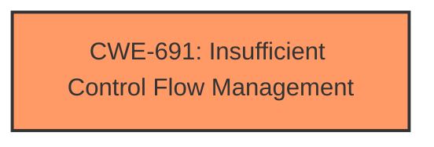

# Analysis Report for CVE-2021-33122

# Vulnerability Analysis Report: CVE-2021-33122

## Description


## Analysis (with Relationship Data)

# Summary
| CWE ID  | CWE Name  | Confidence | CWE Abstraction Level | CWE Vulnerability Mapping Label | CWE-Vulnerability Mapping Notes |
|---|---|---|---|---|---|
| CWE-691 | Insufficient Control Flow Management | 0.8 | Pillar | Primary | Discouraged |

## Evidence and Confidence

*   **Confidence Score:** 0.8
*   **Evidence Strength:** HIGH

## Relationship Analysis
The primary CWE identified is CWE-691, which is a high-level Pillar. Given the nature of the vulnerability, it's difficult to pinpoint a more specific CWE without further information. CWE-691, Insufficient Control Flow Management, is at the highest level of abstraction, and the guidance is Discouraged.



## Vulnerability Chain
The vulnerability chain consists of:
  - Root Cause: **Insufficient Control Flow Management** in BIOS firmware
  - Impact: Potential escalation of privilege via local access.

## Summary of Analysis
The analysis is based on the provided vulnerability description and the retriever results. The vulnerability description explicitly mentions "**Insufficient control flow management**" as the root cause. The retriever results also list CWE-691 as the top candidate.

The evidence is strong, as the vulnerability description and CVE reference links directly support the identification of **Insufficient control flow management** as the weakness. While the retriever results suggest other potential CWEs related to access control, the primary focus of the vulnerability description is on the **control flow**, making CWE-691 the most appropriate choice.

The selection of CWE-691 is at the highest level of abstraction, but other CWEs such as CWE-284 and CWE-1220 are related to access control which may not be the root cause of the vulnerability.

Relevant CWE Information:

# Enhanced Context (25 CWEs)

## CWE-691: Insufficient Control Flow Management
**Abstraction Level**: Pillar
**Similarity Score**: 0.77
**Source**: dense

**Description**:
The code does not sufficiently manage its control flow during execution, creating conditions in which the control flow can be modified in unexpected ways.

**Mapping Guidance**:
- Usage: Discouraged
- Rationale: This CWE entry is extremely high-level, a Pillar. However, classification research is limited for weaknesses of this type, so there can be gaps or organizational difficulties within CWE that force use of this weakness, even at such a high level of abstraction.

**Technical Explanation:**
CWE-691 (Insufficient Control Flow Management) is selected because the vulnerability description explicitly states "**Insufficient control flow management**" as the root cause. This CWE describes a scenario where the code doesn't adequately manage its execution flow, leading to unexpected modifications. The security implication is that a privileged user can potentially escalate their privileges.

**Relationship Explanation:**
CWE-691 is a Pillar, which is a high-level category. Although more specific CWEs might exist, the available information doesn't provide enough detail to pinpoint a more precise weakness.

**Mapping Guidance Influence:**
The MITRE mapping guidance indicates that using a Pillar is Discouraged, but justified when classification research is limited. In this case, the provided information doesn't allow for a more specific classification, making CWE-691 the most appropriate choice.

**Other CWEs Considered:**
Several other CWEs were considered but not selected due to the lack of specific evidence in the vulnerability description.
- CWE-284 (Improper Access Control): While escalation of privilege is mentioned, the root cause is specifically **control flow management**, not access control.
- CWE-1220 (Insufficient Granularity of Access Control): Similar to CWE-284, this relates to access control, but the root cause is **control flow**.
- CWE-119 (Improper Restriction of Operations within the Bounds of a Memory Buffer): This is related to memory management, which isn't explicitly mentioned.


## CWE Relationship Analysis

Current CWEs represent these abstraction levels: .


### Vulnerability Chain Analysis

**Chain starting from CWE-691:**
- 691 (Insufficient Control Flow Management) - ROOT


**Chain starting from CWE-1220:**
- 1220 (Insufficient Granularity of Access Control) - ROOT


### CWE Relationship Diagram

```mermaid
graph TD
    classDef primary fill:#f96,stroke:#333,stroke-width:2px
    classDef secondary fill:#69f,stroke:#333
    classDef tertiary fill:#9e9,stroke:#333
```


*Report generated on 2025-04-01 19:30:34*
