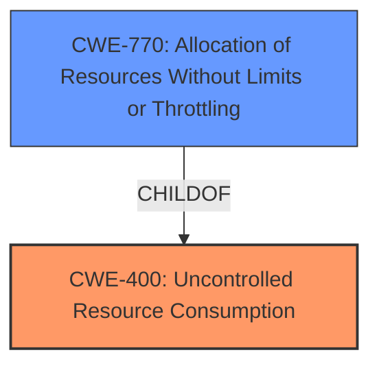

# Enhanced Analysis for CVE-2021-33135

# Summary
| CWE ID  | CWE Name                                         | Confidence | CWE Abstraction Level | CWE Vulnerability Mapping Label | CWE-Vulnerability Mapping Notes |
| :-------- | :----------------------------------------------- | :--------- | :---------------------- | :------------------------------ | :------------------------------ |
| CWE-400 | Uncontrolled Resource Consumption              | 0.9        | Class                   | Primary                         | Discouraged                     |
| CWE-770 | Allocation of Resources Without Limits or Throttling | 0.75        | Base                    | Secondary                       | Allowed                         |

## Evidence and Confidence

*   **Confidence Score:** 0.85
*   **Evidence Strength:** HIGH

## Relationship Analysis
The primary CWE, CWE-400 (Uncontrolled Resource Consumption), is a Class-level CWE, while the secondary CWE, CWE-770 (Allocation of Resources Without Limits or Throttling), is a Base-level CWE and a child of CWE-400. This hierarchical relationship suggests that CWE-770 is a more specific type of uncontrolled resource consumption related to allocation. However, the description explicitly mentions "uncontrolled resource consumption" as the root cause. The choice of CWE-400 is influenced by the direct mention of "uncontrolled resource consumption" in the vulnerability description, making it a fitting, albeit more general, classification. CWE-770 provides more specific details about the nature of the resource consumption, which involves allocation without limits or throttling.



## Vulnerability Chain
The vulnerability chain involves the following:

1.  **Root Cause:** **Uncontrolled resource consumption** in the Linux kernel drivers for Intel SGX.
2.  **Weakness:** Lack of proper resource management within the driver, potentially specifically related to the allocation of resources without limits or throttling.
3.  **Impact:** Denial of Service (DoS) due to resource exhaustion.

## Summary of Analysis
Initially, the direct mention of "**Uncontrolled resource consumption**" in the vulnerability description strongly suggested CWE-400 as the primary classification. The supporting evidence from the "CVE Reference Links Content Summary" reinforced this by highlighting the lack of proper resource management as the root cause.

However, considering the retriever results and the hierarchical relationship between CWE-400 and CWE-770, it became apparent that CWE-770 provides a more granular perspective by specifying that the uncontrolled resource consumption is related to allocation without limits. While CWE-400 is more general, it directly aligns with the identified root cause.

Ultimately, CWE-400 was chosen as the primary due to its direct correspondence with the vulnerability description and its identification as the root cause. CWE-770 was added as a secondary CWE to provide additional context about the specific mechanism of resource consumption.

The selected CWEs are at appropriate levels of specificity. CWE-400 is a Class, which is higher-level, but the rootcause is **uncontrolled resource consumption** so a Class is used. CWE-770 is a Base CWE which describes how resources are allocated.

Relevant CWE Information:

# Enhanced Context (25 CWEs)

## CWE-226: Sensitive Information in Resource Not Removed Before Reuse
**Abstraction Level**: Base
**Similarity Score**: 0.79
**Source**: dense

**Description**:
The product releases a resource such as memory or a file so that it can be made available for reuse, but it does not clear or "zeroize" the information contained in the resource before the product performs a critical state transition or makes the resource available for reuse by other entities.

**Mapping Guidance**:
- Usage: Allowed
- Rationale: This CWE entry is at the Base level of abstraction, which is a preferred level of abstraction for mapping to the root causes of vulnerabilities.

*This CWE was not selected because the vulnerability is not related to sensitive information being present in reused resources.*

## CWE-404: Improper Resource Shutdown or Release
**Abstraction Level**: Class
**Similarity Score**: 0.79
**Source**: dense

**Description**:
The product does not release or incorrectly releases a resource before it is made available for re-use.

**Mapping Guidance**:
- Usage: Allowed-with-Review
- Rationale: This CWE entry is a Class and might have Base-level children that would be more appropriate

*This CWE was not selected because the vulnerability is more related to not limiting resource allocation rather than incorrect release.*

## CWE-1325: Improperly Controlled Sequential Memory Allocation
**Abstraction Level**: Base
**Similarity Score**: 0.77
**Source**: dense

**Description**:
The product manages a group of objects or resources and performs a separate memory allocation for each object, but it does not properly limit the total amount of memory that is consumed by all of the combined objects.

**Mapping Guidance**:
- Usage: Allowed
- Rationale: This CWE entry is at the Base level of abstraction, which is a preferred level of abstraction for mapping to the root causes of vulnerabilities.

*This CWE was not selected because the vulnerability is not specifically about sequential memory allocation.*

## CWE-789: Memory Allocation with Excessive Size Value
**Abstraction Level**: Variant
**Similarity Score**: 0.77
**Source**: dense

**Description**:
The product allocates memory based on an untrusted, large size value, but it does not ensure that the size is within expected limits, allowing arbitrary amounts of memory to be allocated.

**Mapping Guidance**:
- Usage: Allowed
- Rationale: This CWE entry is at the Variant level of abstraction, which is a preferred level of abstraction for mapping to the root causes of vulnerabilities.

*This CWE was not selected because the vulnerability is not necessarily about excessive size values, but rather the lack of overall limits on resources.*

## CWE-664: Improper Control of a Resource Through its Lifetime
**Abstraction Level**: Pillar
**Similarity Score**: 0.76
**Source**: dense

**Description**:
The product does not maintain or incorrectly maintains control over a resource throughout its lifetime of creation, use, and release.

**Mapping Guidance**:
- Usage: Discouraged
- Rationale: This CWE entry is high-level when lower-level children are available.

*This CWE was not selected because the vulnerability is better described by more specific child CWEs.*

## CWE-667: Improper Locking
**Abstraction Level**: Class
**Similarity Score**: 0.75
**Source**: dense

**Description**:
The product does not properly acquire or release a lock on a resource, leading to unexpected resource state changes and behaviors.

**Mapping Guidance**:
- Usage: Allowed-with-Review
- Rationale: This CWE entry is a Class and might have Base-level children that would be more appropriate

*This CWE was not selected because the vulnerability is not related to improper locking mechanisms.*

## CWE-772: Missing Release of Resource after Effective Lifetime
**Abstraction Level**: Base
**Similarity Score**: 0.75
**Source**: dense

**Description**:
The product does not release a resource after its effective lifetime has ended, i.e., after the resource is no longer needed.

**Mapping Guidance**:
- Usage: Allowed
- Rationale: This CWE entry is at the Base level of abstraction, which is a preferred level of abstraction for mapping to the root causes of vulnerabilities.

*This CWE was not selected because the primary issue is not missing the release of resources but rather the lack of limits on resource allocation.*

## CWE-909: Missing Initialization of Resource
**Abstraction Level**: Class
**Similarity Score**: 0.75
**Source**: dense

**Description**:
The product does not initialize a critical resource.

**Mapping Guidance**:
- Usage: Allowed-with-Review
- Rationale: This CWE entry is a Class and might have Base-level children that would be more appropriate

*This CWE was not selected because the vulnerability is not about missing initialization of resources.*

## CWE-405: Asymmetric Resource Consumption (Amplification)
**Abstraction Level**: Class
**Similarity Score**: 0.74
**Source**: dense

**Description**:
The product does not properly control situations in which an adversary can cause the product to consume or produce excessive resources without requiring the adversary to invest equivalent work or otherwise prove authorization, i.e., the adversary's influence is "asymmetric."

**Mapping Guidance**:
- Usage: Allowed-with-Review
- Rationale: This CWE entry is a Class and might have Base-level children that would be more appropriate

*This CWE was not selected because the vulnerability is not specifically about asymmetric resource consumption.*

## CWE-691: Insufficient Control Flow Management
**Abstraction Level**: Pillar
**Similarity Score**: 0.74
**Source**: dense

**Description**:
The code does not sufficiently manage its control flow during execution, creating conditions in which the control


## CWE Relationship Analysis

Current CWEs represent these abstraction levels: .


### Vulnerability Chain Analysis

**Chain starting from CWE-667:**
- 667 (Improper Locking) - ROOT


**Chain starting from CWE-691:**
- 691 (Insufficient Control Flow Management) - ROOT


### CWE Relationship Diagram

```mermaid
graph TD
    classDef primary fill:#f96,stroke:#333,stroke-width:2px
    classDef secondary fill:#69f,stroke:#333
    classDef tertiary fill:#9e9,stroke:#333
```