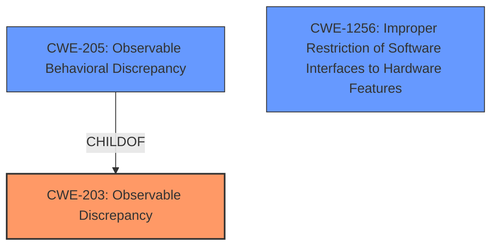

# Analysis for CVE-2021-33149

# Summary
| CWE ID  | CWE Name  | Confidence | CWE Abstraction Level | CWE Vulnerability Mapping Label | CWE-Vulnerability Mapping Notes |
|-----------------|--------------------------------------------------------------------|----------------------|---------------------------|------------------------------------|------------------------------------|
| **CWE-203** | Observable Discrepancy | 0.9 | Base | Primary | Allowed |
| CWE-205 | Observable Behavioral Discrepancy | 0.7 | Base | Secondary | Allowed |
| CWE-1256 | Improper Restriction of Software Interfaces to Hardware Features | 0.6 | Base | Secondary | Allowed |

## Evidence and Confidence

*   **Confidence Score:** 0.9
*   **Evidence Strength:** HIGH

## Relationship Analysis
The primary CWE, CWE-203, is a parent of CWE-205. This indicates that CWE-205 is a more specific type of observable discrepancy. The vulnerability description mentions an **observable behavioral discrepancy** which is a good match for CWE-205, but the root cause is related to "improper conditions check in voltage settings" which leads to the observable discrepancy. Because the root cause is about voltage settings, it is related to hardware. CWE-1256 is also a potential candidate due to the hardware context, but the provided information doesn't explicitly state that software interfaces are improperly restricted. However, the "improper conditions check in voltage settings" could be interpreted as such.

## Vulnerability Chain
The vulnerability chain starts with an **improper condition check in voltage settings**, which leads to an **observable behavioral discrepancy**, and ultimately results in information disclosure.

## Summary of Analysis
The initial analysis focused on identifying the root cause and the resulting weakness. The vulnerability description key phrases and the CVE Reference Links Content Summary both highlight an **observable behavioral discrepancy**, making CWE-203 a strong candidate. The retriever results also list CWE-203 and CWE-205 as potential matches.

The relationship analysis reveals that CWE-205 is a child of CWE-203, providing a more specific classification. However, the root cause is an "improper condition check in voltage settings for some Intel(R) Processors", indicating a hardware context. This makes CWE-1256 a relevant consideration.

The final decision is to map CWE-203 as the primary CWE because the weakness is an observable discrepancy. However, the root cause of this discrepancy lies in the hardware domain due to an improper condition check in voltage settings. Therefore, CWE-1256 is added as a secondary CWE since it's also caused by voltage settings in the Intel(R) Processors which are hardware.

The selection of CWE-203 is at the optimal level of specificity because it directly addresses the **observable discrepancy**. While CWE-205 is more specific, the description of CWE-203 aligns closely with the provided evidence.

Relevant CWE Information:

# Enhanced Context (25 CWEs)

## CWE-691: Insufficient Control Flow Management
**Abstraction Level**: Pillar
**Similarity Score**: 0.80
**Source**: dense

**Description**:
The code does not sufficiently manage its control flow during execution, creating conditions in which the control flow can be modified in unexpected ways.

**Mapping Guidance**:
- Usage: Discouraged
- Rationale: This CWE entry is extremely high-level, a Pillar. However, classification research is limited for weaknesses of this type, so there can be gaps or organizational difficulties within CWE that force use of this weakness, even at such a high level of abstraction.

## CWE-205: Observable Behavioral Discrepancy
**Abstraction Level**: Base
**Similarity Score**: 0.77
**Source**: dense

**Description**:
The product's behaviors indicate important differences that may be observed by unauthorized actors in a way that reveals (1) its internal state or decision process, or (2) differences from other products with equivalent functionality.

**Mapping Guidance**:
- Usage: Allowed
- Rationale: This CWE entry is at the Base level of abstraction, which is a preferred level of abstraction for mapping to the root causes of vulnerabilities.

## CWE-664: Improper Control of a Resource Through its Lifetime
**Abstraction Level**: Pillar
**Similarity Score**: 0.76
**Source**: dense

**Description**:
The product does not maintain or incorrectly maintains control over a resource throughout its lifetime of creation, use, and release.

**Mapping Guidance**:
- Usage: Discouraged
- Rationale: This CWE entry is high-level when lower-level children are available.

## CWE-208: Observable Timing Discrepancy
**Abstraction Level**: Base
**Similarity Score**: 0.76
**Source**: dense

**Description**:
Two separate operations in a product require different amounts of time to complete, in a way that is observable to an actor and reveals security-relevant information about the state of the product, such as whether a particular operation was successful or not.

**Mapping Guidance**:
- Usage: Allowed
- Rationale: This CWE entry is at the Base level of abstraction, which is a preferred level of abstraction for mapping to the root causes of vulnerabilities.

## CWE-703: Improper Check or Handling of Exceptional Conditions
**Abstraction Level**: Pillar
**Similarity Score**: 0.76
**Source**: dense

**Description**:
The product does not properly anticipate or handle exceptional conditions that rarely occur during normal operation of the product.

**Mapping Guidance**:
- Usage: Discouraged
- Rationale: This CWE entry is extremely high-level, a Pillar.

## CWE-653: Improper Isolation or Compartmentalization
**Abstraction Level**: Class
**Similarity Score**: 0.75
**Source**: dense

**Description**:
The product does not properly compartmentalize or isolate functionality, processes, or resources that require different privilege levels, rights, or permissions.

**Mapping Guidance**:
- Usage: Allowed
- Rationale: This CWE entry is at the Base level of abstraction, which is a preferred level of abstraction for mapping to the root causes of vulnerabilities.

## CWE-206: Observable Internal Behavioral Discrepancy
**Abstraction Level**: Variant
**Similarity Score**: 0.75
**Source**: dense

**Description**:
The product performs multiple behaviors that are combined to produce a single result, but the individual behaviors are observable separately in a way that allows attackers to reveal internal state or internal decision points.

**Mapping Guidance**:
- Usage: Allowed
- Rationale: This CWE entry is at the Variant level of abstraction, which is a preferred level of abstraction for mapping to the root causes of vulnerabilities.

## CWE-207: Observable Behavioral Discrepancy With Equivalent Products
**Abstraction Level**: Variant
**Similarity Score**: 0.75
**Source**: dense

**Description**:
The product operates in an environment in which its existence or specific identity should not be known, but it behaves differently than other products with equivalent functionality, in a way that is observable to an attacker.

**Mapping Guidance**:
- Usage: Allowed
- Rationale: This CWE entry is at the Variant level of abstraction, which is a preferred level of abstraction for mapping to the root causes of vulnerabilities.

## CWE-668: Exposure of Resource to Wrong Sphere
**Abstraction Level**: Class
**Similarity Score**: 0.75
**Source**: dense

**Description**:
The product exposes a resource to the wrong control sphere, providing unintended actors with inappropriate access to the resource.

**Mapping Guidance**:
- Usage: Discouraged
- Rationale: CWE-668 is high-level and is often misused as a catch-all when lower-level CWE IDs might be applicable. It is sometimes used for low-information vulnerability reports [REF-1287]. It is a level-1 Class (i.e., a child of a Pillar). It is not useful for trend analysis.

## CWE-696: Incorrect Behavior Order
**Abstraction Level**: Class
**Similarity Score**: 0.75
**Source**: dense

**Description**:
The product performs multiple related behaviors, but the behaviors are performed in the wrong order in ways which may produce resultant weaknesses.

**Mapping Guidance**:
- Usage: Allowed-with-Review
- Rationale: This CWE entry is a Class and might have Base-level children that would be more appropriate

## CWE-203: Observable Discrepancy
**Abstraction Level**: Base
**Similarity Score**: 5779.83
**Source**: sparse

**Description**:
The product behaves differently or sends different responses under different circumstances in a way that is observable to an unauthorized actor, which exposes security-relevant information about the state of the product, such as whether