# Raw Analyzer Response for CVE-2021-33195

# Summary
| CWE ID | CWE Name | Confidence | CWE Abstraction Level | CWE Vulnerability Mapping Label | CWE-Vulnerability Mapping Notes |
|---|---|---|---|---|---|
| CWE-20 | Improper Input Validation | 0.9 | Class | Primary | Allowed |
| CWE-79 | Improper Neutralization of Input During Web Page Generation ('Cross-site Scripting') | 0.7 | Base | Secondary | Allowed |

## Evidence and Confidence

*   **Confidence Score:** 0.8
*   **Evidence Strength:** HIGH

## Relationship Analysis
The primary relationship influencing the CWE selection is the parent-child relationship between CWE-20 and its potential children. While several more specific input validation CWEs were considered, the general nature of the **improper input validation** makes CWE-20 the most appropriate. CWE-79 is a potential impact of the **improper input validation**, specifically in the context of web applications.

```mermaid
graph TD
    cwe20["CWE-20: Improper Input Validation"]
    cwe79["CWE-79: Improper Neutralization of Input During Web Page Generation ('Cross-site Scripting')"]
    cwe1286["CWE-1286: Improper Validation of Syntactic Correctness of Input"]
    cwe1289["CWE-1289: Improper Validation of Unsafe Equivalence in Input"]
    cwe184["CWE-184: Incomplete List of Disallowed Inputs"]
    cwe73["CWE-73: External Control of File Name or Path"]
    cwe59["CWE-59: Improper Link Resolution Before File Access ('Link Following')"]
    cwe22["CWE-22: Improper Limitation of a Pathname to a Restricted Directory ('Path Traversal')"]
    cwe295["CWE-295: Improper Certificate Validation"]
    cwe494["CWE-494: Download of Code Without Integrity Check"]

    cwe1286 -->|ChildOf| cwe20
    cwe1289 -->|ChildOf| cwe20
    cwe184 -->|ChildOf| cwe20
    cwe73 -->|ChildOf| cwe20
    cwe59 -->|ChildOf| cwe20
    cwe22 -->|ChildOf| cwe20
    cwe295 -->|ChildOf| cwe20
    cwe494 -->|ChildOf| cwe20
    cwe79 -->|CanFollow| cwe20

    classDef primary fill:#f96,stroke:#333,stroke-width:2px
    classDef secondary fill:#69f,stroke:#333
    classDef tertiary fill:#9e9,stroke:#333
    class cwe20 primary
    class cwe79 secondary
    class cwe1286,cwe1289,cwe184,cwe73,cwe59,cwe22,cwe295,cwe494 tertiary
```

## Vulnerability Chain
The vulnerability chain starts with **improper input validation** (CWE-20) of DNS responses, leading to the possibility of **unsafe injection**. If this unsanitized data is then used in a web context, it can lead to Cross-Site Scripting (CWE-79).

## Summary of Analysis
The initial assessment focused on the core weakness: the **lack of validation** of DNS responses in Go's DNS lookup functions. The evidence strongly supports the classification of **improper input validation** (CWE-20). The potential for XSS arises from the use of these **invalid hostnames** in unsanitized contexts, suggesting a secondary CWE of CWE-79.

The evidence for the **lack of input sanitization** is strong:
- "functions for DNS lookups that do not validate replies from DNS servers"
- "don't filter returned host name string types, allowing invalid names to be returned to the caller"
- "improper input validation"
- "Lack of sanitization for DNS query responses"

The graph relationships helped contextualize the vulnerability. The various children of CWE-20 highlight the many ways that input validation can fail. The `CanFollow` relationship between CWE-20 and CWE-79 shows a potential path from **improper input validation** to XSS.

The selected CWEs are at the optimal level of specificity because CWE-20 captures the general **lack of validation** without focusing on a specific type of input. CWE-79 then represents the potential impact in a web context.

Relevant CWE Information:

# Enhanced Context (25 CWEs)
The following CWEs were identified as potentially relevant to this vulnerability:

## CWE-20: Improper Input Validation
The vulnerability stems from the DNS lookup functions in Go not validating replies from DNS servers, allowing for the return of **unsafe injection** that does not conform to the RFC1035 format. This matches the description of CWE-20, which is the product receives input but it does not validate or incorrectly validates that the input is correct. The security implication is that an attacker could control the DNS responses and inject arbitrary data, leading to potential vulnerabilities such as Cross-Site Scripting (XSS) if the data is used in a web context.

## CWE-79: Improper Neutralization of Input During Web Page Generation ('Cross-site Scripting')
The vulnerability allows for the return of invalid hostnames, which, if used in an unsanitized context, could lead to injection of unexpected content, such as XSS. This aligns with CWE-79, which describes a scenario where the product does not neutralize or incorrectly neutralizes input during web page generation, leading to XSS. The security implication is that an attacker could inject malicious scripts into the web page, potentially leading to data theft, session hijacking, or other malicious activities.

## CWE-1286: Improper Validation of Syntactic Correctness of Input
The vulnerability involves the lack of validation of DNS responses, which should conform to the RFC1035 format. This aligns with CWE-1286, which describes a product that receives input expected to be well-formed but does not validate or incorrectly validates that the input complies with the syntax. This was considered, but the problem is not just about syntax, but about validating the DNS server responses. Therefore, CWE-20 is more appropriate.

## CWE-917: Improper Neutralization of Special Elements used in an Expression Language Statement ('Expression Language Injection')
This CWE is related to expression language injection, which is not the primary issue in this vulnerability. The core problem is the lack of input validation of DNS responses, not the injection of special elements into an expression language statement. Therefore, this CWE is not applicable.

## CWE-113: Improper Neutralization of CRLF Sequences in HTTP Headers ('HTTP Request/Response Splitting')
This CWE is related to the improper neutralization of CRLF sequences in HTTP headers, which is not the primary issue in this vulnerability. Therefore, this CWE is not applicable.

## CWE-95: Improper Neutralization of Directives in Dynamically Evaluated Code ('Eval Injection')
This CWE is related to eval injection, which is not the primary issue in this vulnerability. Therefore, this CWE is not applicable.

## CWE-295: Improper Certificate Validation
This CWE is related to improper certificate validation, which is not the primary issue in this vulnerability. Therefore, this CWE is not applicable.

## CWE-350: Reliance on Reverse DNS Resolution for a Security-Critical Action
This CWE is related to reliance on reverse DNS resolution for a security-critical action, which is a specific case that doesn't fit the general **input validation** issue in this vulnerability. Therefore, this CWE is not applicable.

## CWE-322: Key Exchange without Entity Authentication
This CWE is related to key exchange without entity authentication, which is not the primary issue in this vulnerability. Therefore, this CWE is not applicable.

## CWE-74: Improper Neutralization of Special Elements in Output Used by a Downstream Component ('Injection')
This CWE is too broad and is discouraged by MITRE. The specific injection in this case is more related to the lack of **input validation**, making CWE-20 more appropriate.

## CWE-502: Deserialization of Untrusted Data
This CWE is related to deserialization of untrusted data, which is not the primary issue in this vulnerability. Therefore, this CWE is not applicable.

## CWE-22: Improper Limitation of a Pathname to a Restricted Directory ('Path Traversal')
This CWE is related to path traversal, which is not the primary issue in this vulnerability. Therefore, this CWE is not applicable.