# Analysis for CVE-2021-33195

# Summary
| CWE ID | CWE Name | Confidence | CWE Abstraction Level | CWE Vulnerability Mapping Label | CWE-Vulnerability Mapping Notes |
|---|---|---|---|---|---|
| CWE-20 | Improper Input Validation | 0.9 | Class | Primary | Allowed |
| CWE-79 | Improper Neutralization of Input During Web Page Generation ('Cross-site Scripting') | 0.7 | Base | Secondary | Allowed |

## Evidence and Confidence

*   **Confidence Score:** 0.8
*   **Evidence Strength:** HIGH

## Relationship Analysis
The primary relationship influencing the CWE selection is the parent-child relationship between CWE-20 and its potential children. While several more specific input validation CWEs were considered, the general nature of the **improper input validation** makes CWE-20 the most appropriate. CWE-79 is a potential impact of the **improper input validation**, specifically in the context of web applications.

```mermaid
graph TD
    cwe20["CWE-20: Improper Input Validation"]
    cwe79["CWE-79: Improper Neutralization of Input During Web Page Generation ('Cross-site Scripting')"]
    cwe1286["CWE-1286: Improper Validation of Syntactic Correctness of Input"]
    cwe1289["CWE-1289: Improper Validation of Unsafe Equivalence in Input"]
    cwe184["CWE-184: Incomplete List of Disallowed Inputs"]
    cwe73["CWE-73: External Control of File Name or Path"]
    cwe59["CWE-59: Improper Link Resolution Before File Access ('Link Following')"]
    cwe22["CWE-22: Improper Limitation of a Pathname to a Restricted Directory ('Path Traversal')"]
    cwe295["CWE-295: Improper Certificate Validation"]
    cwe494["CWE-494: Download of Code Without Integrity Check"]

    cwe1286 -->|ChildOf| cwe20
    cwe1289 -->|ChildOf| cwe20
    cwe184 -->|ChildOf| cwe20
    cwe73 -->|ChildOf| cwe20
    cwe59 -->|ChildOf| cwe20
    cwe22 -->|ChildOf| cwe20
    cwe295 -->|ChildOf| cwe20
    cwe494 -->|ChildOf| cwe20
    cwe79 -->|CanFollow| cwe20

    classDef primary fill:#f96,stroke:#333,stroke-width:2px
    classDef secondary fill:#69f,stroke:#333
    classDef tertiary fill:#9e9,stroke:#333
    class cwe20 primary
    class cwe79 secondary
    class cwe1286,cwe1289,cwe184,cwe73,cwe59,cwe22,cwe295,cwe494 tertiary
```



## Vulnerability Chain
The vulnerability chain starts with **improper input validation** (CWE-20) of DNS responses, leading to the possibility of **unsafe injection**. If this unsanitized data is then used in a web context, it can lead to Cross-Site Scripting (CWE-79).

## Summary of Analysis
The initial assessment focused on the core weakness: the **lack of validation** of DNS responses in Go's DNS lookup functions. The evidence strongly supports the classification of **improper input validation** (CWE-20). The potential for XSS arises from the use of these **invalid hostnames** in unsanitized contexts, suggesting a secondary CWE of CWE-79.

The evidence for the **lack of input sanitization** is strong:
- "functions for DNS lookups that do not validate replies from DNS servers"
- "don't filter returned host name string types, allowing invalid names to be returned to the caller"
- "improper input validation"
- "Lack of sanitization for DNS query responses"

The graph relationships helped contextualize the vulnerability. The various children of CWE-20 highlight the many ways that input validation can fail. The `CanFollow` relationship between CWE-20 and CWE-79 shows a potential path from **improper input validation** to XSS.

The selected CWEs are at the optimal level of specificity because CWE-20 captures the general **lack of validation** without focusing on a specific type of input. CWE-79 then represents the potential impact in a web context.

Relevant CWE Information:

# Enhanced Context (25 CWEs)
The following CWEs were identified as potentially relevant to this vulnerability:

## CWE-20: Improper Input Validation
The vulnerability stems from the DNS lookup functions in Go not validating replies from DNS servers, allowing for the return of **unsafe injection** that does not conform to the RFC1035 format. This matches the description of CWE-20, which is the product receives input but it does not validate or incorrectly validates that the input is correct. The security implication is that an attacker could control the DNS responses and inject arbitrary data, leading to potential vulnerabilities such as Cross-Site Scripting (XSS) if the data is used in a web context.

## CWE-79: Improper Neutralization of Input During Web Page Generation ('Cross-site Scripting')
The vulnerability allows for the return of invalid hostnames, which, if used in an unsanitized context, could lead to injection of unexpected content, such as XSS. This aligns with CWE-79, which describes a scenario where the product does not neutralize or incorrectly neutralizes input during web page generation, leading to XSS. The security implication is that an attacker could inject malicious scripts into the web page, potentially leading to data theft, session hijacking, or other malicious activities.

## CWE-1286: Improper Validation of Syntactic Correctness of Input
The vulnerability involves the lack of validation of DNS responses, which should conform to the RFC1035 format. This aligns with CWE-1286, which describes a product that receives input expected to be well-formed but does not validate or incorrectly validates that the input complies with the syntax. This was considered, but the problem is not just about syntax, but about validating the DNS server responses. Therefore, CWE-20 is more appropriate.

## CWE-917: Improper Neutralization of Special Elements used in an Expression Language Statement ('Expression Language Injection')
This CWE is related to expression language injection, which is not the primary issue in this vulnerability. The core problem is the lack of input validation of DNS responses, not the injection of special elements into an expression language statement. Therefore, this CWE is not applicable.

## CWE-113: Improper Neutralization of CRLF Sequences in HTTP Headers ('HTTP Request/Response Splitting')
This CWE is related to the improper neutralization of CRLF sequences in HTTP headers, which is not the primary issue in this vulnerability. Therefore, this CWE is not applicable.

## CWE-95: Improper Neutralization of Directives in Dynamically Evaluated Code ('Eval Injection')
This CWE is related to eval injection, which is not the primary issue in this vulnerability. Therefore, this CWE is not applicable.

## CWE-295: Improper Certificate Validation
This CWE is related to improper certificate validation, which is not the primary issue in this vulnerability. Therefore, this CWE is not applicable.

## CWE-350: Reliance on Reverse DNS Resolution for a Security-Critical Action
This CWE is related to reliance on reverse DNS resolution for a security-critical action, which is a specific case that doesn't fit the general **input validation** issue in this vulnerability. Therefore, this CWE is not applicable.

## CWE-322: Key Exchange without Entity Authentication
This CWE is related to key exchange without entity authentication, which is not the primary issue in this vulnerability. Therefore, this CWE is not applicable.

## CWE-74: Improper Neutralization of Special Elements in Output Used by a Downstream Component ('Injection')
This CWE is too broad and is discouraged by MITRE. The specific injection in this case is more related to the lack of **input validation**, making CWE-20 more appropriate.

## CWE-502: Deserialization of Untrusted Data
This CWE is related to deserialization of untrusted data, which is not the primary issue in this vulnerability. Therefore, this CWE is not applicable.

## CWE-22: Improper Limitation of a Pathname to a Restricted Directory ('Path Traversal')
This CWE is related to path traversal, which is not the primary issue in this vulnerability. Therefore, this CWE is not applicable.

# Enhanced Query for CVE-2021-33195

## Vulnerability Description
Go before 1.15.13 and 1.16.x before 1.16.5 has functions for DNS lookups that do not validate replies from DNS servers, and thus a return value may contain an **unsafe injection** (e.g., XSS) that does not conform to the RFC1035 format.

### Vulnerability Description Key Phrases
- **weakness:** **unsafe injection**
- **impact:** cross-site scripting
- **product:** Go
- **version:** before 1.15.13 and 1.16.x before 1.16.5
- **component:** DNS lookup functions

## CVE Reference Links Content Summary
```json
[
  {
    "related_to_CVE": "CVE-2021-33195",
    "root_cause": "The `net.Lookup{Addr,CNAME,Host}` functions, when using the pure Go resolver, don't filter returned host name string types, allowing invalid names to be returned to the caller. These names, if used in an unsanitized context, could lead to injection of unexpected content.",
    "weaknesses": [
      "Lack of input sanitization",
      "Improper validation of hostnames"
    ],
    "impact": "Injection of unexpected content due to using invalid hostnames in unsanitized contexts which can lead to information disclosure, data modification, or denial of service.",
    "attack_vectors": [
      "Network"
    ],
    "attacker_capabilities": "An attacker can exploit this vulnerability by controlling the DNS responses received by a vulnerable application, which may be achieved by controlling the DNS server or via a man-in-the-middle attack.",
    "additional_information": "The vulnerability is present in Go versions before 1.15.12 and 1.16.x before 1.16.5. The vulnerability is triggered when the pure Go resolver is used. The cgo resolver may impose its own filtering, but this cannot be relied upon. The `isDomainName` function, which applies RFC 1035 LDH rules, can be used to validate returned names."
  },
  {
    "related_to_CVE": "CVE-2021-33195",
    "root_cause": "Go versions prior to 1.15.13 and 1.16.x prior to 1.16.5 are susceptible to a vulnerability which, when successfully exploited, could lead to disclosure of sensitive information, addition or modification of data, or Denial of Service (DoS). This is due to the net.Lookup functions returning invalid hostnames.",
      "weaknesses": [
        "Improper input validation"
     ],
     "impact": "Disclosure of sensitive information, data modification, or denial of service (DoS).",
     "attack_vectors": [
      "Network"
    ],
    "attacker_capabilities": "An attacker may be able to manipulate DNS results returned to a vulnerable system.",
      "additional_information": "NetApp products are affected when they incorporate vulnerable versions of Golang. The provided link points to a Google Groups discussion related to Go 1.16.5 and 1.15.13 releases, which include security fixes."
  },
  {
     "related_to_CVE": "CVE-2021-33195",
    "root_cause": "The `net` package in Go does not properly validate hostnames returned by DNS lookups, allowing arbitrary values which do not follow RFC 1035 rules for domain names to be returned, leading to potential injection issues if used without sanitization.",
    "weaknesses": [
      "Improper input validation",
      "Lack of sanitization for DNS query responses"
    ],
    "impact": "The vulnerability can lead to injection of unexpected content if arbitrary values from DNS responses are used without proper sanitization, potentially resulting in data modification, information disclosure, or a denial of service.",
    "attack_vectors": [
      "Network"
    ],
     "attacker_capabilities": "An attacker capable of manipulating DNS responses can inject arbitrary data into the application using this vulnerability.",
     "additional_information": "This is issue #46241 in the golang/go repository, and it is also identified as CVE-2021-33195. The affected functions include `LookupCNAME`, `LookupSRV`, `LookupMX`, `LookupNS`, and `LookupAddr`. A possible fix involves checking returned names with the existing `isDomainName` function to ensure they conform to RFC 1035 LDH rules."
  },
    {
    "related_to_CVE": "CVE-2021-33195",
    "root_cause": "The vulnerability is caused by the use of the `net.Lookup{Addr,CNAME,Host}` functions with the pure Go resolver, which does not validate or filter returned host name strings, leading to the possibility of injecting unexpected content if not sanitized.",
    "weaknesses": [
      "Improper Input Validation",
      "Lack of output sanitization"
    ],
    "impact": "The impact is the injection of unexpected content. This could lead to a variety of consequences, including information disclosure, data modification, or denial of service, depending on the specific context where the unsanitized data is used.",
     "attack_vectors": [
       "Network"
      ],
    "attacker_capabilities": "An attacker would need to control DNS responses to inject arbitrary, invalid hostnames into the application that uses a vulnerable version of Go.",
     "additional_information": "The vulnerability is assigned CVE-2021-33195. The `net` package in Go, specifically when using the pure Go resolver, does not filter or validate host name string types. This can be mitigated by checking returned names with the existing `isDomainName` function."
  },
    {
    "related_to_CVE": "CVE-2021-33195",
    "root_cause": "The vulnerability arises from the fact that the `net.Lookup{Addr,CNAME,Host}` functions don't filter returned host name string types when using the pure Go resolver. This allows for invalid names to be returned, which, if used in unsanitized contexts, can lead to injection issues.",
    "weaknesses": [
      "Improper Input Validation",
     "Lack of Output Sanitization"
    ],
    "impact": "The impact is potential injection of unexpected content. This could lead to vulnerabilities such as Cross-Site Scripting (XSS), data modification, or denial of service, depending on how the invalid hostname string is used.",
    "attack_vectors": [
     "Network"
    ],
    "attacker_capabilities": "An attacker capable of manipulating DNS responses can exploit this vulnerability by injecting arbitrary, invalid hostnames.",
    "additional_information": "The affected functions are `net.Lookup{Addr, CNAME, Host}` when using the pure Go resolver. This issue is tracked as CVE-2021-33195. The recommended approach is to check the returned names using the `isDomainName` function, which applies RFC 1035 LDH rules."
  },
  {
    "related_to_CVE": "CVE-2021-33195",
    "root_cause": "The vulnerability stems from the way the `net.Lookup{Addr,CNAME,Host}` functions handle DNS responses when using the pure Go resolver. They do not validate or filter the returned host name strings, allowing for invalid names that can cause injection vulnerabilities.",
     "weaknesses": [
        "Improper Input Validation",
       "Lack of Output Sanitization"
      ],
    "impact": "The lack of validation allows for the injection of unexpected content, possibly leading to data modification, information disclosure, or denial of service (DoS) depending on how the application uses these names.",
    "attack_vectors": [
     "Network"
    ],
    "attacker_capabilities": "An attacker could exploit this by controlling the DNS server or performing a man-in-the-middle attack to provide responses containing invalid host names.",
     "additional_information": "The CVE ID for this vulnerability is CVE-2021-33195. The suggested remediation is to implement validation using the `isDomainName` function, which applies RFC 1035 LDH rules and filter out invalid names, or apply other sanitization techniques."
  },
  {
    "related_to_CVE": "CVE-2021-33195",
    "root_cause": "The net.Lookup functions return arbitrary values from DNS which do not follow the rules for domain names according to RFC 1035.",
    "weaknesses": [
      "Improper Input Validation",
      "Lack of Output Sanitization"
    ],
    "impact": "When the returned names are used without sanitization, for instance in HTML, they can allow injection of unexpected content.",
    "attack_vectors": [
     "Network"
    ],
     "attacker_capabilities": "An attacker with the ability to influence DNS responses can inject arbitrary content.",
     "additional_information": "This issue is identified as CVE-2021-33195, and it's noted that `LookupTXT` may still return arbitrary values that may require sanitization."
  },
    {
     "related_to_CVE": "CVE-2021-33195",
      "root_cause": "The `net.Lookup{Addr,CNAME,Host}` functions do not properly filter returned host names when using the pure Go resolver. This can allow for invalid names to be returned to the caller, which can lead to injection vulnerabilities if used in unsanitized contexts.",
      "weaknesses": [
        "Improper Input Validation",
       "Lack of Input Sanitization"
     ],
      "impact": "The use of invalid host names in an unsanitized context can lead to injection of unexpected content, potentially resulting in information disclosure, data modification, or denial of service.",
      "attack_vectors": [
      "Network"
      ],
      "attacker_capabilities": "An attacker capable of manipulating DNS responses can exploit this vulnerability.",
    "additional_information":"This vulnerability is identified as CVE-2021-33195. The issue occurs because returned names are not checked against the RFC 1035 LDH rules. The cgo resolver might do some filtering, but this is not consistent. The fix should involve checking the returned names using the `isDomainName` function."
  }
]
```

## Retriever Results

### Top Combined Results

| Rank | CWE ID | Name | Abstraction | Usage  | Retrievers | Individual Scores |
|------|--------|------|-------------|-------|------------|-------------------|
| 1 | 1286 | Improper Validation of Syntactic Correctness of Input | Base | Allowed | sparse | 0.349 |
| 2 | 917 | Improper Neutralization of Special Elements used in an Expression Language Statement ('Expression Language Injection') | Base | Allowed | sparse | 0.235 |
| 3 | 113 | Improper Neutralization of CRLF Sequences in HTTP Headers ('HTTP Request/Response Splitting') | Variant | Allowed | sparse | 0.226 |
| 4 | 95 | Improper Neutralization of Directives in Dynamically Evaluated Code ('Eval Injection') | Variant | Allowed | sparse | 0.225 |
| 5 | 295 | Improper Certificate Validation | Base | Allowed | sparse | 0.222 |
| 6 | 350 | Reliance on Reverse DNS Resolution for a Security-Critical Action | Variant | Allowed | dense | 0.542 |
| 7 | 322 | Key Exchange without Entity Authentication | Base | Allowed | graph | 0.002 |
| 8 | 74 | Improper Neutralization of Special Elements in Output Used by a Downstream Component ('Injection') | Class | Discouraged | sparse | 0.221 |
| 9 | 502 | Deserialization of Untrusted Data | Base | Allowed | sparse | 0.220 |
| 10 | 22 | Improper Limitation of a Pathname to a Restricted Directory ('Path Traversal') | Base | Allowed | sparse | 0.220 |


# Complete CWE Specifications


## CWE-1286: Improper Validation of Syntactic Correctness of Input
**Abstraction:** Base
**Status:** Incomplete

### Description
The product receives input that is expected to be well-formed - i.e., to comply with a certain syntax - but it does not validate or incorrectly validates that the input complies with the syntax.

### Extended Description


Often, complex inputs are expected to follow a particular syntax, which is either assumed by the input itself, or declared within metadata such as headers. The syntax could be for data exchange formats, markup languages, or even programming languages. When untrusted input is not properly validated for the expected syntax, attackers could cause parsing failures, trigger unexpected errors, or expose latent vulnerabilities that might not be directly exploitable if the input had conformed to the syntax.


### Alternative Terms
None

### Relationships
ChildOf -> CWE-20

### Mapping Guidance
**Usage:** Allowed
**Rationale:** This CWE entry is at the Base level of abstraction, which is a preferred level of abstraction for mapping to the root causes of vulnerabilities.
**Comments:** Carefully read both the name and description to ensure that this mapping is an appropriate fit. Do not try to 'force' a mapping to a lower-level Base/Variant simply to comply with this preferred level of abstraction.
**Reasons:**
- Acceptable-Use


### Additional Notes
**[Maintenance]** This entry is still under development and will continue to see updates and content improvements.


### Observed Examples
- **CVE-2016-4029:** Chain: incorrect validation of intended decimal-based IP address format (CWE-1286) enables parsing of octal or hexadecimal formats (CWE-1389), allowing bypass of an SSRF protection mechanism (CWE-918).
- **CVE-2007-5893:** HTTP request with missing protocol version number leads to crash


## CWE-917: Improper Neutralization of Special Elements used in an Expression Language Statement ('Expression Language Injection')
**Abstraction:** Base
**Status:** Incomplete

### Description
The product constructs all or part of an expression language (EL) statement in a framework such as a Java Server Page (JSP) using externally-influenced input from an upstream component, but it does not neutralize or incorrectly neutralizes special elements that could modify the intended EL statement before it is executed.

### Extended Description
Frameworks such as Java Server Page (JSP) allow a developer to insert executable expressions within otherwise-static content. When the developer is not aware of the executable nature of these expressions and/or does not disable them, then if an attacker can inject expressions, this could lead to code execution or other unexpected behaviors.

### Alternative Terms
EL Injection

### Relationships
ChildOf -> CWE-77
PeerOf -> CWE-1336
ChildOf -> CWE-74
ChildOf -> CWE-77
ChildOf -> CWE-77

### Mapping Guidance
**Usage:** Allowed
**Rationale:** This CWE entry is at the Base level of abstraction, which is a preferred level of abstraction for mapping to the root causes of vulnerabilities.
**Comments:** Carefully read both the name and description to ensure that this mapping is an appropriate fit. Do not try to 'force' a mapping to a lower-level Base/Variant simply to comply with this preferred level of abstraction.
**Reasons:**
- Acceptable-Use


### Additional Notes
**[Maintenance]** The interrelationships and differences between CWE-917 and CWE-1336 need to be further clarified.

**[Relationship]** In certain versions of Spring 3.0.5 and earlier, there was a vulnerability (CVE-2011-2730) in which Expression Language tags would be evaluated twice, which effectively exposed any application to EL injection. However, even for later versions, this weakness is still possible depending on configuration.


### Observed Examples
- **CVE-2021-44228:** Product does not neutralize ${xyz} style expressions, allowing remote code execution. (log4shell vulnerability in log4j)


## CWE-113: Improper Neutralization of CRLF Sequences in HTTP Headers ('HTTP Request/Response Splitting')
**Abstraction:** Variant
**Status:** Incomplete

### Description
The product receives data from an HTTP agent/component (e.g., web server, proxy, browser, etc.), but it does not neutralize or incorrectly neutralizes CR and LF characters before the data is included in outgoing HTTP headers.

### Extended Description


 HTTP agents or components may include a web server, load balancer, reverse proxy, web caching proxy, application firewall, web browser, etc. Regardless of the role, they are expected to maintain coherent, consistent HTTP communication state across all components. However, including unexpected data in an HTTP header allows an attacker to specify the entirety of the HTTP message that is rendered by the client HTTP agent (e.g., web browser) or back-end HTTP agent (e.g., web server), whether the message is part of a request or a response. 


When an HTTP request contains unexpected CR and LF characters, the server may respond with an output stream that is interpreted as "splitting" the stream into two different HTTP messages instead of one. CR is carriage return, also given by %0d or \r, and LF is line feed, also given by %0a or \n.


In addition to CR and LF characters, other valid/RFC compliant special characters and unique character encodings can be utilized, such as HT (horizontal tab, also given by %09 or \t) and SP (space, also given as + sign or %20).


These types of unvalidated and unexpected data in HTTP message headers allow an attacker to control the second "split" message to mount attacks such as server-side request forgery, cross-site scripting, and cache poisoning attacks.


HTTP response splitting weaknesses may be present when:


  1. Data enters a web application through an untrusted source, most frequently an HTTP request.

  1. The data is included in an HTTP response header sent to a web user without neutralizing malicious characters that can be interpreted as separator characters for headers.


### Alternative Terms
HTTP Request Splitting
HTTP Response Splitting

### Relationships
ChildOf -> CWE-93
CanPrecede -> CWE-79
ChildOf -> CWE-20
ChildOf -> CWE-436

### Mapping Guidance
**Usage:** Allowed
**Rationale:** This CWE entry is at the Variant level of abstraction, which is a preferred level of abstraction for mapping to the root causes of vulnerabilities.
**Comments:** Carefully read both the name and description to ensure that this mapping is an appropriate fit. Do not try to 'force' a mapping to a lower-level Base/Variant simply to comply with this preferred level of abstraction.
**Reasons:**
- Acceptable-Use


### Observed Examples
- **CVE-2020-15811:** Chain: Proxy uses a substring search instead of parsing the Transfer-Encoding header (CWE-697), allowing request splitting (CWE-113) and cache poisoning
- **CVE-2021-41084:** Scala-based HTTP interface allows request splitting and response splitting through header names, header values, status reasons, and URIs
- **CVE-2018-12116:** Javascript-based framework allows request splitting through a path option of an HTTP request


## CWE-95: Improper Neutralization of Directives in Dynamically Evaluated Code ('Eval Injection')
**Abstraction:** Variant
**Status:** Incomplete

### Description
The product receives input from an upstream component, but it does not neutralize or incorrectly neutralizes code syntax before using the input in a dynamic evaluation call (e.g. "eval").

### Extended Description
This may allow an attacker to execute arbitrary code, or at least modify what code can be executed.

### Alternative Terms
None

### Relationships
ChildOf -> CWE-94

### Mapping Guidance
**Usage:** Allowed
**Rationale:** This CWE entry is at the Variant level of abstraction, which is a preferred level of abstraction for mapping to the root causes of vulnerabilities.
**Comments:** Carefully read both the name and description to ensure that this mapping is an appropriate fit. Do not try to 'force' a mapping to a lower-level Base/Variant simply to comply with this preferred level of abstraction.
**Reasons:**
- Acceptable-Use


### Additional Notes
**[Other]** Factors: special character errors can play a role in increasing the variety of code that can be injected, although some vulnerabilities do not require special characters at all, e.g. when a single function without arguments can be referenced and a terminator character is not necessary.


### Observed Examples
- **CVE-2024-4181:** Framework for LLM applications allows eval injection via a crafted response from a hosting provider.
- **CVE-2022-2054:** Python compiler uses eval() to execute malicious strings as Python code.
- **CVE-2021-22204:** Chain: regex in EXIF processor code does not correctly determine where a string ends (CWE-625), enabling eval injection (CWE-95), as exploited in the wild per CISA KEV.


## CWE-295: Improper Certificate Validation
**Abstraction:** Base
**Status:** Draft

### Description
The product does not validate, or incorrectly validates, a certificate.

### Extended Description
When a certificate is invalid or malicious, it might allow an attacker to spoof a trusted entity by interfering in the communication path between the host and client. The product might connect to a malicious host while believing it is a trusted host, or the product might be deceived into accepting spoofed data that appears to originate from a trusted host.

### Alternative Terms
None

### Relationships
ChildOf -> CWE-287
ChildOf -> CWE-287
PeerOf -> CWE-322

### Mapping Guidance
**Usage:** Allowed
**Rationale:** This CWE entry is at the Base level of abstraction, which is a preferred level of abstraction for mapping to the root causes of vulnerabilities.
**Comments:** Carefully read both the name and description to ensure that this mapping is an appropriate fit. Do not try to 'force' a mapping to a lower-level Base/Variant simply to comply with this preferred level of abstraction.
**Reasons:**
- Acceptable-Use


### Observed Examples
- **CVE-2019-12496:** A Go framework for robotics, drones, and IoT devices skips verification of root CA certificates by default.
- **CVE-2014-1266:** chain: incorrect "goto" in Apple SSL product bypasses certificate validation, allowing Adversary-in-the-Middle (AITM) attack (Apple "goto fail" bug). CWE-705 (Incorrect Control Flow Scoping) -> CWE-561 (Dead Code) -> CWE-295 (Improper Certificate Validation) -> CWE-393 (Return of Wrong Status Code) -> CWE-300 (Channel Accessible by Non-Endpoint).
- **CVE-2021-22909:** Chain: router's firmware update procedure uses curl with "-k" (insecure) option that disables certificate validation (CWE-295), allowing adversary-in-the-middle (AITM) compromise with a malicious firmware image (CWE-494).


## CWE-350: Reliance on Reverse DNS Resolution for a Security-Critical Action
**Abstraction:** Variant
**Status:** Draft

### Description
The product performs reverse DNS resolution on an IP address to obtain the hostname and make a security decision, but it does not properly ensure that the IP address is truly associated with the hostname.

### Extended Description


Since DNS names can be easily spoofed or misreported, and it may be difficult for the product to detect if a trusted DNS server has been compromised, DNS names do not constitute a valid authentication mechanism.


When the product performs a reverse DNS resolution for an IP address, if an attacker controls the DNS server for that IP address, then the attacker can cause the server to return an arbitrary hostname. As a result, the attacker may be able to bypass authentication, cause the wrong hostname to be recorded in log files to hide activities, or perform other attacks.


Attackers can spoof DNS names by either (1) compromising a DNS server and modifying its records (sometimes called DNS cache poisoning), or (2) having legitimate control over a DNS server associated with their IP address.


### Alternative Terms
None

### Relationships
ChildOf -> CWE-290
ChildOf -> CWE-807
CanPrecede -> CWE-923

### Mapping Guidance
**Usage:** Allowed
**Rationale:** This CWE entry is at the Variant level of abstraction, which is a preferred level of abstraction for mapping to the root causes of vulnerabilities.
**Comments:** Carefully read both the name and description to ensure that this mapping is an appropriate fit. Do not try to 'force' a mapping to a lower-level Base/Variant simply to comply with this preferred level of abstraction.
**Reasons:**
- Acceptable-Use


### Additional Notes
**[Maintenance]** CWE-350, CWE-247, and CWE-292 were merged into CWE-350 in CWE 2.5. CWE-247 was originally derived from Seven Pernicious Kingdoms, CWE-350 from PLOVER, and CWE-292 from CLASP. All taxonomies focused closely on the use of reverse DNS for authentication of incoming requests.


### Observed Examples
- **CVE-2001-1488:** Does not do double-reverse lookup to prevent DNS spoofing.
- **CVE-2001-1500:** Does not verify reverse-resolved hostnames in DNS.
- **CVE-2000-1221:** Authentication bypass using spoofed reverse-resolved DNS hostnames.


## CWE-322: Key Exchange without Entity Authentication
**Abstraction:** Base
**Status:** Draft

### Description
The product performs a key exchange with an actor without verifying the identity of that actor.

### Extended Description
Performing a key exchange will preserve the integrity of the information sent between two entities, but this will not guarantee that the entities are who they claim they are. This may enable an attacker to impersonate an actor by modifying traffic between the two entities. Typically, this involves a victim client that contacts a malicious server that is impersonating a trusted server. If the client skips authentication or ignores an authentication failure, the malicious server may request authentication information from the user. The malicious server can then use this authentication information to log in to the trusted server using the victim's credentials, sniff traffic between the victim and trusted server, etc.

### Alternative Terms
None

### Relationships
ChildOf -> CWE-306
CanPrecede -> CWE-923
PeerOf -> CWE-295

### Mapping Guidance
**Usage:** Allowed
**Rationale:** This CWE entry is at the Base level of abstraction, which is a preferred level of abstraction for mapping to the root causes of vulnerabilities.
**Comments:** Carefully read both the name and description to ensure that this mapping is an appropriate fit. Do not try to 'force' a mapping to a lower-level Base/Variant simply to comply with this preferred level of abstraction.
**Reasons:**
- Acceptable-Use


## CWE-74: Improper Neutralization of Special Elements in Output Used by a Downstream Component ('Injection')
**Abstraction:** Class
**Status:** Incomplete

### Description
The product constructs all or part of a command, data structure, or record using externally-influenced input from an upstream component, but it does not neutralize or incorrectly neutralizes special elements that could modify how it is parsed or interpreted when it is sent to a downstream component.

### Extended Description
Software or other automated logic has certain assumptions about what constitutes data and control respectively. It is the lack of verification of these assumptions for user-controlled input that leads to injection problems. Injection problems encompass a wide variety of issues -- all mitigated in very different ways and usually attempted in order to alter the control flow of the process. For this reason, the most effective way to discuss these weaknesses is to note the distinct features that classify them as injection weaknesses. The most important issue to note is that all injection problems share one thing in common -- i.e., they allow for the injection of control plane data into the user-controlled data plane. This means that the execution of the process may be altered by sending code in through legitimate data channels, using no other mechanism. While buffer overflows, and many other flaws, involve the use of some further issue to gain execution, injection problems need only for the data to be parsed.

### Alternative Terms
None

### Relationships
ChildOf -> CWE-707

### Mapping Guidance
**Usage:** Discouraged
**Rationale:** CWE-74 is high-level and often misused when lower-level weaknesses are more appropriate.
**Comments:** Examine the children and descendants of this entry to find a more precise mapping.
**Reasons:**
- Frequent Misuse
- Abstraction


### Additional Notes
**[Theoretical]** Many people treat injection only as an input validation problem (CWE-20) because many people do not distinguish between the consequence/attack (injection) and the protection mechanism that prevents the attack from succeeding. However, input validation is only one potential protection mechanism (output encoding is another), and there is a chaining relationship between improper input validation and the improper enforcement of the structure of messages to other components. Other issues not directly related to input validation, such as race conditions, could similarly impact message structure.


### Observed Examples
- **CVE-2024-5184:** API service using a large generative AI model allows direct prompt injection to leak hard-coded system prompts or execute other prompts.
- **CVE-2022-36069:** Python-based dependency management tool avoids OS command injection when generating Git commands but allows injection of optional arguments with input beginning with a dash (CWE-88), potentially allowing for code execution.
- **CVE-1999-0067:** Canonical example of OS command injection. CGI program does not neutralize "|" metacharacter when invoking a phonebook program.


## CWE-502: Deserialization of Untrusted Data
**Abstraction:** Base
**Status:** Draft

### Description
The product deserializes untrusted data without sufficiently ensuring that the resulting data will be valid.

### Extended Description
Not provided

### Alternative Terms
Marshaling, Unmarshaling: Marshaling and unmarshaling are effectively synonyms for serialization and deserialization, respectively.
Pickling, Unpickling: In Python, the "pickle" functionality is used to perform serialization and deserialization.
PHP Object Injection: Some PHP application researchers use this term when attacking unsafe use of the unserialize() function; but it is also used for CWE-915.

### Relationships
ChildOf -> CWE-913
ChildOf -> CWE-913
PeerOf -> CWE-915

### Mapping Guidance
**Usage:** Allowed
**Rationale:** This CWE entry is at the Base level of abstraction, which is a preferred level of abstraction for mapping to the root causes of vulnerabilities.
**Comments:** Carefully read both the name and description to ensure that this mapping is an appropriate fit. Do not try to 'force' a mapping to a lower-level Base/Variant simply to comply with this preferred level of abstraction.
**Reasons:**
- Acceptable-Use


### Additional Notes
**[Maintenance]** The relationships between CWE-502 and CWE-915 need further exploration. CWE-915 is more narrowly scoped to object modification, and is not necessarily used for deserialization.


### Observed Examples
- **CVE-2019-12799:** chain: bypass of untrusted deserialization issue (CWE-502) by using an assumed-trusted class (CWE-183)
- **CVE-2015-8103:** Deserialization issue in commonly-used Java library allows remote execution.
- **CVE-2015-4852:** Deserialization issue in commonly-used Java library allows remote execution.


## CWE-22: Improper Limitation of a Pathname to a Restricted Directory ('Path Traversal')
**Abstraction:** Base
**Status:** Stable

### Description
The product uses external input to construct a pathname that is intended to identify a file or directory that is located underneath a restricted parent directory, but the product does not properly neutralize special elements within the pathname that can cause the pathname to resolve to a location that is outside of the restricted directory.

### Extended Description


Many file operations are intended to take place within a restricted directory. By using special elements such as ".." and "/" separators, attackers can escape outside of the restricted location to access files or directories that are elsewhere on the system. One of the most common special elements is the "../" sequence, which in most modern operating systems is interpreted as the parent directory of the current location. This is referred to as relative path traversal. Path traversal also covers the use of absolute pathnames such as "/usr/local/bin" to access unexpected files. This is referred to as absolute path traversal.


### Alternative Terms
Directory traversal
Path traversal: "Path traversal" is preferred over "directory traversal," but both terms are attack-focused.

### Relationships
ChildOf -> CWE-706
ChildOf -> CWE-706
ChildOf -> CWE-668

### Mapping Guidance
**Usage:** Allowed
**Rationale:** This CWE entry is at the Base level of abstraction, which is a preferred level of abstraction for mapping to the root causes of vulnerabilities.
**Comments:** Carefully read both the name and description to ensure that this mapping is an appropriate fit. Do not try to 'force' a mapping to a lower-level Base/Variant simply to comply with this preferred level of abstraction.
**Reasons:**
- Acceptable-Use


### Additional Notes
**[Other]** In many programming languages, the injection of a null byte (the 0 or NUL) may allow an attacker to truncate a generated filename to apply to a wider range of files. For example, the product may add ".txt" to any pathname, thus limiting the attacker to text files, but a null injection may effectively remove this restriction.

**[Relationship]** Pathname equivalence can be regarded as a type of canonicalization error.

**[Relationship]** Some pathname equivalence issues are not directly related to directory traversal, rather are used to bypass security-relevant checks for whether a file/directory can be accessed by the attacker (e.g. a trailing "/" on a filename could bypass access rules that don't expect a trailing /, causing a server to provide the file when it normally would not).

**[Terminology]** 

Like other weaknesses, terminology is often based on the types of manipulations used, instead of the underlying weaknesses. Some people use "directory traversal" only to refer to the injection of ".." and equivalent sequences whose specific meaning is to traverse directories.


Other variants like "absolute pathname" and "drive letter" have the *effect* of directory traversal, but some people may not call it such, since it doesn't involve ".." or equivalent.


**[Research Gap]** Many variants of path traversal attacks are probably under-studied with respect to root cause. CWE-790 and CWE-182 begin to cover part of this gap.

**[Research Gap]** 

Incomplete diagnosis or reporting of vulnerabilities can make it difficult to know which variant is affected. For example, a researcher might say that "..\" is vulnerable, but not test "../" which may also be vulnerable.


Any combination of directory separators ("/", "\", etc.) and numbers of "." (e.g. "....") can produce unique variants; for example, the "//../" variant is not listed (CVE-2004-0325). See this entry's children and lower-level descendants.


### Observed Examples
- **CVE-2024-37032:** Large language model (LLM) management tool does not validate the format of a digest value (CWE-1287) from a private, untrusted model registry, enabling relative path traversal (CWE-23), a.k.a. Probllama
- **CVE-2024-4315:** Chain: API for text generation using Large Language Models (LLMs) does not include the "\" Windows folder separator in its denylist (CWE-184) when attempting to prevent Local File Inclusion via path traversal (CWE-22), allowing deletion of arbitrary files on Windows systems.
- **CVE-2022-45918:** Chain: a learning management tool debugger uses external input to locate previous session logs (CWE-73) and does not properly validate the given path (CWE-20), allowing for filesystem path traversal using "../" sequences (CWE-24)

