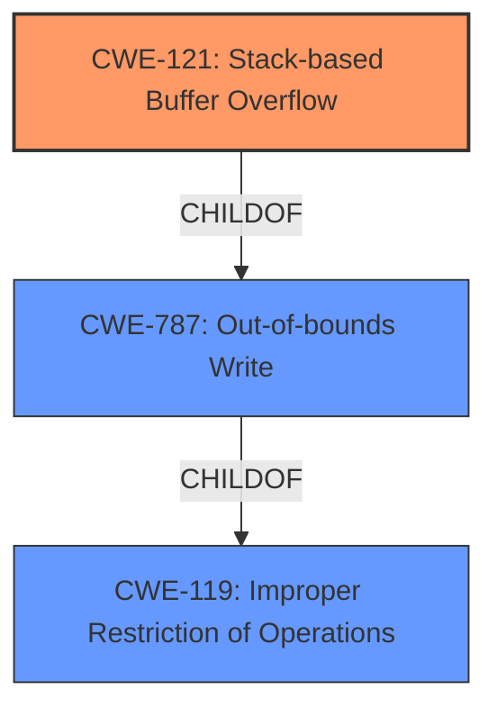

# Raw Analyzer Response for CVE-2021-33265

# Summary
| CWE ID | CWE Name | Confidence | CWE Abstraction Level | CWE Vulnerability Mapping Label | CWE-Vulnerability Mapping Notes |
|---|---|---|---|---|---|
| CWE-121 | Stack-based Buffer Overflow | 1.0 | Variant | Allowed | Primary CWE |

## Evidence and Confidence

*   **Confidence Score:** 1.0
*   **Evidence Strength:** HIGH

## Relationship Analysis
The primary relationship influencing the decision is the hierarchical structure. CWE-121 (Stack-based Buffer Overflow) is a Variant of CWE-787 (Out-of-bounds Write) and CWE-119 (Improper Restriction of Operations within the Bounds of a Memory Buffer). Given the explicit mention of "stack buffer overflow" in the vulnerability description, the variant CWE-121 is more specific and thus more appropriate than its parents.

## Vulnerability Chain
The vulnerability chain starts with the lack of input validation, leading to a buffer overflow on the stack, and ultimately resulting in potential arbitrary code execution.

Lack of Input Validation -> Stack Buffer Overflow (CWE-121) -> Arbitrary Code Execution

## Summary of Analysis
The initial analysis identified CWE-787 (Out-of-bounds Write) as a potential candidate based on similar CVE descriptions, but after further investigation and considering the explicit mention of "stack buffer overflow" in the vulnerability description and the "CVE Reference Links Content Summary" indicating a classic stack buffer overflow due to `strcpy` without length validation, CWE-121 (Stack-based Buffer Overflow) was selected as the primary CWE. This decision is supported by the fact that CWE-121 is a Variant of CWE-787 and provides a more specific classification of the vulnerability.

The selection of CWE-121 is based on strong evidence from the vulnerability description. The phrase "**stack buffer overflow**" directly indicates the nature of the vulnerability. The "CVE Reference Links Content Summary" confirms that the **root cause** is a stack buffer overflow caused by using `strcpy` without proper bounds checking:

>   The `get_var` function extracts user-controlled input from an HTTP request, specifically the value associated with keys of the format `sched_name_%d`.
>   The extracted string (`pcVar2`) is then copied to a stack buffer (`local_1c4`) using `strcpy` without any length validation.
>   **Stack-based buffer overflow:** The primary vulnerability is a classic stack buffer overflow due to the use of `strcpy` on a user-controlled input without any size checks.

This evidence clearly justifies the selection of CWE-121. The abstraction level is appropriate because CWE-121 is a Variant, providing a specific classification for stack-based buffer overflows.

Relevant CWE Information:

# Enhanced Context (25 CWEs)
The following CWEs were identified as potentially relevant to this vulnerability:

## CWE-674: Uncontrolled Recursion
**Abstraction Level**: Class
**Similarity Score**: 0.74
**Source**: dense

**Description**:
The product does not properly control the amount of recursion that takes place,  consuming excessive resources, such as allocated memory or the program stack.

**Mapping Guidance**:
- Usage: Allowed-with-Review
- Rationale: This CWE entry is a Class and might have Base-level children that would be more appropriate

**Why Not Used:** This CWE is not relevant as the vulnerability is a buffer overflow, not uncontrolled recursion.

## CWE-1325: Improperly Controlled Sequential Memory Allocation
**Abstraction Level**: Base
**Similarity Score**: 0.74
**Source**: dense

**Description**:
The product manages a group of objects or resources and performs a separate memory allocation for each object, but it does not properly limit the total amount of memory that is consumed by all of the combined objects.

**Mapping Guidance**:
- Usage: Allowed
- Rationale: This CWE entry is at the Base level of abstraction, which is a preferred level of abstraction for mapping to the root causes of vulnerabilities.

**Why Not Used:** This CWE is not relevant to the described vulnerability as it deals with resource management and memory allocation limits, whereas the vulnerability is a stack buffer overflow.

## CWE-691: Insufficient Control Flow Management
**Abstraction Level**: Pillar
**Similarity Score**: 0.74
**Source**: dense

**Description**:
The code does not sufficiently manage its control flow during execution, creating conditions in which the control flow can be modified in unexpected ways.

**Mapping Guidance**:
- Usage: Discouraged
- Rationale: This CWE entry is extremely high-level, a Pillar. However, classification research is limited for weaknesses of this type, so there can be gaps or organizational difficulties within CWE that force use of this weakness, even at such a high level of abstraction.

**Why Not Used:** This CWE is too abstract and doesn't accurately represent the specific buffer overflow vulnerability.

## CWE-664: Improper Control of a Resource Through its Lifetime
**Abstraction Level**: Pillar
**Similarity Score**: 0.73
**Source**: dense

**Description**:
The product does not maintain or incorrectly maintains control over a resource throughout its lifetime of creation, use, and release.

**Mapping Guidance**:
- Usage: Discouraged
- Rationale: This CWE entry is high-level when lower-level children are available.

**Why Not Used:** This CWE is too abstract and doesn't accurately represent the specific buffer overflow vulnerability.

## CWE-191: Integer Underflow (Wrap or Wraparound)
**Abstraction Level**: Base
**Similarity Score**: 0.73
**Source**: dense

**Description**:
The product subtracts one value from another, such that the result is less than the minimum allowable integer value, which produces a value that is not equal to the correct result.

**Mapping Guidance**:
- Usage: Allowed
- Rationale: This CWE entry is at the Base level of abstraction, which is a preferred level of abstraction for mapping to the root causes of vulnerabilities.

**Why Not Used:** This CWE deals with integer underflows, which is not the case in the described vulnerability.

## CWE-131: Incorrect Calculation of Buffer Size
**Abstraction Level**: Base
**Similarity Score**: 0.73
**Source**: dense

**Description**:
The product does not correctly calculate the size to be used when allocating a buffer, which could lead to a buffer overflow.

**Mapping Guidance**:
- Usage: Allowed
- Rationale: This CWE entry is at the Base level of abstraction, which is a preferred level of abstraction for mapping to the root causes of vulnerabilities.

**Why Not Used:** While this CWE is related to buffer overflows, the provided information states that the overflow occurs because `strcpy` is used *without any length validation*, not due to an incorrect calculation of buffer size.

## CWE-41: Improper Resolution of Path Equivalence
**Abstraction Level**: Base
**Similarity Score**: 0.73
**Source**: dense

**Description**:
The product is vulnerable to file system contents disclosure through path equivalence. Path equivalence involves the use of special characters in file and directory names. The associated manipulations are intended to generate multiple names for the same object.

**Mapping Guidance**:
- Usage: Allowed
- Rationale: This CWE entry is at the Base level of abstraction, which is a preferred level of abstraction for mapping to the root causes of vulnerabilities.

**Why Not Used:** This CWE is not relevant to the described buffer overflow vulnerability.

## CWE-226: Sensitive Information in Resource Not Removed Before Reuse
**Abstraction Level**: Base
**Similarity Score**: 0.73
**Source**: dense

**Description**:
The product releases a resource such as memory or a file so that it can be made available for reuse, but it does not clear or "zeroize" the information contained in the resource before the product performs a critical state transition or makes the resource available for reuse by other entities.

**Mapping Guidance**:
- Usage: Allowed
- Rationale: This CWE entry is at the Base level of abstraction, which is a preferred level of abstraction for mapping to the root causes of vulnerabilities.

**Why Not Used:** This CWE is not relevant to the described buffer overflow vulnerability.

## CWE-667: Improper Locking
**Abstraction Level**: Class
**Similarity Score**: 0.73
**Source**: dense

**Description**:
The product does not properly acquire or release a lock on a resource, leading to unexpected resource state changes and behaviors.

**Mapping Guidance**:
- Usage: Allowed-with-Review
- Rationale: This CWE entry is a Class and might have Base-level children that would be more appropriate

**Why Not Used:** This CWE is not relevant to the described buffer overflow vulnerability.