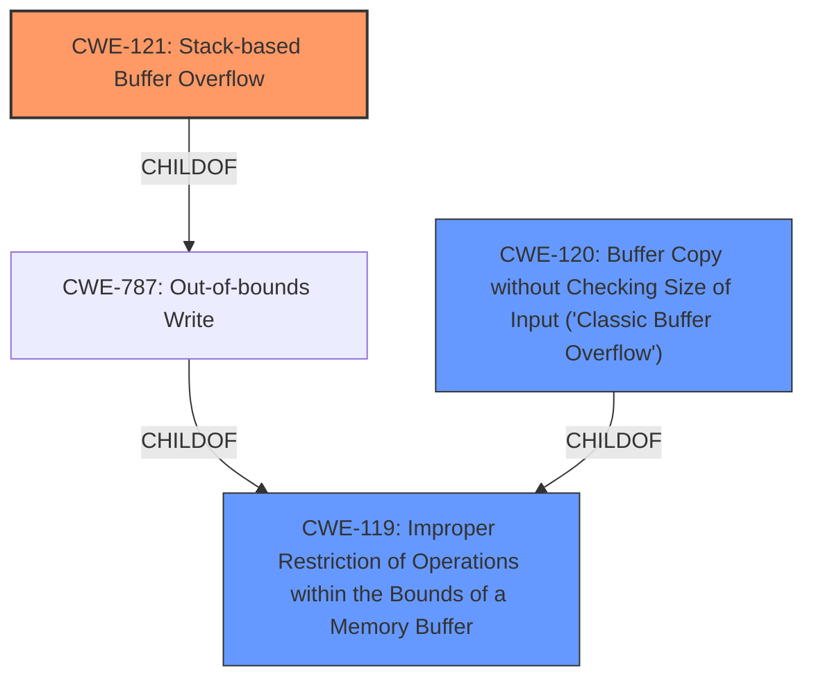

# Raw Analyzer Response for CVE-2021-33266

# Summary
| CWE ID | CWE Name | Confidence | CWE Abstraction Level | CWE Vulnerability Mapping Label | CWE-Vulnerability Mapping Notes |
|---|---|---|---|---|---|
| CWE-121 | Stack-based Buffer Overflow | 1.0 | Variant | Primary | Allowed |
| CWE-119 | Improper Restriction of Operations within the Bounds of a Memory Buffer | 0.7 | Class | Secondary | Discouraged |
| CWE-120 | Buffer Copy without Checking Size of Input ('Classic Buffer Overflow') | 0.6 | Base | Secondary | Allowed-with-Review |

## Evidence and Confidence

*   **Confidence Score:** 0.9
*   **Evidence Strength:** HIGH

## Relationship Analysis
The primary CWE is CWE-121 Stack-based Buffer Overflow (Variant). This is a specific type of CWE-787 Out-of-bounds Write, which is in turn a specific case of CWE-119 Improper Restriction of Operations within the Bounds of a Memory Buffer (Class). The analysis also considered CWE-120 Buffer Copy without Checking Size of Input ('Classic Buffer Overflow') (Base) as a related weakness because the `strcpy` function, which copies the buffer without checking size, is used. However, since the overflow is explicitly stated to be on the stack, CWE-121 is preferred.

## Vulnerability Chain
The vulnerability chain begins with **improper handling of user-supplied input** via a POST request. The `get_var` function extracts this input without proper bounds checking. The extracted string is then copied into a stack buffer using `strcpy`, resulting in a **stack buffer overflow**. This overflow allows an attacker to overwrite the return address on the stack, leading to **arbitrary code execution** and potential **device compromise**.

## Summary of Analysis
The initial analysis identified a **stack buffer overflow** due to the use of `strcpy` without bounds checking when handling user-supplied input from a POST request. The primary CWE selected is CWE-121 Stack-based Buffer Overflow, as the description explicitly mentions a stack buffer overflow. This is supported by the **Vulnerability Description Key Phrases**, "**weakness:** **stack buffer overflow**" and the **CVE Reference Links Content Summary**, which states, "The vulnerability is a stack-based buffer overflow" and "The extracted string is then copied into a stack buffer using `strcpy` without any bounds checking".

CWE-119 Improper Restriction of Operations within the Bounds of a Memory Buffer was considered because it is a more general class of weakness that includes buffer overflows. However, since the vulnerability is specifically a stack-based buffer overflow, CWE-121 is more appropriate. Furthermore, the mapping notes for CWE-119 advises looking at the children of CWE-119 and considering CWEs such as CWE-787 Out-of-bounds Write, and CWE-125 Out-of-bounds Read, or others.

CWE-120 Buffer Copy without Checking Size of Input ('Classic Buffer Overflow') was considered because the root cause involves copying a buffer without checking its size. However, since the vulnerability is specifically a stack-based buffer overflow (CWE-121), and CWE-120 is not as specific as CWE-121, CWE-121 is preferred. The **CVE Reference Links Content Summary** further clarifies the root cause: "The extracted string is then copied into a stack buffer using `strcpy` without any bounds checking, leading to a stack overflow if the input string is too long."

The selected CWEs are at the optimal level of specificity because CWE-121 directly describes the vulnerability. This decision is based on the evidence provided and the MITRE mapping guidance to choose the most specific CWE available.