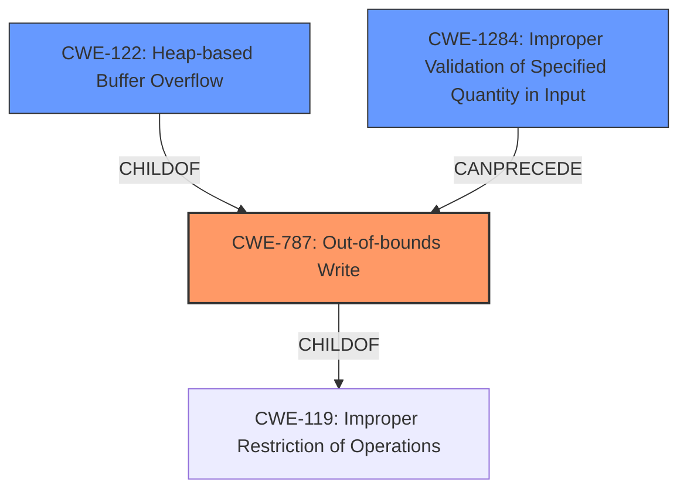

# Enhanced Analysis for CVE-2021-33285

# Summary
| CWE ID  | CWE Name | Confidence | CWE Abstraction Level | CWE Vulnerability Mapping Label | CWE-Vulnerability Mapping Notes |
|----------------|----------------------------------------------------------------------------------------------------------------------|--------------------|---------------------------|------------------------------------|------------------------------------------------------------------------------------------------------------------------------------------------------|
| CWE-787 | Out-of-bounds Write | 0.9 | Base | Allowed | The product writes data past the end of the intended buffer due to **missing consistency check**. |
| CWE-122 | Heap-based Buffer Overflow | 0.7 | Variant | Allowed | The **heap buffer overflow** occurs because the data is written to a heap-allocated buffer.|
| CWE-1284 | Improper Validation of Specified Quantity in Input | 0.6 | Base | Allowed | The quantity (`bytes_in_use` compared to `bytes_allocated`) is not properly validated. |

## Evidence and Confidence

*   **Confidence Score:** 0.8
*   **Evidence Strength:** HIGH

## Relationship Analysis
The primary weakness is CWE-787, which is a child of CWE-119 (Improper Restriction of Operations within the Bounds of a Memory Buffer). CWE-122 (Heap-based Buffer Overflow) is a variant of CWE-787, specifying the location of the overflow. CWE-1284 (Improper Validation of Specified Quantity in Input) can precede the overflow.



## Vulnerability Chain
The vulnerability chain starts with **Improper Validation of Specified Quantity in Input** (CWE-1284), where the `bytes_in_use` field is not validated against the `bytes_allocated` field. This leads to an **Out-of-bounds Write** (CWE-787), specifically a **Heap-based Buffer Overflow** (CWE-122), resulting in memory disclosure and denial of service.

## Summary of Analysis
The initial assessment focused on the **heap buffer overflow** and **missing consistency check**. The provided evidence clearly indicates a failure to validate the `bytes_in_use` field against the `bytes_allocated` field, leading to an out-of-bounds write.

*   The vulnerability description states: "when a specially crafted NTFS attribute is supplied to the function ntfs_get_attribute_value, a **heap buffer overflow** can occur allowing for memory disclosure or denial of service."
*   The vulnerability description also states: "The root cause is a **missing consistency check** after reading an MFT record the bytes_in_use field should be less than the bytes_allocated field. When it is not, the parsing of the records proceeds into the wild."
*   The CVE Reference Links Content Summary confirms this: "The vulnerability is due to a missing consistency check after reading an MFT (Master File Table) record in NTFS-3G. Specifically, the `bytes_in_use` field is not verified to be less than the `bytes_allocated` field. When this condition is not met, parsing of the records continues into memory beyond the allocated buffer causing an out-of-bounds heap buffer access."

The graph relationships and retriever results support the selection of CWE-787 as the primary weakness, with CWE-122 providing more specific context. CWE-1284 is included because the **missing consistency check** involves failing to validate the size of the input data.

The selected CWEs are at the optimal level of specificity because they accurately reflect the root cause (**missing consistency check** leading to out-of-bounds write) and the specific type of buffer overflow (heap-based).

**CWEs Considered but Not Used:**

*   CWE-119: Improper Restriction of Operations within the Bounds of a Memory Buffer - This is a higher-level class that is too general. CWE-787 is a more specific base weakness.
*   CWE-190: Integer Overflow or Wraparound - While an integer overflow could theoretically occur, the primary issue is the lack of validation, not an overflow itself.
*   CWE-125: Out-of-bounds Read - The vulnerability is primarily an out-of-bounds write, not a read.
*   CWE-20: Improper Input Validation - This is a very broad class. CWE-1284 is more specific to the kind of input validation error that is present in the vulnerability.


## CWE Relationship Analysis

Current CWEs represent these abstraction levels: .


### Vulnerability Chain Analysis

**Chain starting from CWE-787:**
- 787 (Out-of-bounds Write) - ROOT


**Chain starting from CWE-122:**
- 122 (Heap-based Buffer Overflow) - ROOT


### CWE Relationship Diagram

```mermaid
graph TD
    classDef primary fill:#f96,stroke:#333,stroke-width:2px
    classDef secondary fill:#69f,stroke:#333
    classDef tertiary fill:#9e9,stroke:#333
```