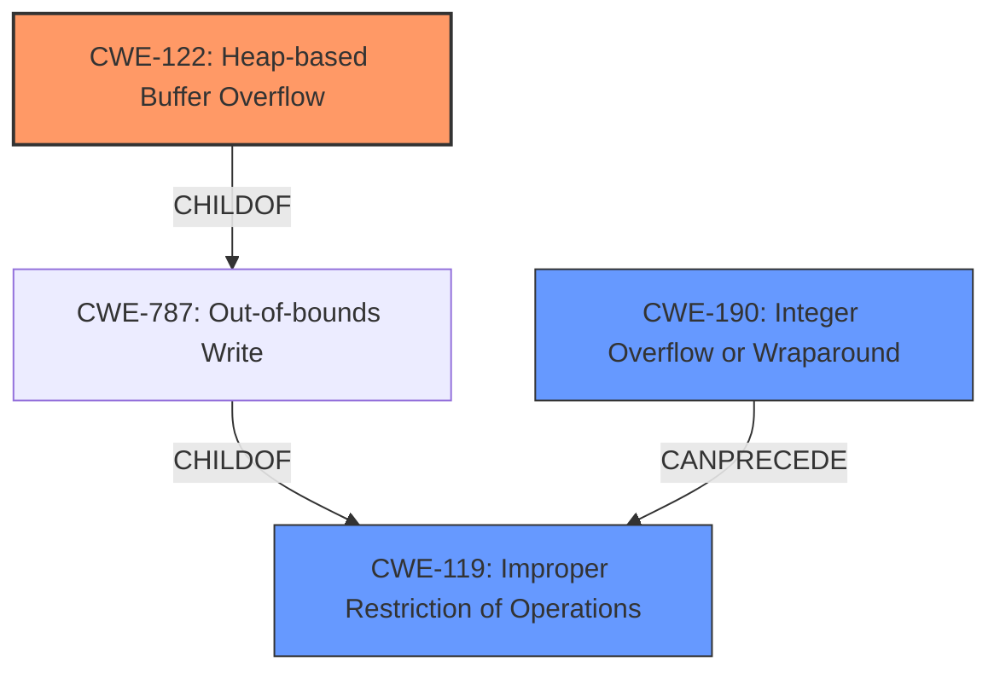

# Analysis for CVE-2021-33287

# Summary
| CWE ID    | CWE Name                                                                  | Confidence | CWE Abstraction Level | CWE Vulnerability Mapping Label | CWE-Vulnerability Mapping Notes |
| :-------- | :------------------------------------------------------------------------ | :--------- | :-------------------- | :------------------------------ | :------------------------------ |
| CWE-122   | Heap-based Buffer Overflow                                                  | 1.0        | Variant               | Primary CWE                     | Allowed                       |
| CWE-119   | Improper Restriction of Operations within the Bounds of a Memory Buffer    | 0.7        | Class                 | Secondary Candidate             | Discouraged                    |
| CWE-190   | Integer Overflow or Wraparound                                            | 0.6        | Base                  | Secondary Candidate             | Allowed                       |

## Evidence and Confidence

*   **Confidence Score:** 0.9
*   **Evidence Strength:** HIGH

## Relationship Analysis
The primary CWE is CWE-122, which is a variant of CWE-787 (Out-of-bounds Write) and CWE-119. CWE-119 is a class-level CWE that is generally discouraged for use when more specific CWEs exist. CWE-190 can precede CWE-119, indicating a potential chain where an integer overflow leads to a buffer overflow.



## Vulnerability Chain
The vulnerability chain involves a specially crafted NTFS attribute leading to a **heap buffer overflow**, which can then result in arbitrary memory writes or denial of service. A possible integer overflow might precede the **heap buffer overflow** by influencing the buffer size or index calculation.
  - Root Cause: Specially crafted NTFS attributes, possible Integer Overflow
  - Weakness: **Heap-based Buffer Overflow**
  - Impact: Arbitrary memory write or Denial of Service

## Summary of Analysis
The initial assessment identified CWE-122 as the primary candidate, supported by the **"weakness: heap buffer overflow"** phrase in the Vulnerability Description Key Phrases section and "Heap buffer overflow" in the CVE Reference Links Content Summary. The CVE reference links also suggest a possible Integer Overflow.

The relationship analysis revealed that CWE-122 is a variant of CWE-787 and a child of CWE-119, making it a more specific and appropriate choice than CWE-119. The canPrecede relationship between CWE-190 and CWE-119 suggests that an integer overflow could potentially be a contributing factor, but the evidence is not strong enough to make it a primary cause.

The final decision is based on the explicit mention of "**heap buffer overflow**" in the vulnerability description and CVE summaries, making CWE-122 the most accurate and specific CWE.

Relevant CWE Information:

# Enhanced Context (25 CWEs)
The following CWEs were identified as potentially relevant to this vulnerability:

## CWE-191: Integer Underflow (Wrap or Wraparound)
**Abstraction Level**: Base
**Similarity Score**: 0.78
**Source**: dense

**Description**:
The product subtracts one value from another, such that the result is less than the minimum allowable integer value, which produces a value that is not equal to the correct result.

**Mapping Guidance**:
- Usage: Allowed
- Rationale: This CWE entry is at the Base level of abstraction, which is a preferred level of abstraction for mapping to the root causes of vulnerabilities.


## CWE-131: Incorrect Calculation of Buffer Size
**Abstraction Level**: Base
**Similarity Score**: 0.77
**Source**: dense

**Description**:
The product does not correctly calculate the size to be used when allocating a buffer, which could lead to a buffer overflow.

**Mapping Guidance**:
- Usage: Allowed
- Rationale: This CWE entry is at the Base level of abstraction, which is a preferred level of abstraction for mapping to the root causes of vulnerabilities.


## CWE-125: Out-of-bounds Read
**Abstraction Level**: Base
**Similarity Score**: 0.76
**Source**: dense

**Description**:
The product reads data past the end, or before the beginning, of the intended buffer.

**Mapping Guidance**:
- Usage: Allowed
- Rationale: This CWE entry is at the Base level of abstraction, which is a preferred level of abstraction for mapping to the root causes of vulnerabilities.


## CWE-126: Buffer Over-read
**Abstraction Level**: Variant
**Similarity Score**: 0.76
**Source**: dense

**Description**:
The product reads from a buffer using buffer access mechanisms such as indexes or pointers that reference memory locations after the targeted buffer.

**Mapping Guidance**:
- Usage: Allowed
- Rationale: This CWE entry is at the Variant level of abstraction, which is a preferred level of abstraction for mapping to the root causes of vulnerabilities.


## CWE-124: Buffer Underwrite ('Buffer Underflow')
**Abstraction Level**: Base
**Similarity Score**: 0.75
**Source**: dense

**Description**:
The product writes to a buffer using an index or pointer that references a memory location prior to the beginning of the buffer.

**Mapping Guidance**:
- Usage: Allowed
- Rationale: This CWE entry is at the Base level of abstraction, which is a preferred level of abstraction for mapping to the root causes of vulnerabilities.


## CWE-193: Off-by-one Error
**Abstraction Level**: Base
**Similarity Score**: 0.75
**Source**: dense

**Description**:
A product calculates or uses an incorrect maximum or minimum value that is 1 more, or 1 less, than the correct value.

**Mapping Guidance**:
- Usage: Allowed
- Rationale: This CWE entry is at the Base level of abstraction, which is a preferred level of abstraction for mapping to the root causes of vulnerabilities.


## CWE-190: Integer Overflow or Wraparound
**Abstraction Level**: Base
**Similarity Score**: 0.75
**Source**: dense

**Description**:
The product performs a calculation that can
         produce an integer overflow or wraparound when the logic
         assumes that the resulting value will always be larger than
         the original value. This occurs when an integer value is
         incremented to a value that is too large to store in the
         associated representation. When this occurs, the value may
         become a very small or negative number.

**Mapping Guidance**:
- Usage: Allowed
- Rationale: This CWE entry is at the Base level of abstraction, which is a preferred level of abstraction for mapping to the root causes of vulnerabilities.


## CWE-129: Improper Validation of Array Index
**Abstraction Level**: Variant
**Similarity Score**: 0.75
**Source**: dense

**Description**:
The product uses untrusted input when calculating or using an array index, but the product does not validate or incorrectly validates the index to ensure the index references a valid position within the array.

**Mapping Guidance**:
- Usage: Allowed
- Rationale: This CWE entry is at the Variant level of abstraction, which is a preferred level of abstraction for mapping to the root causes of vulnerabilities.


## CWE-805: Buffer Access with Incorrect Length Value
**Abstraction Level**: Base
**Similarity Score**: 0.75
**Source**: dense

**Description**:
The product uses a sequential operation to read or write a buffer, but it uses an incorrect length value that causes it to access memory that is outside of the bounds of the buffer.

**Mapping Guidance**:
- Usage: Allowed
- Rationale: This CWE entry is at the Base level of abstraction, which is a preferred level of abstraction for mapping to the root causes of vulnerabilities.


## CWE-119: Improper Restriction of Operations within the Bounds of a Memory Buffer
**Abstraction Level**: Class
**Similarity Score**: 0.74
**Source**: dense

**Description**:
The product performs operations on a memory buffer, but it reads from or writes to a memory location outside the buffer's intended boundary. This may result in read or write operations on unexpected memory locations that could be linked to other variables, data structures, or internal program data.

**Mapping Guidance**:
- Usage: Discouraged
- Rationale: CWE-119 is commonly misused in low-information vulnerability reports when lower-level CWEs could be used instead, or when more details about the vulnerability are available.


## CWE-190: Integer Overflow or Wraparound
**Abstraction Level**: Base

# Enhanced Query for CVE-2021-33287

## Vulnerability Description
In NTFS-3G versions < 2021.8.22, when specially crafted NTFS attributes are read in the function ntfs_attr_pread_i, a **heap buffer overflow** can occur and allow for writing to arbitrary memory or denial of service of the application.

### Vulnerability Description Key Phrases
- **weakness:** **heap buffer overflow**
- **impact:** writing to arbitrary memory and denial of service
- **vector:** specially crafted NTFS attributes
- **product:** NTFS-3G
- **version:** < 2021.8.22
- **component:** ntfs_attr_pread_i function

## CVE Reference Links Content Summary
```
{
  "CVE-2021-33287": {
    "root_cause": "The vulnerability exists due to improper bounds checking when processing NTFS attributes in the ntfs_attr_pread_i function, leading to a heap buffer overflow.",
    "weaknesses": [
      "Heap buffer overflow"
    ],
    "impact": "The vulnerability can lead to arbitrary memory writes or a denial of service.",
    "attack_vectors": "Local access to a system with a maliciously crafted NTFS-formatted image file.",
    "required_capabilities": "Ability to mount the malicious NTFS image file."
  },
   "CVE-2021-39254": {
    "root_cause": "Integer overflow in memmove when resizing attribute records.",
    "weaknesses": [
      "Integer Overflow",
      "Heap-based buffer overflow"
    ],
     "impact": "A crafted NTFS image can cause a heap-based buffer overflow which could lead to arbitrary code execution.",
    "attack_vectors": "Local access, a malicious NTFS image file is required.",
    "required_capabilities": "Ability to mount the malicious NTFS image file."
  },
    "CVE-2021-39256": {
    "root_cause": "A heap-based buffer overflow vulnerability in ntfs_inode_lookup_by_name.",
    "weaknesses": [
       "Heap-based buffer overflow"
    ],
    "impact": "A crafted NTFS image can cause a heap-based buffer overflow.",
    "attack_vectors": "Local access, a malicious NTFS image file is required.",
    "required_capabilities": "Ability to mount the malicious NTFS image file."
  },
  "CVE-2021-35269": {
    "root_cause": "A heap buffer overflow in ntfs_attr_setup_flag when setting up an NTFS attribute from the MFT.",
    "weaknesses": [
      "Heap buffer overflow",
      "Improper Privilege Management"
     ],
    "impact": "Code execution and/or privilege escalation",
    "attack_vectors": "Local access, a malicious NTFS image file is required.",
     "required_capabilities": "Ability to mount the malicious NTFS image file."
  },
  "CVE-2021-35266": {
    "root_cause": "A heap buffer overflow can occur when a specially crafted NTFS inode pathname is supplied.",
    "weaknesses": [
      "Heap buffer overflow"
    ],
    "impact": "Memory disclosure, denial of service and/or code execution.",
    "attack_vectors": "Local access, a malicious NTFS image file is required.",
     "required_capabilities": "Ability to mount the malicious NTFS image file."
  },
    "CVE-2021-35268": {
    "root_cause": "A heap buffer overflow in the ntfs_inode_real_open function when loading a crafted NTFS inode.",
    "weaknesses": [
      "Heap buffer overflow"
    ],
    "impact": "Code execution and/or privilege escalation.",
    "attack_vectors": "Local access, a malicious NTFS image file is required.",
     "required_capabilities": "Ability to mount the malicious NTFS image file."
  },
   "CVE-2021-39252": {
    "root_cause": "Out-of-bounds read vulnerability in ntfs_ie_lookup.",
    "weaknesses": [
      "Out-of-bounds read"
    ],
    "impact": "A crafted NTFS image can cause an out-of-bounds read.",
    "attack_vectors": "Local access, a malicious NTFS image file is required.",
    "required_capabilities": "Ability to mount the malicious NTFS image file."
  },
   "CVE-2021-39253": {
    "root_cause": "Out-of-bounds read in ntfs_runlists_merge_i.",
    "weaknesses": [
       "Out-of-bounds read"
    ],
    "impact": "A crafted NTFS image can trigger an out-of-bounds read.",
    "attack_vectors": "Local access, a malicious NTFS image file is required.",
    "required_capabilities": "Ability to mount the malicious NTFS image file."
   },
    "CVE-2021-39260": {
    "root_cause": "Out-of-bounds access in ntfs_inode_sync_standard_information.",
      "weaknesses": [
        "Buffer Overflow",
        "Out-of-bounds access"
     ],
    "impact": "A crafted NTFS image can cause an out-of-bounds access.",
    "attack_vectors": "Local access, a malicious NTFS image file is required.",
     "required_capabilities": "Ability to mount the malicious NTFS image file."
  },
   "CVE-2021-39255": {
    "root_cause": "Out-of-bounds read due to an invalid attribute in ntfs_attr_find_in_attrdef.",
    "weaknesses": [
      "Out-of-bounds read"
    ],
     "impact": "A crafted NTFS image can trigger an out-of-bounds read.",
    "attack_vectors": "Local access, a malicious NTFS image file is required.",
    "required_capabilities": "Ability to mount the malicious NTFS image file."
  },
   "CVE-2021-39251": {
    "root_cause": "NULL pointer dereference vulnerability in ntfs_extent_inode_open.",
    "weaknesses": [
       "NULL pointer dereference"
    ],
      "impact": "A crafted NTFS image can cause a NULL pointer dereference.",
    "attack_vectors": "Local access, a malicious NTFS image file is required.",
     "required_capabilities": "Ability to mount the malicious NTFS image file."
  },
   "CVE-2021-39261": {
      "root_cause": "A heap-based buffer overflow in ntfs_compressed_pwrite.",
    "weaknesses": [
      "Heap-based buffer overflow"
    ],
     "impact": "A crafted NTFS image can cause a heap-based buffer overflow",
    "attack_vectors": "Local access, a malicious NTFS image file is required.",
    "required_capabilities": "Ability to mount the malicious NTFS image file."
  },
   "CVE-2021-39262": {
       "root_cause": "Out-of-bounds access in ntfs_decompress",
    "weaknesses": [
       "Buffer Overflow",
        "Out-of-bounds access"
     ],
     "impact": "A crafted NTFS image can cause an out-of-bounds access.",
    "attack_vectors": "Local access, a malicious NTFS image file is required.",
     "required_capabilities": "Ability to mount the malicious NTFS image file."
    },
  "CVE-2021-39263": {
    "root_cause": "A heap-based buffer overflow, caused by an unsanitized attribute in ntfs_get_attribute_value.",
    "weaknesses": [
      "Heap-based buffer overflow"
    ],
    "impact": "A crafted NTFS image can trigger a heap-based buffer overflow.",
    "attack_vectors": "Local access, a malicious NTFS image file is required.",
    "required_capabilities": "Ability to mount the malicious NTFS image file."
  },
  "CVE-2021-33285":{
        "root_cause": "Out-of-bounds heap buffer access in ntfs_get_attribute_value() due to incorrect check of bytes_in_use value in MFT records.",
        "weaknesses": [
            "Out-of-bounds heap buffer access"
        ],
        "impact": "Heap buffer overflow and potential code execution.",
        "attack_vectors": "Local access, a malicious NTFS image file is required.",
        "required_capabilities": "Ability to mount the malicious NTFS image file."
  },
  "CVE-2021-33289":{
        "root_cause": "A heap buffer overflow can occur when a specially crafted MFT section is supplied in an NTFS image.",
        "weaknesses": [
            "Heap buffer overflow"
        ],
        "impact": "Heap buffer overflow and potential code execution.",
        "attack_vectors": "Local access, a malicious NTFS image file is required.",
        "required_capabilities": "Ability to mount the malicious NTFS image file."
  },
   "CVE-2021-33286":{
        "root_cause": "A heap buffer overflow can occur when a specially crafted unicode string is supplied in an NTFS image",
        "weaknesses": [
             "Heap buffer overflow"
        ],
        "impact": "Code execution.",
        "attack_vectors": "Local access, a malicious NTFS image file is required.",
         "required_capabilities": "Ability to mount the malicious NTFS image file."
  },
   "CVE-2021-35267":{
        "root_cause": "A stack buffer overflow when correcting differences in the MFT and MFTMirror.",
         "weaknesses": [
             "Stack buffer overflow"
        ],
        "impact": "Code execution or escalation of privileges when setuid-root.",
         "attack_vectors": "Local access, a malicious NTFS image file is required.",
          "required_capabilities": "Ability to mount the malicious NTFS image file."
      }
  }
```

## Retriever Results

### Top Combined Results

| Rank | CWE ID | Name | Abstraction | Usage  | Retrievers | Individual Scores |
|------|--------|------|-------------|-------|------------|-------------------|
| 1 | 119 | Improper Restriction of Operations within the Bounds of a Memory Buffer | Class | Discouraged | alternate_terms | 0.800 |
| 2 | 190 | Integer Overflow or Wraparound | Base | Allowed | alternate_terms | 0.800 |
| 3 | 122 | Heap-based Buffer Overflow | Variant | Allowed | sparse | 0.338 |
| 4 | 193 | Off-by-one Error | Base | Allowed | sparse | 0.266 |
| 5 | 126 | Buffer Over-read | Variant | Allowed | sparse | 0.264 |
| 6 | 1386 | Insecure Operation on Windows Junction / Mount Point | Base | Allowed | dense | 0.559 |
| 7 | 128 | Wrap-around Error | Base | Allowed | graph | 0.003 |
| 8 | 1284 | Improper Validation of Specified Quantity in Input | Base | Allowed | sparse | 0.263 |
| 9 | 125 | Out-of-bounds Read | Base | Allowed | sparse | 0.262 |
| 10 | 121 | Stack-based Buffer Overflow | Variant | Allowed | sparse | 0.254 |


# Complete CWE Specifications


## CWE-119: Improper Restriction of Operations within the Bounds of a Memory Buffer
**Abstraction:** Class
**Status:** Stable

### Description
The product performs operations on a memory buffer, but it reads from or writes to a memory location outside the buffer's intended boundary. This may result in read or write operations on unexpected memory locations that could be linked to other variables, data structures, or internal program data.

### Extended Description
Not provided

### Alternative Terms
Buffer Overflow: This term has many different meanings to different audiences. From a CWE mapping perspective, this term should be avoided where possible. Some researchers, developers, and tools intend for it to mean "write past the end of a buffer," whereas others use the same term to mean "any read or write outside the boundaries of a buffer, whether before the beginning of the buffer or after the end of the buffer." Others could mean "any action after the end of a buffer, whether it is a read or write." Since the term is commonly used for exploitation and for vulnerabilities, it further confuses things.
buffer overrun: Some prominent vendors and researchers use the term "buffer overrun," but most people use "buffer overflow." See the alternate term for "buffer overflow" for context.
memory safety: Generally used for techniques that avoid weaknesses related to memory access, such as those identified by CWE-119 and its descendants. However, the term is not formal, and there is likely disagreement between practitioners as to which weaknesses are implicitly covered by the "memory safety" term.

### Relationships
ChildOf -> CWE-118
ChildOf -> CWE-20

### Mapping Guidance
**Usage:** Discouraged
**Rationale:** CWE-119 is commonly misused in low-information vulnerability reports when lower-level CWEs could be used instead, or when more details about the vulnerability are available.
**Comments:** Look at CWE-119's children and consider mapping to CWEs such as CWE-787: Out-of-bounds Write, CWE-125: Out-of-bounds Read, or others.
**Reasons:**
- Frequent Misuse


### Additional Notes
**[Applicable Platform]** 

It is possible in any programming languages without memory management support to attempt an operation outside of the bounds of a memory buffer, but the consequences will vary widely depending on the language, platform, and chip architecture.


### Observed Examples
- **CVE-2021-22991:** Incorrect URI normalization in application traffic product leads to buffer overflow, as exploited in the wild per CISA KEV.
- **CVE-2020-29557:** Buffer overflow in Wi-Fi router web interface, as exploited in the wild per CISA KEV.
- **CVE-2009-2550:** Classic stack-based buffer overflow in media player using a long entry in a playlist


## CWE-190: Integer Overflow or Wraparound
**Abstraction:** Base
**Status:** Stable

### Description
The product performs a calculation that can
         produce an integer overflow or wraparound when the logic
         assumes that the resulting value will always be larger than
         the original value. This occurs when an integer value is
         incremented to a value that is too large to store in the
         associated representation. When this occurs, the value may
         become a very small or negative number.

### Extended Description
Not provided

### Alternative Terms
Overflow: The terms "overflow" and "wraparound" are used interchangeably by some people, but they can have more precise distinctions by others. See Terminology Notes.
Wraparound: The terms "overflow" and "wraparound" are used interchangeably by some people, but they can have more precise distinctions by others. See Terminology Notes.
wrap, wrap-around, wrap around: Alternate spellings of "wraparound"

### Relationships
ChildOf -> CWE-682
ChildOf -> CWE-682
ChildOf -> CWE-20
CanPrecede -> CWE-119

### Mapping Guidance
**Usage:** Allowed
**Rationale:** This CWE entry is at the Base level of abstraction, which is a preferred level of abstraction for mapping to the root causes of vulnerabilities.
**Comments:** Be careful of terminology problems with "overflow," "underflow," and "wraparound" - see Terminology Notes. Carefully read both the name and description to ensure that this mapping is an appropriate fit. Do not try to 'force' a mapping to a lower-level Base/Variant simply to comply with this preferred level of abstraction.
**Reasons:**
- Acceptable-Use
**Suggested Alternatives:**
- CWE-191: Integer Underflow (Wrap or Wraparound). Consider CWE-191 when the result is less than the minimum value that can be represented (sometimes called "underflows").


### Additional Notes
**[Relationship]** Integer overflows can be primary to buffer overflows when they cause less memory to be allocated than expected.

**[Terminology]** 

"Integer overflow" is sometimes used to cover several types of errors, including signedness errors, or buffer overflows that involve manipulation of integer data types instead of characters. Part of the confusion results from the fact that 0xffffffff is -1 in a signed context. Other confusion also arises because of the role that integer overflows have in chains.


A "wraparound" is a well-defined, standard behavior that follows specific rules for how to handle situations when the intended numeric value is too large or too small to be represented, as specified in standards such as C11.


"Overflow" is sometimes conflated with "wraparound" but typically indicates a non-standard or undefined behavior.


The "overflow" term is sometimes used to indicate cases where either the maximum or the minimum is exceeded, but others might only use "overflow" to indicate exceeding the maximum while using "underflow" for exceeding the minimum.


Some people use "overflow" to mean any value outside the representable range - whether greater than the maximum, or less than the minimum - but CWE uses "underflow" for cases in which the intended result is less than the minimum.


See [REF-1440] for additional explanation of the ambiguity of terminology.


**[Other]** While there may be circumstances in which the logic intentionally relies on wrapping - such as with modular arithmetic in timers or counters - it can have security consequences if the wrap is unexpected. This is especially the case if the integer overflow can be triggered using user-supplied inputs.


### Observed Examples
- **CVE-2021-43537:** Chain: in a web browser, an unsigned 64-bit integer is forcibly cast to a 32-bit integer (CWE-681) and potentially leading to an integer overflow (CWE-190). If an integer overflow occurs, this can cause heap memory corruption (CWE-122)
- **CVE-2022-21668:** Chain: Python library does not limit the resources used to process images that specify a very large number of bands (CWE-1284), leading to excessive memory consumption (CWE-789) or an integer overflow (CWE-190).
- **CVE-2022-0545:** Chain: 3D renderer has an integer overflow (CWE-190) leading to write-what-where condition (CWE-123) using a crafted image.


## CWE-122: Heap-based Buffer Overflow
**Abstraction:** Variant
**Status:** Draft

### Description
A heap overflow condition is a buffer overflow, where the buffer that can be overwritten is allocated in the heap portion of memory, generally meaning that the buffer was allocated using a routine such as malloc().

### Extended Description
Not provided

### Alternative Terms
None

### Relationships
ChildOf -> CWE-788
ChildOf -> CWE-787

### Mapping Guidance
**Usage:** Allowed
**Rationale:** This CWE entry is at the Variant level of abstraction, which is a preferred level of abstraction for mapping to the root causes of vulnerabilities.
**Comments:** Carefully read both the name and description to ensure that this mapping is an appropriate fit. Do not try to 'force' a mapping to a lower-level Base/Variant simply to comply with this preferred level of abstraction.
**Reasons:**
- Acceptable-Use


### Additional Notes
**[Relationship]** Heap-based buffer overflows are usually just as dangerous as stack-based buffer overflows.


### Observed Examples
- **CVE-2021-43537:** Chain: in a web browser, an unsigned 64-bit integer is forcibly cast to a 32-bit integer (CWE-681) and potentially leading to an integer overflow (CWE-190). If an integer overflow occurs, this can cause heap memory corruption (CWE-122)
- **CVE-2007-4268:** Chain: integer signedness error (CWE-195) passes signed comparison, leading to heap overflow (CWE-122)
- **CVE-2009-2523:** Chain: product does not handle when an input string is not NULL terminated (CWE-170), leading to buffer over-read (CWE-125) or heap-based buffer overflow (CWE-122).


## CWE-193: Off-by-one Error
**Abstraction:** Base
**Status:** Draft

### Description
A product calculates or uses an incorrect maximum or minimum value that is 1 more, or 1 less, than the correct value.

### Extended Description
Not provided

### Alternative Terms
off-by-five: An "off-by-five" error was reported for sudo in 2002 (CVE-2002-0184), but that is more like a "length calculation" error.

### Relationships
ChildOf -> CWE-682
ChildOf -> CWE-682
CanPrecede -> CWE-617
CanPrecede -> CWE-170
CanPrecede -> CWE-119

### Mapping Guidance
**Usage:** Allowed
**Rationale:** This CWE entry is at the Base level of abstraction, which is a preferred level of abstraction for mapping to the root causes of vulnerabilities.
**Comments:** Carefully read both the name and description to ensure that this mapping is an appropriate fit. Do not try to 'force' a mapping to a lower-level Base/Variant simply to comply with this preferred level of abstraction.
**Reasons:**
- Acceptable-Use


### Additional Notes
**[Relationship]** This is not always a buffer overflow. For example, an off-by-one error could be a factor in a partial comparison, a read from the wrong memory location, an incorrect conditional, etc.


### Observed Examples
- **CVE-2003-0252:** Off-by-one error allows remote attackers to cause a denial of service and possibly execute arbitrary code via requests that do not contain newlines.
- **CVE-2001-1391:** Off-by-one vulnerability in driver allows users to modify kernel memory.
- **CVE-2002-0083:** Off-by-one error allows local users or remote malicious servers to gain privileges.


## CWE-126: Buffer Over-read
**Abstraction:** Variant
**Status:** Draft

### Description
The product reads from a buffer using buffer access mechanisms such as indexes or pointers that reference memory locations after the targeted buffer.

### Extended Description
This typically occurs when the pointer or its index is incremented to a position beyond the bounds of the buffer or when pointer arithmetic results in a position outside of the valid memory location to name a few. This may result in exposure of sensitive information or possibly a crash.

### Alternative Terms
None

### Relationships
ChildOf -> CWE-125
ChildOf -> CWE-788

### Mapping Guidance
**Usage:** Allowed
**Rationale:** This CWE entry is at the Variant level of abstraction, which is a preferred level of abstraction for mapping to the root causes of vulnerabilities.
**Comments:** Carefully read both the name and description to ensure that this mapping is an appropriate fit. Do not try to 'force' a mapping to a lower-level Base/Variant simply to comply with this preferred level of abstraction.
**Reasons:**
- Acceptable-Use


### Additional Notes
**[Relationship]** These problems may be resultant from missing sentinel values (CWE-463) or trusting a user-influenced input length variable.


### Observed Examples
- **CVE-2022-1733:** Text editor has out-of-bounds read past end of line while indenting C code
- **CVE-2014-0160:** Chain: "Heartbleed" bug receives an inconsistent length parameter (CWE-130) enabling an out-of-bounds read (CWE-126), returning memory that could include private cryptographic keys and other sensitive data.
- **CVE-2009-2523:** Chain: product does not handle when an input string is not NULL terminated, leading to buffer over-read or heap-based buffer overflow.


## CWE-1386: Insecure Operation on Windows Junction / Mount Point
**Abstraction:** Base
**Status:** Incomplete

### Description
The product opens a file or directory, but it does not properly prevent the name from being associated with a junction or mount point to a destination that is outside of the intended control sphere.

### Extended Description


Depending on the intended action being performed, this could allow an attacker to cause the product to read, write, delete, or otherwise operate on unauthorized files.


In Windows, NTFS5 allows for file system objects called reparse points. Applications can create a hard link from one directory to another directory, called a junction point. They can also create a mapping from a directory to a drive letter, called a mount point. If a file is used by a privileged program, but it can be replaced with a hard link to a sensitive file (e.g., AUTOEXEC.BAT), an attacker could excalate privileges. When the process opens the file, the attacker can assume the privileges of that process, tricking the privileged process to read, modify, or delete the sensitive file, preventing the program from accurately processing data. Note that one can also point to registries and semaphores.


### Alternative Terms
None

### Relationships
ChildOf -> CWE-59

### Mapping Guidance
**Usage:** Allowed
**Rationale:** This CWE entry is at the Base level of abstraction, which is a preferred level of abstraction for mapping to the root causes of vulnerabilities.
**Comments:** Carefully read both the name and description to ensure that this mapping is an appropriate fit. Do not try to 'force' a mapping to a lower-level Base/Variant simply to comply with this preferred level of abstraction.
**Reasons:**
- Acceptable-Use


### Additional Notes
**[Terminology]** Symbolic links, hard links, junctions, and mount points can be confusing terminology, as there are differences in how they operate between UNIX-based systems and Windows, and there are interactions between them.

**[Maintenance]** This entry is still under development and will continue to see updates and content improvements.


### Observed Examples
- **CVE-2021-26426:** Privileged service allows attackers to delete unauthorized files using a directory junction, leading to arbitrary code execution as SYSTEM.
- **CVE-2020-0863:** By creating a mount point and hard links, an attacker can abuse a service to allow users arbitrary file read permissions.
- **CVE-2019-1161:** Chain: race condition (CWE-362) in anti-malware product allows deletion of files by creating a junction (CWE-1386) and using hard links during the time window in which a temporary file is created and deleted.


## CWE-128: Wrap-around Error
**Abstraction:** Base
**Status:** Incomplete

### Description
Wrap around errors occur whenever a value is incremented past the maximum value for its type and therefore "wraps around" to a very small, negative, or undefined value.

### Extended Description
Not provided

### Alternative Terms
None

### Relationships
ChildOf -> CWE-682
CanPrecede -> CWE-119
PeerOf -> CWE-190

### Mapping Guidance
**Usage:** Allowed
**Rationale:** This CWE entry is at the Base level of abstraction, which is a preferred level of abstraction for mapping to the root causes of vulnerabilities.
**Comments:** Carefully read both the name and description to ensure that this mapping is an appropriate fit. Do not try to 'force' a mapping to a lower-level Base/Variant simply to comply with this preferred level of abstraction.
**Reasons:**
- Acceptable-Use


### Additional Notes
**[Relationship]** The relationship between overflow and wrap-around needs to be examined more closely, since several entries (including CWE-190) are closely related.


## CWE-1284: Improper Validation of Specified Quantity in Input
**Abstraction:** Base
**Status:** Incomplete

### Description
The product receives input that is expected to specify a quantity (such as size or length), but it does not validate or incorrectly validates that the quantity has the required properties.

### Extended Description


Specified quantities include size, length, frequency, price, rate, number of operations, time, and others. Code may rely on specified quantities to allocate resources, perform calculations, control iteration, etc. When the quantity is not properly validated, then attackers can specify malicious quantities to cause excessive resource allocation, trigger unexpected failures, enable buffer overflows, etc.


### Alternative Terms
None

### Relationships
ChildOf -> CWE-20
ChildOf -> CWE-20
CanPrecede -> CWE-789

### Mapping Guidance
**Usage:** Allowed
**Rationale:** This CWE entry is at the Base level of abstraction, which is a preferred level of abstraction for mapping to the root causes of vulnerabilities.
**Comments:** Carefully read both the name and description to ensure that this mapping is an appropriate fit. Do not try to 'force' a mapping to a lower-level Base/Variant simply to comply with this preferred level of abstraction.
**Reasons:**
- Acceptable-Use


### Additional Notes
**[Maintenance]** This entry is still under development and will continue to see updates and content improvements.


### Observed Examples
- **CVE-2022-21668:** Chain: Python library does not limit the resources used to process images that specify a very large number of bands (CWE-1284), leading to excessive memory consumption (CWE-789) or an integer overflow (CWE-190).
- **CVE-2008-1440:** lack of validation of length field leads to infinite loop
- **CVE-2008-2374:** lack of validation of string length fields allows memory consumption or buffer over-read


## CWE-125: Out-of-bounds Read
**Abstraction:** Base
**Status:** Draft

### Description
The product reads data past the end, or before the beginning, of the intended buffer.

### Extended Description
Not provided

### Alternative Terms
OOB read: Shorthand for "Out of bounds" read

### Relationships
ChildOf -> CWE-119
ChildOf -> CWE-119
ChildOf -> CWE-119
ChildOf -> CWE-119

### Mapping Guidance
**Usage:** Allowed
**Rationale:** This CWE entry is at the Base level of abstraction, which is a preferred level of abstraction for mapping to the root causes of vulnerabilities.
**Comments:** Carefully read both the name and description to ensure that this mapping is an appropriate fit. Do not try to 'force' a mapping to a lower-level Base/Variant simply to comply with this preferred level of abstraction.
**Reasons:**
- Acceptable-Use


### Observed Examples
- **CVE-2023-1018:** The reference implementation code for a Trusted Platform Module does not implement length checks on data, allowing for an attacker to read 2 bytes past the end of a buffer.
- **CVE-2020-11899:** Out-of-bounds read in IP stack used in embedded systems, as exploited in the wild per CISA KEV.
- **CVE-2014-0160:** Chain: "Heartbleed" bug receives an inconsistent length parameter (CWE-130) enabling an out-of-bounds read (CWE-126), returning memory that could include private cryptographic keys and other sensitive data.


## CWE-121: Stack-based Buffer Overflow
**Abstraction:** Variant
**Status:** Draft

### Description
A stack-based buffer overflow condition is a condition where the buffer being overwritten is allocated on the stack (i.e., is a local variable or, rarely, a parameter to a function).

### Extended Description
Not provided

### Alternative Terms
Stack Overflow: "Stack Overflow" is often used to mean the same thing as stack-based buffer overflow, however it is also used on occasion to mean stack exhaustion, usually a result from an excessively recursive function call. Due to the ambiguity of the term, use of stack overflow to describe either circumstance is discouraged.

### Relationships
ChildOf -> CWE-788
ChildOf -> CWE-787

### Mapping Guidance
**Usage:** Allowed
**Rationale:** This CWE entry is at the Variant level of abstraction, which is a preferred level of abstraction for mapping to the root causes of vulnerabilities.
**Comments:** Carefully read both the name and description to ensure that this mapping is an appropriate fit. Do not try to 'force' a mapping to a lower-level Base/Variant simply to comply with this preferred level of abstraction.
**Reasons:**
- Acceptable-Use


### Additional Notes
**[Other]** Stack-based buffer overflows can instantiate in return address overwrites, stack pointer overwrites or frame pointer overwrites. They can also be considered function pointer overwrites, array indexer overwrites or write-what-where condition, etc.


### Observed Examples
- **CVE-2021-35395:** Stack-based buffer overflows in SFK for wifi chipset used for IoT/embedded devices, as exploited in the wild per CISA KEV.

