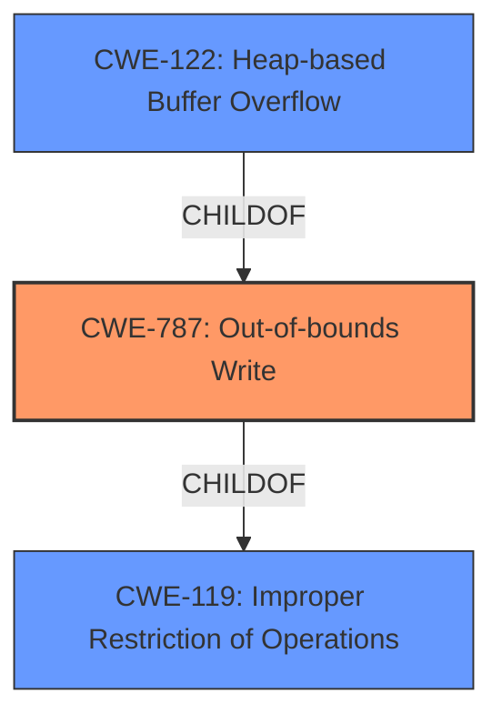

# Analysis Report for CVE-2021-33289

# Vulnerability Analysis Report: CVE-2021-33289

## Description


## Analysis (with Relationship Data)

# Summary
| CWE ID | CWE Name | Confidence | CWE Abstraction Level | CWE Vulnerability Mapping Label | CWE-Vulnerability Mapping Notes |
|---|---|---|---|---|---|
| CWE-787 | Out-of-bounds Write | 1.0 | Base | Allowed | Primary CWE |
| CWE-122 | Heap-based Buffer Overflow | 0.7 | Variant | Allowed | Secondary Candidate |
| CWE-119 | Improper Restriction of Operations within the Bounds of a Memory Buffer | 0.5 | Class | Discouraged | Secondary Candidate |

## Evidence and Confidence

*   **Confidence Score:** 0.9
*   **Evidence Strength:** HIGH

## Relationship Analysis
The primary CWE is CWE-787 **Out-of-bounds Write**, which is a base level CWE and a parent of CWE-122 **Heap-based Buffer Overflow**. CWE-119 **Improper Restriction of Operations within the Bounds of a Memory Buffer** is a class level CWE that is a parent of CWE-787. The relationships indicate a hierarchy with increasing specificity from Class to Base. I selected CWE-787 as it is the most specific, base level CWE.



## Vulnerability Chain
The vulnerability chain involves a specially crafted MFT section leading to a **heap buffer overflow**, which allows for code execution.
  - Crafted MFT section (Root Cause)
  - **Heap Buffer Overflow** (Weakness)
  - Code Execution (Impact)

## Summary of Analysis
The initial analysis identified CWE-787 **Out-of-bounds Write** as the primary candidate due to the **heap buffer overflow** vulnerability. This assessment is based on the vulnerability description, which explicitly states a **heap buffer overflow** can occur when a specially crafted MFT section is supplied in an NTFS image, allowing for code execution. The "Vulnerability Description Key Phrases" section also highlights "**heap buffer overflow**" as the primary weakness.

The "CVE Reference Links Content Summary" reinforces this by listing several CVEs with similar vulnerabilities described as **heap-based buffer overflows** caused by crafted NTFS images or attributes. For example, "CVE-2021-33289" notes a **heap-based buffer overflow** due to a specially crafted MFT section, while "CVE-2021-35266" describes a **heap-based buffer overflow** from a crafted NTFS inode pathname.

The retriever results also support this by listing CWE-122 **Heap-based Buffer Overflow** with a high score.

CWE-787 **Out-of-bounds Write** is at the optimal level of specificity because it directly describes the root cause of the vulnerability, which is writing data beyond the intended buffer boundaries.

I considered the following CWEs but did not use them:

*   CWE-119 **Improper Restriction of Operations within the Bounds of a Memory Buffer**: This is a class-level CWE and is too general. While the vulnerability does involve improper restriction of operations, CWE-787 provides a more specific description of the weakness as an out-of-bounds write.
*   CWE-122 **Heap-based Buffer Overflow**: This is a variant of CWE-787. While the overflow occurs on the heap, the fundamental issue is still an out-of-bounds write.
*   CWE-190 **Integer Overflow or Wraparound** and CWE-191 **Integer Underflow (Wrap or Wraparound)**: These CWEs relate to integer handling issues, which are not explicitly mentioned in the vulnerability description. While an integer overflow could potentially lead to a buffer overflow, the description focuses on the **heap buffer overflow** itself.
*   CWE-125 **Out-of-bounds Read**: The vulnerability description focuses on a **heap buffer overflow**, implying a write operation rather than a read.

Relevant CWE Information:

# Enhanced Context (25 CWEs)

## CWE-119: Improper Restriction of Operations within the Bounds of a Memory Buffer
**Abstraction Level**: Class
**Similarity Score**: 0.800
**Source**: alternate_terms

**Description**:
The product performs operations on a memory buffer, but it reads from or writes to a memory location outside the buffer's intended boundary. This may result in read or write operations on unexpected memory locations that could be linked to other variables, data structures, or internal program data.

**Mapping Guidance**:
- Usage: Discouraged
- Rationale: CWE-119 is commonly misused in low-information vulnerability reports when lower-level CWEs could be used instead, or when more details about the vulnerability are available.

## CWE-190: Integer Overflow or Wraparound
**Abstraction Level**: Base
**Similarity Score**: 0.800
**Source**: alternate_terms

**Description**:
The product performs a calculation that can
         produce an integer overflow or wraparound when the logic
         assumes that the resulting value will always be larger than
         the original value. This occurs when an integer value is
         incremented to a value that is too large to store in the
         associated representation. When this occurs, the value may
         become a very small or negative number.

**Mapping Guidance**:
- Usage: Allowed
- Rationale: This CWE entry is at the Base level of abstraction, which is a preferred level of abstraction for mapping to the root causes of vulnerabilities.

## CWE-122: Heap-based Buffer Overflow
**Abstraction Level**: Variant
**Similarity Score**: 0.285
**Source**: sparse

**Description**:
A heap overflow condition is a buffer overflow, where the buffer that can be overwritten is allocated in the heap portion of memory, generally meaning that the buffer was allocated using a routine such as malloc().

**Mapping Guidance**:
- Usage: Allowed
- Rationale: This CWE entry is at the Variant level of abstraction, which is a preferred level of abstraction for mapping to the root causes of vulnerabilities.

## CWE-193: Off-by-one Error
**Abstraction Level**: Base
**Similarity Score**: 0.219
**Source**: sparse

**Description**:
A product calculates or uses an incorrect maximum or minimum value that is 1 more, or 1 less, than the correct value.

**Mapping Guidance**:
- Usage: Allowed
- Rationale: This CWE entry is at the Base level of abstraction, which is a preferred level of abstraction for mapping to the root causes of vulnerabilities.

## CWE-1284: Improper Validation of Specified Quantity in Input
**Abstraction Level**: Base
**Similarity Score**: 0.213
**Source**: sparse

**Description**:
The product receives input that is expected to specify a quantity (such as size or length), but it does not validate or incorrectly validates that the quantity has the required properties.

**Mapping Guidance**:
- Usage: Allowed
- Rationale: This CWE entry is at the Base level of abstraction, which is a preferred level of abstraction for mapping to the root causes of vulnerabilities.

## CWE-126: Buffer Over-read
**Abstraction Level**: Variant
**Similarity Score**: 0.569
**Source**: dense

**Description**:
The product reads from a buffer using buffer access mechanisms such as indexes or pointers that reference memory locations after the targeted buffer.

**Mapping Guidance**:
- Usage: Allowed
- Rationale: This CWE entry is at the Variant level of abstraction, which is a preferred level of abstraction for mapping to the root causes of vulnerabilities.

## CWE-128: Wrap-around Error
**Abstraction Level**: base
**Similarity Score**: 0.003
**Source**: graph

**Description**:
CWE-128: Wrap-around Error

**Mapping Guidance**:
- Usage: Allowed
- Rationale: This CWE entry is at the Base level of abstraction, which is a preferred level of abstraction for mapping to the root causes of vulnerabilities.

## CWE-191: Integer Underflow (Wrap or Wraparound)
**Abstraction Level**: Base
**Similarity Score**: 0.209
**Source**: sparse

**Description**:
The product subtracts one value from another, such that the result is less than the minimum allowable integer value, which produces a value that is not equal to the correct result.

**Mapping Guidance**:
- Usage: Allowed
- Rationale: This CWE entry is at the Base level of abstraction, which is a preferred level of abstraction for mapping to the root causes of vulnerabilities.

## CWE-125: Out-of-bounds Read
**Abstraction Level**: Base
**Similarity Score


## CWE Relationship Analysis

Current CWEs represent these abstraction levels: .


### Vulnerability Chain Analysis

**Chain starting from CWE-787:**
- 787 (Out-of-bounds Write) - ROOT


**Chain starting from CWE-193:**
- 193 (Off-by-one Error) - ROOT


### CWE Relationship Diagram

```mermaid
graph TD
    classDef primary fill:#f96,stroke:#333,stroke-width:2px
    classDef secondary fill:#69f,stroke:#333
    classDef tertiary fill:#9e9,stroke:#333
```


*Report generated on 2025-04-01 17:16:04*
