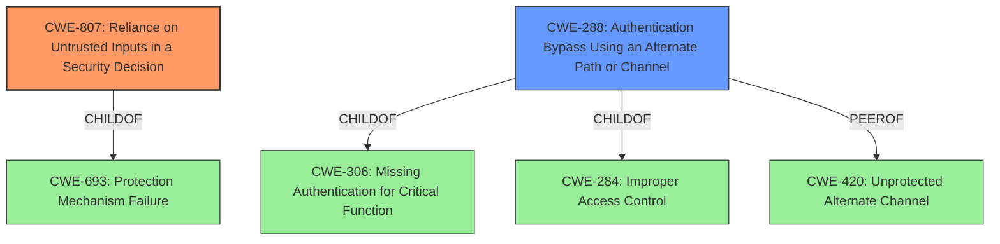

# Raw Analyzer Response for CVE-2021-3332

# Summary
| CWE ID | CWE Name | Confidence | CWE Abstraction Level | CWE Vulnerability Mapping Label | CWE-Vulnerability Mapping Notes |
|---|---|---|---|---|---|
| CWE-807 | Reliance on Untrusted Inputs in a Security Decision | 0.9 | Base | Primary | Allowed |
| CWE-288 | Authentication Bypass Using an Alternate Path or Channel | 0.7 | Base | Secondary | Allowed |

## Evidence and Confidence

*   **Confidence Score:** 0.8
*   **Evidence Strength:** HIGH

## Relationship Analysis
The primary CWE selected is CWE-807, which is a Base level CWE, providing a good level of specificity. CWE-807 is related to CWE-693 (Protection Mechanism Failure) as a child. CWE-288 (Authentication Bypass Using an Alternate Path or Channel) is a peer of CWE-420 (Unprotected Alternate Channel) and child of CWE-284 (Improper Access Control). The relationship analysis highlights how authentication bypass can occur through reliance on untrusted inputs.

## Vulnerability Chain
The vulnerability chain starts with the **reliance on an untrusted input** (CWE-807). The plugin checks for the *absence* of `post_password` but fails to handle its *presence*, leading to an **authentication bypass** (CWE-288).

## Summary of Analysis
The initial assessment pointed towards CWE-807 as the primary weakness due to the plugin's **reliance on the absence of the `post_password` POST parameter** to enforce its protection. The vulnerability description mentions that the plugin **bypasses a protection mechanism** when the `post_password` is present, because the plugin doesn't handle the case where it is present. The analysis is based on the provided evidence, specifically: "The plugin checks for the absence of the `post_password` POST parameter but doesn't handle the case where it's present, causing a bypass of the login protection."

The graph relationships highlight that authentication bypass vulnerabilities often stem from weaknesses related to improper handling of inputs and insufficient protection mechanisms.

The selection of CWE-807 is at the optimal level of specificity, as it directly addresses the root cause of the vulnerability. While CWE-288 is also applicable as a secondary weakness, CWE-807 captures the underlying coding error that leads to the bypass. CWE-288 is the impact of the weakness.

Relevant CWE Information:
# Enhanced Context (25 CWEs)
The following CWEs were identified as potentially relevant to this vulnerability:

## CWE-807: Reliance on Untrusted Inputs in a Security Decision
**Abstraction Level**: Base
**Similarity Score**: 0.78
**Source**: dense

**Description**:
The product uses a protection mechanism that relies on the existence or values of an input, but the input can be modified by an untrusted actor in a way that bypasses the protection mechanism.

**Mapping Guidance**:
- Usage: Allowed
- Rationale: This CWE entry is at the Base level of abstraction, which is a preferred level of abstraction for mapping to the root causes of vulnerabilities.

**Observed Examples:**
- **CVE-2009-1549:** Attacker can bypass authentication by setting a cookie to a specific value.
- **CVE-2009-1619:** Attacker can bypass authentication and gain admin privileges by setting an "admin" cookie to 1.

## CWE-288: Authentication Bypass Using an Alternate Path or Channel
**Abstraction Level**: Base
**Similarity Score**: 0.75
**Source**: dense

**Description**:
The product requires authentication, but the product has an alternate path or channel that does not require authentication.

**Mapping Guidance**:
- Usage: Allowed
- Rationale: This CWE entry is at the Base level of abstraction, which is a preferred level of abstraction for mapping to the root causes of vulnerabilities.

**Observed Examples:**
- **CVE-2000-1179:** Router allows remote attackers to read system logs without authentication without authentication by directly connecting to the login screen and typing certain control characters.