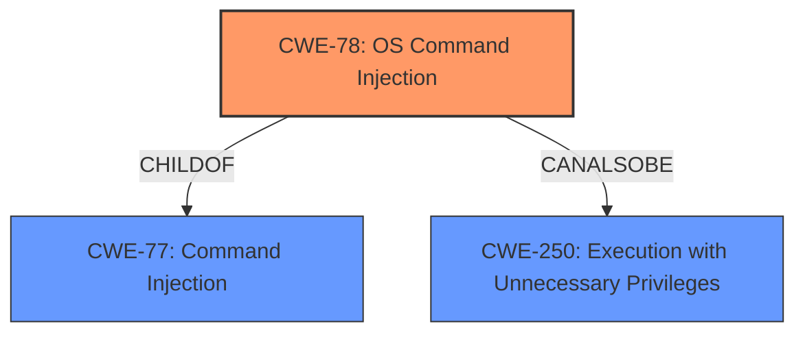

# Analysis for CVE-2021-33356

# Summary
| CWE ID | CWE Name | Confidence | CWE Abstraction Level | CWE Vulnerability Mapping Label | CWE-Vulnerability Mapping Notes |
|---|---|---|---|---|---|
| CWE-78 | Improper Neutralization of Special Elements used in an OS Command ('OS Command Injection') | 1.0 | Base | Allowed | Primary CWE |
| CWE-250 | Execution with Unnecessary Privileges | 0.7 | Base | Allowed | Secondary Candidate |

## Evidence and Confidence

*   **Confidence Score:** 0.9
*   **Evidence Strength:** HIGH

## Relationship Analysis
The primary relationship influencing the CWE selection is the ChildOf relationship between CWE-78 (OS Command Injection) and CWE-77 (Command Injection). CWE-78 is a more specific case of CWE-77, focusing specifically on OS commands. Since the vulnerability description explicitly mentions the injection of arbitrary commands leading to remote command execution with root privileges, CWE-78 is the more appropriate choice. CWE-250 relates to unnecessary privileges which could exist in this instance but isn't directly part of the root cause of the injection vulnerability.

## Vulnerability Chain
The vulnerability chain starts with **insufficient input validation**, leading to **command injection**, and finally resulting in **remote command execution with root privileges**.
  - **Root Cause:** Insufficient Input Validation
  - **Weakness:** Command Injection (CWE-78)
  - **Impact:** Remote Command Execution with Root Privileges. Execution with Unnecessary Privileges (CWE-250)

## Summary of Analysis
The analysis is based on the provided vulnerability description and supporting evidence from the CVE Reference Links Content Summary. The key phrase "command injection" directly aligns with CWE-78, which is the most specific and relevant CWE for this vulnerability. The summary states "The `installers/common.sh` script in RaspAP allows for the execution of arbitrary commands due to **insufficient input validation**"
The graph relationships confirm that CWE-78 is a specific type of command injection, making it the optimal choice.

CWE-77 (Improper Neutralization of Special Elements used in a Command ('Command Injection')) was considered but not selected as the primary CWE because CWE-78 is a more specific instance of command injection, referring to OS commands, which is explicitly stated in the vulnerability description. While CWE-77 is a parent of CWE-78, the additional specificity of CWE-78 makes it a better fit.

CWE-20 (Improper Input Validation) was considered but not selected as the primary CWE because it is a high-level class that is often misused. While **insufficient input validation** is the root cause, the vulnerability manifests as **command injection**, making CWE-78 more specific and appropriate. CWE-20 could be seen as a pre-requisite to CWE-78, but we are focused on the primary weakness of **command injection**.

CWE-250 (Execution with Unnecessary Privileges) was considered because the vulnerability allows for remote command execution with root privileges. However, this is a consequence of the **command injection** rather than the root cause. CWE-250 could be a secondary CWE if the application should not have been running with elevated privileges in the first place, but that is not explicitly stated in the description.

The selected CWE, CWE-78, is at the optimal level of specificity because it directly represents the **command injection** vulnerability described in the report. It is a base-level CWE, which is preferred for mapping root causes.