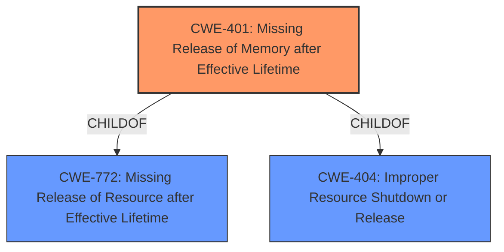

# Analysis Report for CVE-2021-33363

# Vulnerability Analysis Report: CVE-2021-33363

## Description


## Analysis (with Relationship Data)

# Summary
| CWE ID | CWE Name | Confidence | CWE Abstraction Level | CWE Vulnerability Mapping Label | CWE-Vulnerability Mapping Notes |
|---|---|---|---|---|---|
| CWE-401 | Missing Release of Memory after Effective Lifetime | 1.0 | Variant | Allowed | Primary CWE |

## Evidence and Confidence

*   **Confidence Score:** 1.0
*   **Evidence Strength:** HIGH

## Relationship Analysis
The primary relationship that influenced the decision was the ChildOf relationship, positioning CWE-401 as a variant of more general memory management issues (CWE-772 and CWE-404). This indicates a specific type of memory management failure, making it a precise fit for the vulnerability description.



## Vulnerability Chain
The vulnerability chain starts with a logic error in the `infe_box_read` function, leading to a **memory leak**, and ultimately causing a denial-of-service.

## Summary of Analysis
The initial analysis strongly pointed to CWE-401 due to the explicit mention of a **"memory leak"** in the vulnerability description. The "CVE Reference Links Content Summary" section confirmed that the **root cause** was indeed a failure to release allocated memory, specifically when both `content_type` and `content_encoding` are present in the input stream. This evidence aligns perfectly with the CWE-401 description: "The product does not sufficiently track and release allocated memory after it has been used."

The retriever results also strongly supported CWE-401 as the best match, with a score of 1.0. The relationship analysis further solidified this decision, as CWE-401 is a Variant of more general resource management issues.
The evidence provided in the "CVE Reference Links Content Summary" specifically mentions: "When both `content_type` and `content_encoding` are present in the input stream, only the memory allocated for `content_type` is freed. If a second `infe` box appears within the first, then the memory associated with the `content_encoding` is leaked." This statement directly supports the selection of CWE-401, as it clearly indicates a failure to release allocated memory.

CWE-125 (Out-of-bounds Read) was considered but rejected because the vulnerability's **root cause** is a memory leak, not an out-of-bounds read. Similarly, other CWEs like CWE-190 (Integer Overflow or Wraparound) and CWE-787 (Out-of-bounds Write) were deemed irrelevant because they don't align with the described weakness.

The selected CWE is at the optimal level of specificity (Variant) because it precisely describes the **memory leak** issue, providing a more accurate representation of the vulnerability than its parent classes.


## CWE Relationship Analysis

Current CWEs represent these abstraction levels: .


### Vulnerability Chain Analysis

**Chain starting from CWE-787:**
- 787 (Out-of-bounds Write) - ROOT


**Chain starting from CWE-404:**
- 404 (Improper Resource Shutdown or Release) - ROOT


### CWE Relationship Diagram

```mermaid
graph TD
    classDef primary fill:#f96,stroke:#333,stroke-width:2px
    classDef secondary fill:#69f,stroke:#333
    classDef tertiary fill:#9e9,stroke:#333
```


*Report generated on 2025-04-02 03:42:25*
