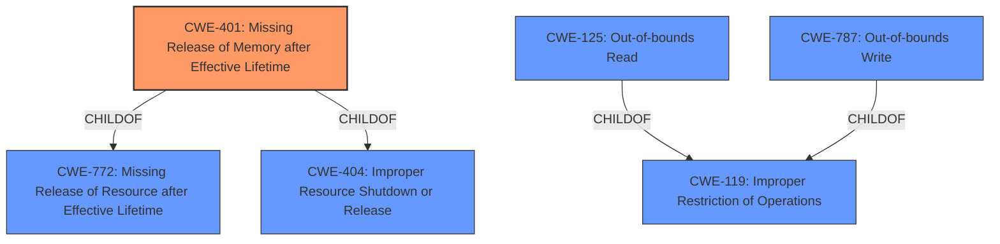

# Enhanced Analysis for CVE-2021-33365

# Summary
| CWE ID | CWE Name | Confidence | CWE Abstraction Level | CWE Vulnerability Mapping Label | CWE-Vulnerability Mapping Notes |
|---|---|---|---|---|---|
| CWE-401 | Missing Release of Memory after Effective Lifetime | 1.0 | Variant | Allowed | Primary CWE |
| CWE-125 | Out-of-bounds Read | 0.4 | Base | Allowed | Secondary Candidate |
| CWE-787 | Out-of-bounds Write | 0.4 | Base | Allowed | Secondary Candidate |

## Evidence and Confidence

*   **Confidence Score:** 0.8
*   **Evidence Strength:** HIGH

## Relationship Analysis
The primary CWE, CWE-401 (Missing Release of Memory after Effective Lifetime), is a variant of CWE-772 (Missing Release of Resource after Effective Lifetime) and CWE-404 (Improper Resource Shutdown or Release). CWE-401 directly addresses the **memory leak** issue described in the vulnerability.

CWE-125 (Out-of-bounds Read) and CWE-787 (Out-of-bounds Write) are related to memory corruption but don't directly describe the **memory leak** root cause. They are children of CWE-119 (Improper Restriction of Operations within the Bounds of a Memory Buffer).



## Vulnerability Chain
The vulnerability chain starts with a **memory leak** (**CWE-401**) in the `gf_isom_get_root_od` function. This occurs when the `gf_odf_desc_copy` function fails to free allocated memory for `od` and `iod` objects. Repeatedly triggering this leak can lead to resource exhaustion and denial of service. There is a potential for arbitrary code execution in some cases, but there is insufficient evidence.

## Summary of Analysis
The initial analysis focused on the **memory leak** in the `gf_isom_get_root_od` function. The primary focus was to identify the root cause of the vulnerability based on the provided evidence.

The "Vulnerability Description Key Phrases" section identifies the **weakness** as a **memory leak**. The "CVE Reference Links Content Summary" confirms this by stating, "The root cause is a memory leak in the `gf_isom_get_root_od` function."

The chosen CWE, CWE-401 (Missing Release of Memory after Effective Lifetime), directly corresponds to this **memory leak**. The description of CWE-401, "The product does not sufficiently track and release allocated memory after it has been used, which slowly consumes remaining memory," perfectly matches the vulnerability description.

While other CWEs like CWE-125 (Out-of-bounds Read) and CWE-787 (Out-of-bounds Write) were considered due to their presence in the Retriever Results, they do not accurately represent the root cause, which is the failure to release allocated memory. These would be more appropriate if the issue was related to improper access or modification of memory outside the intended bounds, but this is not the case here. Therefore, CWE-401 is the most specific and accurate representation of the vulnerability.

The selection of CWE-401 is further supported by the Mapping Guidance, which allows its use and states that it is at the preferred Variant level of abstraction.

Relevant CWE Information:

# Enhanced Context (25 CWEs)

## CWE-401: Missing Release of Memory after Effective Lifetime
**Abstraction Level**: Variant
**Similarity Score**: 1.00
**Source**: Retriever Results

**Description**:
The product does not sufficiently track and release allocated memory after it has been used, which slowly consumes remaining memory.

**Mapping Guidance**:
- Usage: Allowed
- Rationale: This CWE entry is at the Variant level of abstraction, which is a preferred level of abstraction for mapping to the root causes of vulnerabilities.


## CWE Relationship Analysis

Current CWEs represent these abstraction levels: .


### Vulnerability Chain Analysis

**Chain starting from CWE-787:**
- 787 (Out-of-bounds Write) - ROOT


**Chain starting from CWE-404:**
- 404 (Improper Resource Shutdown or Release) - ROOT


### CWE Relationship Diagram

```mermaid
graph TD
    classDef primary fill:#f96,stroke:#333,stroke-width:2px
    classDef secondary fill:#69f,stroke:#333
    classDef tertiary fill:#9e9,stroke:#333
```