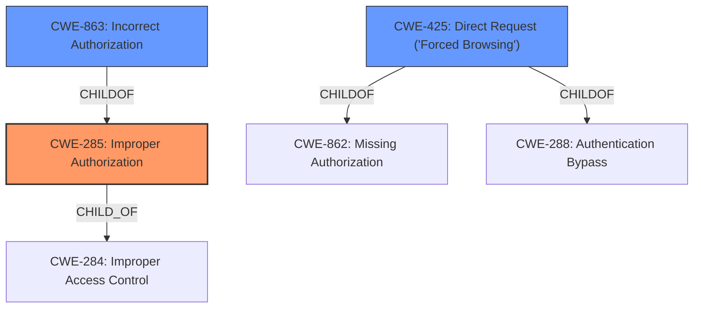

# Raw Analyzer Response for CVE-2021-3339

# Summary
| CWE ID  | CWE Name                                                                         | Confidence | CWE Abstraction Level | CWE Vulnerability Mapping Label | CWE-Vulnerability Mapping Notes |
| :-------- | :------------------------------------------------------------------------------- | :---------- | :---------------------- | :------------------------------ | :-------------------------------- |
| CWE-285   | Improper Authorization                                                           | 0.8        | Class                   | Primary                         | Discouraged                       |
| CWE-863   | Incorrect Authorization                                                          | 0.7        | Class                   | Secondary                       | Allowed-with-Review               |
| CWE-425   | Direct Request ('Forced Browsing')                                             | 0.6        | Base                    | Secondary                       | Allowed                           |

## Evidence and Confidence

*   **Confidence Score:** 0.8
*   **Evidence Strength:** MEDIUM

## Relationship Analysis
The primary weakness identified is **Improper Authorization (CWE-285)**, which is a class-level CWE. **Incorrect Authorization (CWE-863)** is a child of CWE-285 and represents a more specific case where an authorization check is performed but is done incorrectly. **Direct Request ('Forced Browsing') (CWE-425)** is a base-level CWE that describes a scenario where the application does not adequately enforce authorization on all restricted URLs.

## Vulnerability Chain
The vulnerability chain starts with the **failure to constrain web-page access to members of a security group**. This leads to **Improper Authorization (CWE-285)**, where unauthorized users can access restricted resources. This can further be specified as **Incorrect Authorization (CWE-863)**, where there is an authorization check, but it is implemented incorrectly. The vulnerability can also be viewed as **Direct Request (CWE-425)**, where restricted URLs, scripts, or files are directly accessed without adequate authorization.

## Summary of Analysis
The initial analysis points to an authorization issue where the product **does not constrain web-page access to members of a security group**.

The Retriever results also suggest **CWE-285 (Improper Authorization)** and **CWE-863 (Incorrect Authorization)** as potential candidates. The vulnerability description clearly states that the application **does not constrain web-page access**, which falls under the definition of **Improper Authorization**.

*   **CWE-285 (Improper Authorization):** This CWE is a class-level weakness describing a scenario where the product does not perform or incorrectly performs an authorization check. The description states the product **does not constrain web-page access**, directly matching the CWE definition. Although the mapping guidance discourages its use because it is high-level and suggests lower-level CWEs, it is the most appropriate primary classification given the available information.
*   **CWE-863 (Incorrect Authorization):** This CWE describes a situation where an authorization check is performed, but it is done incorrectly. This is a more specific scenario than CWE-285. Given that the vulnerability description only mentions that access is not constrained, it is reasonable to assume there's potentially an attempt to authorize which is implemented incorrectly. The mapping guidance suggests examining children of this entry to see if there is a better fit.
*   **CWE-425 (Direct Request ('Forced Browsing'))**: This CWE describes a scenario where the web application does not adequately enforce appropriate authorization on all restricted URLs, scripts, or files. The description states the product **does not constrain web-page access** to the *Search Screen and Profile Screen* URLs, directly matching the CWE definition.

The selection of CWE-285 as the primary CWE and CWE-863 and CWE-425 as secondary CWEs offer the optimal level of specificity.

Relevant CWE Information: