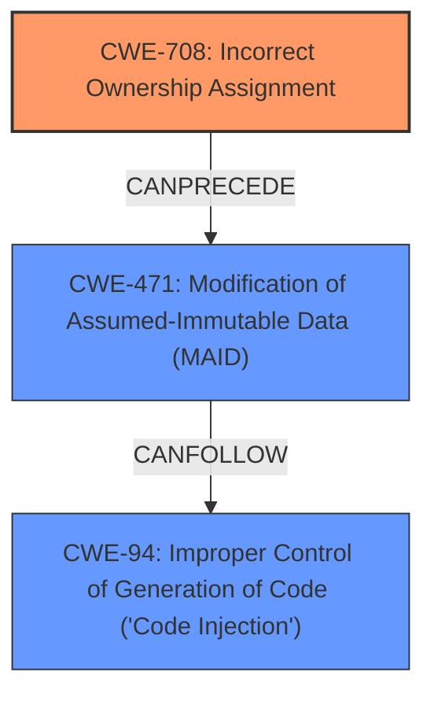

# Analysis for CVE-2021-33393

# Summary
| CWE ID | CWE Name | Confidence | CWE Abstraction Level | CWE Vulnerability Mapping Label | CWE-Vulnerability Mapping Notes |
|---|---|---|---|---|---|
| CWE-708 | Incorrect Ownership Assignment | 1.0 | Base | Allowed | Primary CWE |
| CWE-471 | Modification of Assumed-Immutable Data (MAID) | 0.5 | Base | Allowed | Secondary CWE |
| CWE-94 | Improper Control of Generation of Code ('Code Injection') | 0.5 | Base | Allowed-with-Review | Secondary CWE |

## Evidence and Confidence

*   **Confidence Score:** 0.8
*   **Evidence Strength:** HIGH

## Relationship Analysis
The primary CWE is CWE-708 (**Incorrect Ownership Assignment**) because the core issue is the **incorrect** assignment of ownership to the `backup.pl` script. This leads to a situation where an unprivileged user can modify the script. The secondary CWEs, CWE-471 (**Modification of Assumed-Immutable Data**) and CWE-94 (**Improper Control of Generation of Code ('Code Injection')**), are consequences that arise from the initial incorrect ownership. Specifically, the attacker modifies the script (CWE-471), leading to potential code injection (CWE-94) when the script is executed.

## Vulnerability Chain
The vulnerability chain starts with the **incorrect** assignment of ownership (CWE-708) to the `backup.pl` script. This allows an unprivileged user to modify the script (CWE-471), which then leads to the potential for code injection (CWE-94) when the script is executed by root. The sequence is:

1.  **Incorrect Ownership Assignment** (CWE-708): The `/var/ipfire/backup/bin/backup.pl` script is not owned by the root account.
2.  **Modification of Assumed-Immutable Data** (CWE-471): An unprivileged account modifies the `backup.pl` script with malicious code.
3.  **Improper Control of Generation of Code ('Code Injection')** (CWE-94): When the script is executed, the injected code runs, potentially leading to arbitrary code execution.

## Summary of Analysis
The initial analysis identified that the root cause of the vulnerability is the **incorrect** file ownership, which allows an attacker to modify the backup script and inject malicious code. The Retriever results and the provided vulnerability description both support this assessment. The graph relationships clearly show that CWE-708 leads to CWE-471 and subsequently to CWE-94.

The evidence from the "Vulnerability Description Key Phrases" confirms the root cause: "**rootcause:** **ownership of /var/ipfire/backup/bin/backup.pl is not checked**." The "CVE Reference Links Content Summary" also emphasizes this by stating: "The vulnerability stems from the insecure file permissions and ownership of the `/var/ipfire/backup/bin/backup.pl` script in IPFire. The script was initially owned by the `nobody` user, which allowed any process running as `nobody` to overwrite the script with arbitrary content."

Based on the provided evidence, the chosen CWEs are at the optimal level of specificity. CWE-708 directly addresses the **incorrect ownership** issue, while CWE-471 and CWE-94 explain the subsequent steps in the vulnerability chain.

Relevant CWE Information:

# Enhanced Context (25 CWEs)

## CWE-41: Improper Resolution of Path Equivalence
**Abstraction Level**: Base
**Similarity Score**: 0.79
**Source**: dense

**Description**:
The product is vulnerable to file system contents disclosure through path equivalence. Path equivalence involves the use of special characters in file and directory names. The associated manipulations are intended to generate multiple names for the same object.

**Mapping Guidance**:
- Usage: Allowed
- Rationale: This CWE entry is at the Base level of abstraction, which is a preferred level of abstraction for mapping to the root causes of vulnerabilities.

## CWE-425: Direct Request ('Forced Browsing')
**Abstraction Level**: Base
**Similarity Score**: 0.79
**Source**: dense

**Description**:
The web application does not adequately enforce appropriate authorization on all restricted URLs, scripts, or files.

**Mapping Guidance**:
- Usage: Allowed
- Rationale: This CWE entry is at the Base level of abstraction, which is a preferred level of abstraction for mapping to the root causes of vulnerabilities.

## CWE-472: External Control of Assumed-Immutable Web Parameter
**Abstraction Level**: Base
**Similarity Score**: 0.79
**Source**: dense

**Description**:
The web application does not sufficiently verify inputs that are assumed to be immutable but are actually externally controllable, such as hidden form fields.

**Mapping Guidance**:
- Usage: Allowed
- Rationale: This CWE entry is at the Base level of abstraction, which is a preferred level of abstraction for mapping to the root causes of vulnerabilities.

## CWE-552: Files or Directories Accessible to External Parties
**Abstraction Level**: Base
**Similarity Score**: 0.78
**Source**: dense

**Description**:
The product makes files or directories accessible to unauthorized actors, even though they should not be.

**Mapping Guidance**:
- Usage: Allowed
- Rationale: This CWE entry is at the Base level of abstraction, which is a preferred level of abstraction for mapping to the root causes of vulnerabilities.

## CWE-639: Authorization Bypass Through User-Controlled Key
**Abstraction Level**: Base
**Similarity Score**: 0.78
**Source**: dense

**Description**:
The system's authorization functionality does not prevent one user from gaining access to another user's data or record by modifying the key value identifying the data.

**Mapping Guidance**:
- Usage: Allowed
- Rationale: This CWE entry is at the Base level of abstraction, which is a preferred level of abstraction for mapping to the root causes of vulnerabilities.

## CWE-23: Relative Path Traversal
**Abstraction Level**: Base
**Similarity Score**: 0.78
**Source**: dense

**Description**:
The product uses external input to construct a pathname that should be within a restricted directory, but it does not properly neutralize sequences such as ".." that can resolve to a location that is outside of that directory.

**Mapping Guidance**:
- Usage: Allowed
- Rationale: This CWE entry is at the Base level of abstraction, which is a preferred level of abstraction for mapping to the root causes of vulnerabilities.

## CWE-73: External Control of File Name or Path
**Abstraction Level**: Base
**Similarity Score**: 0.78
**Source**: dense

**Description**:
The product allows user input to control or influence paths or file names that are used in filesystem operations.

**Mapping Guidance**:
- Usage: Allowed
- Rationale: This CWE entry is at the Base level of abstraction, which is a preferred level of abstraction for mapping to the root causes of vulnerabilities.

## CWE-668: Exposure of Resource to Wrong Sphere
**Abstraction Level**: Class
**Similarity Score**: 0.78
**Source**: dense

**Description**:
The product exposes a resource to the wrong control sphere, providing unintended actors with inappropriate access to the resource.

**Mapping Guidance**:
- Usage: Discouraged
- Rationale: CWE-668 is high-level and is often misused as a catch-all when lower-level CWE IDs might be applicable. It is sometimes used for low-information vulnerability reports [REF-1287]. It is a level-1 Class (i.e., a child of a Pillar). It is not useful for trend analysis.

## CWE-74: Improper Neutralization of Special Elements in Output Used by a Downstream Component ('Injection')
**Abstraction Level**: Class
**Similarity Score**: 0.78
**Source**: dense

**Description**:
The product constructs all or part of a command, data structure, or record using externally-influenced input from an upstream component, but it does not neutralize or incorrectly neutralizes special elements that could modify how it is parsed or interpreted when it is sent to a downstream component.

**Mapping Guidance**:
- Usage: Discouraged
- Rationale: CWE-74 is high-level and often misused when lower-level weaknesses are more appropriate.

## CWE-923: Improper Restriction of Communication Channel to Intended Endpoints
**Abstraction Level**: Class
**Similarity Score**: 0.78
**Source**: dense

**Description

# Enhanced Query for CVE-2021-33393

## Vulnerability Description
lfs/backup in IPFire 2.25-core155 does not ensure that /var/ipfire/backup/bin/backup.pl is owned by the root account. It might be owned by an unprivileged account, which could potentially be used to install a Trojan horse backup.pl script that is later executed by root. Similar problems with the ownership/permissions of other files may be present as well.

### Vulnerability Description Key Phrases
- **rootcause:** **ownership of /var/ipfire/backup/bin/backup.pl is not checked**
- **impact:** execute Trojan horse backup.pl script
- **attacker:** unprivileged account
- **product:** IPFire
- **version:** 2.25-core155
- **component:** lfs/backup

## CVE Reference Links Content Summary
Based on the provided content, here's an analysis of the vulnerability described:

**Root Cause of Vulnerability:**

The vulnerability stems from the insecure file permissions and ownership of the `/var/ipfire/backup/bin/backup.pl` script in IPFire. The script was initially owned by the `nobody` user, which allowed any process running as `nobody` to overwrite the script with arbitrary content. Since this script is later executed, this could lead to arbitrary code execution.

**Weaknesses/Vulnerabilities Present:**

*   **Insecure File Permissions:** The primary weakness was the write access granted to the `nobody` user on the `backup.pl` script, leading to an exploitable condition.
*   **Code Injection:** By overwriting the script, an attacker could inject and execute arbitrary code.

**Impact of Exploitation:**

*   **Remote Code Execution (RCE):** An attacker could achieve remote code execution on the IPFire system by exploiting this vulnerability.
*   **Privilege Escalation:** While the script initially runs with the privileges of `nobody`, the attacker can write code that escalates to `root`.

**Attack Vectors:**

1.  **Web Interface Access:** An authenticated attacker can install a malicious package, triggering the execution of the backup script through the web interface.
2.  **File Overwrite:** By leveraging the write permissions of the `nobody` user, the attacker overwrites the `backup.pl` script with malicious code.
3.  **Script Execution:** The system runs the modified backup script, executing the attacker's injected code.

**Required Attacker Capabilities/Position:**

*   **Authentication:** The attacker needs valid credentials to log into the IPFire web interface.
*   **Network Access:** The attacker must be able to communicate with the IPFire system through the network.
*   **Web Interface Interaction:** The attacker needs to be able to install packages to trigger the vulnerable code.

**Additional Details:**

*   The vulnerability is present in IPFire version 2.25, core update 156.
*   A fix was implemented to change the ownership of `/var/ipfire/backup/bin/backup.pl` to `root:root` to prevent unauthorized modification.
*   The provided commit `6769d909306d7bdc43d64598872126fcf1b217f6` addresses the vulnerability.
*   The attacker can leverage the vulnerability to gain a root shell by injecting a malicious script that calls `setuid(0)`.
*   The exploit relies on the fact that the backup script is executed with elevated privileges after the user logs in and installs a package, even though it is run as the 'nobody' user.

This information provides a comprehensive understanding of the vulnerability based on the given content.

## Retriever Results

### Top Combined Results

| Rank | CWE ID | Name | Abstraction | Usage  | Retrievers | Individual Scores |
|------|--------|------|-------------|-------|------------|-------------------|
| 1 | 1022 | Use of Web Link to Untrusted Target with window.opener Access | Variant | Allowed | alternate_terms | 0.700 |
| 2 | 427 | Uncontrolled Search Path Element | Base | Allowed | alternate_terms | 0.700 |
| 3 | 563 | Assignment to Variable without Use | Base | Allowed | alternate_terms | 0.700 |
| 4 | 708 | Incorrect Ownership Assignment | Base | Allowed | sparse | 0.857 |
| 5 | 621 | Variable Extraction Error | Variant | Allowed | sparse | 0.700 |
| 6 | 530 | Exposure of Backup File to an Unauthorized Control Sphere | Variant | Allowed | dense | 0.444 |
| 7 | 471 | Modification of Assumed-Immutable Data (MAID) | Base | Allowed | graph | 0.002 |
| 8 | 915 | Improperly Controlled Modification of Dynamically-Determined Object Attributes | Base | Allowed | sparse | 0.700 |
| 9 | 306 | Missing Authentication for Critical Function | Base | Allowed | sparse | 0.361 |
| 10 | 425 | Direct Request ('Forced Browsing') | Base | Allowed | sparse | 0.348 |

# Complete CWE Specifications

## CWE-1022: Use of Web Link to Untrusted Target with window.opener Access
**Abstraction:** Variant
**Status:** Incomplete

### Description
The web application produces links to untrusted external sites outside of its sphere of control, but it does not properly prevent the external site from modifying  security-critical properties of the window.opener object, such as the location property.

### Extended Description
When a user clicks a link to an external site ("target"), the target="_blank" attribute causes the target site's contents to be opened in a new window or tab, which runs in the same process as the original page. The window.opener object records information about the original page that offered the link. If an attacker can run script on the target page, then they could read or modify certain properties of the window.opener object, including the location property - even if the original and target site are not the same origin. An attacker can modify the location property to automatically redirect the user to a malicious site, e.g. as part of a phishing attack. Since this redirect happens in the original window/tab - which is not necessarily visible, since the browser is focusing the display on the new target page - the user might not notice any suspicious redirection.

### Alternative Terms
tabnabbing

### Relationships
ChildOf -> CWE-266

### Mapping Guidance
**Usage:** Allowed
**Rationale:** This CWE entry is at the Variant level of abstraction, which is a preferred level of abstraction for mapping to the root causes of vulnerabilities.
**Comments:** Carefully read both the name and description to ensure that this mapping is an appropriate fit. Do not try to 'force' a mapping to a lower-level Base/Variant simply to comply with this preferred level of abstraction.
**Reasons:**
- Acceptable-Use

### Observed Examples
- **CVE-2022-4927:** Library software does not use rel: "noopener noreferrer" setting, allowing tabnabbing attacks to redirect to a malicious page

## CWE-427: Uncontrolled Search Path Element
**Abstraction:** Base
**Status:** Draft

### Description
The product uses a fixed or controlled search path to find resources, but one or more locations in that path can be under the control of unintended actors.

### Extended Description

Although this weakness can occur with any type of resource, it is frequently introduced when a product uses a directory search path to find executables or code libraries, but the path contains a directory that can be modified by an attacker, such as "/tmp" or the current working directory.

In Windows-based systems, when the LoadLibrary or LoadLibraryEx function is called with a DLL name that does not contain a fully qualified path, the function follows a search order that includes two path elements that might be uncontrolled:

  - the directory from which the program has been loaded

  - the current working directory

In some cases, the attack can be conducted remotely, such as when SMB or WebDAV network shares are used.

One or more locations in that path could include the Windows drive root or its subdirectories. This often exists in Linux-based code assuming the controlled nature of the root directory (/) or its subdirectories (/etc, etc), or a code that recursively accesses the parent directory. In Windows, the drive root and some of its subdirectories have weak permissions by default, which makes them uncontrolled.

In some Unix-based systems, a PATH might be created that contains an empty element, e.g. by splicing an empty variable into the PATH. This empty element can be interpreted as equivalent to the current working directory, which might be an untrusted search element.

In software package management frameworks (e.g., npm, RubyGems, or PyPi), the framework may identify dependencies on third-party libraries or other packages, then consult a repository that contains the desired package. The framework may search a public repository before a private repository. This could be exploited by attackers by placing a malicious package in the public repository that has the same name as a package from the private repository. The search path might not be directly under control of the developer relying on the framework, but this search order effectively contains an untrusted element.

### Alternative Terms
DLL preloading: This term is one of several that are used to describe exploitation of untrusted search path elements in Windows systems, which received wide attention in August 2010. From a weakness perspective, the term is imprecise because it can apply to both CWE-426 and CWE-427.
Binary planting: This term is one of several that are used to describe exploitation of untrusted search path elements in Windows systems, which received wide attention in August 2010. From a weakness perspective, the term is imprecise because it can apply to both CWE-426 and CWE-427.
Insecure library loading: This term is one of several that are used to describe exploitation of untrusted search path elements in Windows systems, which received wide attention in August 2010. From a weakness perspective, the term is imprecise because it can apply to both CWE-426 and CWE-427.
Dependency confusion: As of February 2021, this term is used to describe CWE-427 in the context of managing installation of software package dependencies, in which attackers release packages on public sites where the names are the same as package names used by private repositories, and the search for the dependent package tries the public site first, downloading untrusted code. It may also be referred to as a "substitution attack."

### Relationships
ChildOf -> CWE-668
ChildOf -> CWE-668

### Mapping Guidance
**Usage:** Allowed
**Rationale:** This CWE entry is at the Base level of abstraction, which is a preferred level of abstraction for mapping to the root causes of vulnerabilities.
**Comments:** Carefully read both the name and description to ensure that this mapping is an appropriate fit. Do not try to 'force' a mapping to a lower-level Base/Variant simply to comply with this preferred level of abstraction.
**Reasons:**
- Acceptable-Use

### Additional Notes
**[Relationship]** Unlike untrusted search path (CWE-426), which inherently involves control over the definition of a control sphere (i.e., modification of a search path), this entry concerns a fixed control sphere in which some part of the sphere may be under attacker control (i.e., the search path cannot be modified by an attacker, but one element of the path can be under attacker control).

**[Theoretical]** This weakness is not a clean fit under CWE-668 or CWE-610, which suggests that the control sphere model might need enhancement or clarification.

### Observed Examples
- **CVE-2023-25815:** chain: a change in an underlying package causes the gettext function to use implicit initialization with a hard-coded path (CWE-1419) under the user-writable C:\ drive, introducing an untrusted search path element (CWE-427) that enables spoofing of messages.
- **CVE-2022-4826:** Go-based git extension on Windows can search for and execute a malicious "..exe" in a repository because Go searches the current working directory if git.exe is not found in the PATH
- **CVE-2020-26284:** A Static Site Generator built in Go, when running on Windows, searches the current working directory for a command, possibly allowing code execution using a malicious .exe or .bat file with the name being searched

## CWE-563: Assignment to Variable without Use
**Abstraction:** Base
**Status:** Draft

### Description
The variable's value is assigned but never used, making it a dead store.

### Extended Description
After the assignment, the variable is either assigned another value or goes out of scope. It is likely that the variable is simply vestigial, but it is also possible that the unused variable points out a bug.

### Alternative Terms
Unused Variable

### Relationships
ChildOf -> CWE-1164

### Mapping Guidance
**Usage:** Allowed
**Rationale:** This CWE entry is at the Base level of abstraction, which is a preferred level of abstraction for mapping to the root causes of vulnerabilities.
**Comments:** Carefully read both the name and description to ensure that this mapping is an appropriate fit. Do not try to 'force' a mapping to a lower-level Base/Variant simply to comply with this preferred level of abstraction.
**Reasons:**
- Acceptable-Use

## CWE-708: Incorrect Ownership Assignment
**Abstraction:** Base
**Status:** Incomplete

### Description
The product assigns an owner to a resource, but the owner is outside of the intended control sphere.

### Extended Description
This may allow the resource to be manipulated by actors outside of the intended control sphere.

### Alternative Terms
None

### Relationships
ChildOf -> CWE-282
CanAlsoBe -> CWE-345

### Mapping Guidance
**Usage:** Allowed
**Rationale:** This CWE entry is at the Base level of abstraction, which is a preferred level of abstraction for mapping to the root causes of vulnerabilities.
**Comments:** Carefully read both the name and description to ensure that this mapping is an appropriate fit. Do not try to 'force' a mapping to a lower-level Base/Variant simply to comply with this preferred level of abstraction.
**Reasons:**
- Acceptable-Use

### Additional Notes
**[Maintenance]** 

This overlaps verification errors, permissions, and privileges.

A closely related weakness is the incorrect assignment of groups to a resource. It is not clear whether it would fall under this entry or require a different entry.

### Observed Examples
- **CVE-2007-5101:** File system sets wrong ownership and group when creating a new file.
- **CVE-2007-4238:** OS installs program with bin owner/group, allowing modification.
- **CVE-2007-1716:** Manager does not properly restore ownership of a reusable resource when a user logs out, allowing privilege escalation.

## CWE-621: Variable Extraction Error
**Abstraction:** Variant
**Status:** Incomplete

### Description
The product uses external input to determine the names of variables into which information is extracted, without verifying that the names of the specified variables are valid. This could cause the program to overwrite unintended variables.

### Extended Description

For example, in PHP, extraction can be used to provide functionality similar to register_globals, a dangerous functionality that is frequently disabled in production systems. Calling extract() or import_request_variables() without the proper arguments could allow arbitrary global variables to be overwritten, including superglobals.

Similar functionality is possible in other interpreted languages, including custom languages.

### Alternative Terms
Variable overwrite

### Relationships
ChildOf -> CWE-914
CanPrecede -> CWE-471

### Mapping Guidance
**Usage:** Allowed
**Rationale:** This CWE entry is at the Variant level of abstraction, which is a preferred level of abstraction for mapping to the root causes of vulnerabilities.
**Comments:** Carefully read both the name and description to ensure that this mapping is an appropriate fit. Do not try to 'force' a mapping to a lower-level Base/Variant simply to comply with this preferred level of abstraction.
**Reasons:**
- Acceptable-Use

### Additional Notes
**[Research Gap]** Probably under-reported for PHP. Seems under-studied for other interpreted languages.

### Observed Examples
- **CVE-2006-7135:** extract issue enables file inclusion
- **CVE-2006-7079:** Chain: PHP app uses extract for register_globals compatibility layer (CWE-621), enabling path traversal (CWE-22)
- **CVE-2007-0649:** extract() buried in include files makes post-disclosure analysis confusing; original report had seemed incorrect.

## CWE-530: Exposure of Backup File to an Unauthorized Control Sphere
**Abstraction:** Variant
**Status:** Incomplete

### Description
A backup file is stored in a directory or archive that is made accessible to unauthorized actors.

### Extended Description
Often, older backup files are renamed with an extension such as .~bk to distinguish them from production files. The source code for old files that have been renamed in this manner and left in the webroot can often be retrieved. This renaming may have been performed automatically by the web server, or manually by the administrator.

### Alternative Terms
None

### Relationships
ChildOf -> CWE-552

### Mapping Guidance
**Usage:** Allowed
**Rationale:** This CWE entry is at the Variant level of abstraction, which is a preferred level of abstraction for mapping to the root causes of vulnerabilities.
**Comments:** Carefully read both the name and description to ensure that this mapping is an appropriate fit. Do not try to 'force' a mapping to a lower-level Base/Variant simply to comply with this preferred level of abstraction.
**Reasons:**
- Acceptable-Use

## CWE-471: Modification of Assumed-Immutable Data (MAID)
**Abstraction:** Base
**Status:** Draft

### Description
The product does not properly protect an assumed-immutable element from being modified by an attacker.

### Extended Description
This occurs when a particular input is critical enough to the functioning of the application that it should not be modifiable at all, but it is. Certain resources are often assumed to be immutable when they are not, such as hidden form fields in web applications, cookies, and reverse DNS lookups.

### Alternative Terms
None

### Relationships
ChildOf -> CWE-664

### Mapping Guidance
**Usage:** Allowed
**Rationale:** This CWE entry is at the Base level of abstraction, which is a preferred level of abstraction for mapping to the root causes of vulnerabilities.
**Comments:** Carefully read both the name and description to ensure that this mapping is an appropriate fit. Do not try to 'force' a mapping to a lower-level Base/Variant simply to comply with this preferred level of abstraction.
**Reasons:**
- Acceptable-Use

### Additional Notes
**[Relationship]** MAID issues can be primary to many other weaknesses, and they are a major factor in languages that provide easy access to internal program constructs, such as PHP's register_globals and similar features. However, MAID issues can also be resultant from weaknesses that modify internal state; for example, a program might validate some data and store it in memory, but a buffer overflow could overwrite that validated data, leading to a change in program logic.

**[Theoretical]** There are many examples where the MUTABILITY property is a major factor in a vulnerability.

### Observed Examples
- **CVE-2002-1757:** Relies on $PHP_SELF variable for authentication.
- **CVE-2005-1905:** Gain privileges by modifying assumed-immutable code addresses that are accessed by a driver.

## CWE-915: Improperly Controlled Modification of Dynamically-Determined Object Attributes
**Abstraction:** Base
**Status:** Incomplete

### Description
The product receives input from an upstream component that specifies multiple attributes, properties, or fields that are to be initialized or updated in an object, but it does not properly control which attributes can be modified.

### Extended Description

If the object contains attributes that were only intended for internal use, then their unexpected modification could lead to a vulnerability.

This weakness is sometimes known by the language-specific mechanisms that make it possible, such as mass assignment, autobinding, or object injection.

### Alternative Terms
Mass Assignment: "Mass assignment" is the name of a feature in Ruby on Rails that allows simultaneous modification of multiple object attributes.
AutoBinding: The "Autobinding" term is used in frameworks such as Spring MVC and ASP.NET MVC.
PHP Object Injection: Some PHP application researchers use this term for attacking unsafe use of the unserialize() function, but it is also used for CWE-502.

### Relationships
ChildOf -> CWE-913
PeerOf -> CWE-502

### Mapping Guidance
**Usage:** Allowed
**Rationale:** This CWE entry is at the Base level of abstraction, which is a preferred level of abstraction for mapping to the root causes of vulnerabilities.
**Comments:** Carefully read both the name and description to ensure that this mapping is an appropriate fit. Do not try to 'force' a mapping to a lower-level Base/Variant simply to comply with this preferred level of abstraction.
**Reasons:**
- Acceptable-Use

### Additional Notes
**[Maintenance]** The relationships between CWE-502 and CWE-915 need further exploration. CWE-915 is more narrowly scoped to object modification, and is not necessarily used for deserialization.

### Observed Examples
- **CVE-2024-3283:** Application for using LLMs allows modification of a sensitive variable using mass assignment.
- **CVE-2012-2054:** Mass assignment allows modification of arbitrary attributes using modified URL.
- **CVE-2012-2055:** Source version control product allows modification of trusted key using mass assignment.

## CWE-306: Missing Authentication for Critical Function
**Abstraction:** Base
**Status:** Draft

### Description
The product does not perform any authentication for functionality that requires a provable user identity or consumes a significant amount of resources.

### Extended Description
Not provided

### Alternative Terms
None

### Relationships
ChildOf -> CWE-287
ChildOf -> CWE-287

### Mapping Guidance
**Usage:** Allowed
**Rationale:** This CWE entry is at the Base level of abstraction, which is a preferred level of abstraction for mapping to the root causes of vulnerabilities.
**Comments:** Carefully read both the name and description to ensure that this mapping is an appropriate fit. Do not try to 'force' a mapping to a lower-level Base/Variant simply to comply with this preferred level of abstraction.
**Reasons:**
- Acceptable-Use

### Observed Examples
- **CVE-2022-31260:** Chain: a digital asset management program has an undisclosed backdoor in the legacy version of a PHP script (CWE-912) that could allow an unauthenticated user to export metadata (CWE-306)
- **CVE-2022-29951:** TCP-based protocol in Programmable Logic Controller (PLC) has no authentication.
- **CVE-2022-29952:** Condition Monitor firmware uses a protocol that does not require authentication.

## CWE-425: Direct Request ('Forced Browsing')
**Abstraction:** Base
**Status:** Incomplete

### Description
The web application does not adequately enforce appropriate authorization on all restricted URLs, scripts, or files.

### Extended Description
Web applications susceptible to direct request attacks often make the false assumption that such resources can only be reached through a given navigation path and so only apply authorization at certain points in the path.

### Alternative Terms
forced browsing: The "forced browsing" term could be misinterpreted to include weaknesses such as CSRF or XSS, so its use is discouraged.

### Relationships
ChildOf -> CWE-862
ChildOf -> CWE-862
ChildOf -> CWE-288
ChildOf -> CWE-424
CanPrecede -> CWE-471
CanPrecede -> CWE-98

### Mapping Guidance
**Usage:** Allowed
**Rationale:** This CWE entry is at the Base level of abstraction, which is a preferred level of abstraction for mapping to the root causes of vulnerabilities.
**Comments:** Carefully read both the name and description to ensure that this mapping is an appropriate fit. Do not try to 'force' a mapping to a lower-level Base/Variant simply to comply with this preferred level of abstraction.
**Reasons:**
- Acceptable-Use

### Additional Notes
**[Relationship]** Overlaps Modification of Assumed-Immutable Data (MAID), authorization errors, container errors; often primary to other weaknesses such as XSS and SQL injection.

**[Theoretical]** "Forced browsing" is a step-based manipulation involving the omission of one or more steps, whose order is assumed to be immutable. The application does not verify that the first step was performed successfully before the second step. The consequence is typically "authentication bypass" or "path disclosure," although it can be primary to all kinds of weaknesses, especially in languages such as PHP, which allow external modification of assumed-immutable variables.

### Observed Examples
- **CVE-2022-29238:** Access-control setting in web-based document collaboration tool is not properly implemented by the code, which prevents listing hidden directories but does not prevent direct requests to files in those directories.
- **CVE-2022-23607:** Python-based HTTP library did not scope cookies to a particular domain such that "supercookies" could be sent to any domain on redirect.
- **CVE-2004-2144:** Bypass authentication via direct request.

