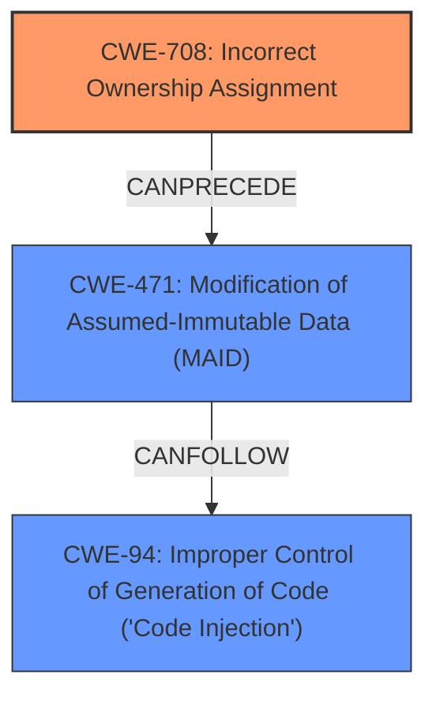

# Analysis Report for CVE-2021-33393

# Vulnerability Analysis Report: CVE-2021-33393

## Description


## Analysis (with Relationship Data)

# Summary
| CWE ID | CWE Name | Confidence | CWE Abstraction Level | CWE Vulnerability Mapping Label | CWE-Vulnerability Mapping Notes |
|---|---|---|---|---|---|
| CWE-708 | Incorrect Ownership Assignment | 1.0 | Base | Allowed | Primary CWE |
| CWE-471 | Modification of Assumed-Immutable Data (MAID) | 0.5 | Base | Allowed | Secondary CWE |
| CWE-94 | Improper Control of Generation of Code ('Code Injection') | 0.5 | Base | Allowed-with-Review | Secondary CWE |

## Evidence and Confidence

*   **Confidence Score:** 0.8
*   **Evidence Strength:** HIGH

## Relationship Analysis
The primary CWE is CWE-708 (**Incorrect Ownership Assignment**) because the core issue is the **incorrect** assignment of ownership to the `backup.pl` script. This leads to a situation where an unprivileged user can modify the script. The secondary CWEs, CWE-471 (**Modification of Assumed-Immutable Data**) and CWE-94 (**Improper Control of Generation of Code ('Code Injection')**), are consequences that arise from the initial incorrect ownership. Specifically, the attacker modifies the script (CWE-471), leading to potential code injection (CWE-94) when the script is executed.



## Vulnerability Chain
The vulnerability chain starts with the **incorrect** assignment of ownership (CWE-708) to the `backup.pl` script. This allows an unprivileged user to modify the script (CWE-471), which then leads to the potential for code injection (CWE-94) when the script is executed by root. The sequence is:

1.  **Incorrect Ownership Assignment** (CWE-708): The `/var/ipfire/backup/bin/backup.pl` script is not owned by the root account.
2.  **Modification of Assumed-Immutable Data** (CWE-471): An unprivileged account modifies the `backup.pl` script with malicious code.
3.  **Improper Control of Generation of Code ('Code Injection')** (CWE-94): When the script is executed, the injected code runs, potentially leading to arbitrary code execution.

## Summary of Analysis
The initial analysis identified that the root cause of the vulnerability is the **incorrect** file ownership, which allows an attacker to modify the backup script and inject malicious code. The Retriever results and the provided vulnerability description both support this assessment. The graph relationships clearly show that CWE-708 leads to CWE-471 and subsequently to CWE-94.

The evidence from the "Vulnerability Description Key Phrases" confirms the root cause: "**rootcause:** **ownership of /var/ipfire/backup/bin/backup.pl is not checked**." The "CVE Reference Links Content Summary" also emphasizes this by stating: "The vulnerability stems from the insecure file permissions and ownership of the `/var/ipfire/backup/bin/backup.pl` script in IPFire. The script was initially owned by the `nobody` user, which allowed any process running as `nobody` to overwrite the script with arbitrary content."

Based on the provided evidence, the chosen CWEs are at the optimal level of specificity. CWE-708 directly addresses the **incorrect ownership** issue, while CWE-471 and CWE-94 explain the subsequent steps in the vulnerability chain.

Relevant CWE Information:

# Enhanced Context (25 CWEs)

## CWE-41: Improper Resolution of Path Equivalence
**Abstraction Level**: Base
**Similarity Score**: 0.79
**Source**: dense

**Description**:
The product is vulnerable to file system contents disclosure through path equivalence. Path equivalence involves the use of special characters in file and directory names. The associated manipulations are intended to generate multiple names for the same object.

**Mapping Guidance**:
- Usage: Allowed
- Rationale: This CWE entry is at the Base level of abstraction, which is a preferred level of abstraction for mapping to the root causes of vulnerabilities.

## CWE-425: Direct Request ('Forced Browsing')
**Abstraction Level**: Base
**Similarity Score**: 0.79
**Source**: dense

**Description**:
The web application does not adequately enforce appropriate authorization on all restricted URLs, scripts, or files.

**Mapping Guidance**:
- Usage: Allowed
- Rationale: This CWE entry is at the Base level of abstraction, which is a preferred level of abstraction for mapping to the root causes of vulnerabilities.

## CWE-472: External Control of Assumed-Immutable Web Parameter
**Abstraction Level**: Base
**Similarity Score**: 0.79
**Source**: dense

**Description**:
The web application does not sufficiently verify inputs that are assumed to be immutable but are actually externally controllable, such as hidden form fields.

**Mapping Guidance**:
- Usage: Allowed
- Rationale: This CWE entry is at the Base level of abstraction, which is a preferred level of abstraction for mapping to the root causes of vulnerabilities.

## CWE-552: Files or Directories Accessible to External Parties
**Abstraction Level**: Base
**Similarity Score**: 0.78
**Source**: dense

**Description**:
The product makes files or directories accessible to unauthorized actors, even though they should not be.

**Mapping Guidance**:
- Usage: Allowed
- Rationale: This CWE entry is at the Base level of abstraction, which is a preferred level of abstraction for mapping to the root causes of vulnerabilities.

## CWE-639: Authorization Bypass Through User-Controlled Key
**Abstraction Level**: Base
**Similarity Score**: 0.78
**Source**: dense

**Description**:
The system's authorization functionality does not prevent one user from gaining access to another user's data or record by modifying the key value identifying the data.

**Mapping Guidance**:
- Usage: Allowed
- Rationale: This CWE entry is at the Base level of abstraction, which is a preferred level of abstraction for mapping to the root causes of vulnerabilities.

## CWE-23: Relative Path Traversal
**Abstraction Level**: Base
**Similarity Score**: 0.78
**Source**: dense

**Description**:
The product uses external input to construct a pathname that should be within a restricted directory, but it does not properly neutralize sequences such as ".." that can resolve to a location that is outside of that directory.

**Mapping Guidance**:
- Usage: Allowed
- Rationale: This CWE entry is at the Base level of abstraction, which is a preferred level of abstraction for mapping to the root causes of vulnerabilities.

## CWE-73: External Control of File Name or Path
**Abstraction Level**: Base
**Similarity Score**: 0.78
**Source**: dense

**Description**:
The product allows user input to control or influence paths or file names that are used in filesystem operations.

**Mapping Guidance**:
- Usage: Allowed
- Rationale: This CWE entry is at the Base level of abstraction, which is a preferred level of abstraction for mapping to the root causes of vulnerabilities.

## CWE-668: Exposure of Resource to Wrong Sphere
**Abstraction Level**: Class
**Similarity Score**: 0.78
**Source**: dense

**Description**:
The product exposes a resource to the wrong control sphere, providing unintended actors with inappropriate access to the resource.

**Mapping Guidance**:
- Usage: Discouraged
- Rationale: CWE-668 is high-level and is often misused as a catch-all when lower-level CWE IDs might be applicable. It is sometimes used for low-information vulnerability reports [REF-1287]. It is a level-1 Class (i.e., a child of a Pillar). It is not useful for trend analysis.

## CWE-74: Improper Neutralization of Special Elements in Output Used by a Downstream Component ('Injection')
**Abstraction Level**: Class
**Similarity Score**: 0.78
**Source**: dense

**Description**:
The product constructs all or part of a command, data structure, or record using externally-influenced input from an upstream component, but it does not neutralize or incorrectly neutralizes special elements that could modify how it is parsed or interpreted when it is sent to a downstream component.

**Mapping Guidance**:
- Usage: Discouraged
- Rationale: CWE-74 is high-level and often misused when lower-level weaknesses are more appropriate.

## CWE-923: Improper Restriction of Communication Channel to Intended Endpoints
**Abstraction Level**: Class
**Similarity Score**: 0.78
**Source**: dense

**Description


## CWE Relationship Analysis

Current CWEs represent these abstraction levels: .


### Vulnerability Chain Analysis

**Chain starting from CWE-708:**
- 708 (Incorrect Ownership Assignment) - ROOT


**Chain starting from CWE-41:**
- 41 (Improper Resolution of Path Equivalence) - ROOT


### CWE Relationship Diagram

```mermaid
graph TD
    classDef primary fill:#f96,stroke:#333,stroke-width:2px
    classDef secondary fill:#69f,stroke:#333
    classDef tertiary fill:#9e9,stroke:#333
```


*Report generated on 2025-04-02 05:02:22*
