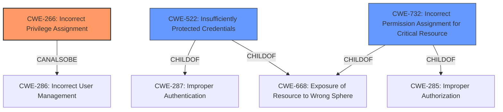

# Raw Analyzer Response for CVE-2021-3344

# Summary
| CWE ID | CWE Name | Confidence | CWE Abstraction Level | CWE Vulnerability Mapping Label | CWE-Vulnerability Mapping Notes |
|---|---|---|---|---|---|
| CWE-266 | Incorrect Privilege Assignment | 0.8 | Base | Allowed | Primary CWE |
| CWE-522 | Insufficiently Protected Credentials | 0.6 | Class | Allowed-with-Review | Secondary Candidate |
| CWE-732 | Incorrect Permission Assignment for Critical Resource | 0.5 | Class | Allowed-with-Review | Secondary Candidate |

## Evidence and Confidence

*   **Confidence Score:** 0.7
*   **Evidence Strength:** HIGH

## Relationship Analysis
The primary CWE, CWE-266, is related to privilege management. The secondary CWEs (CWE-522, CWE-732) offer further context regarding credential protection and permission assignment. The main relationship is that an **incorrect privilege assignment** (CWE-266) allows for access to **insufficiently protected credentials** (CWE-522) that lead to **incorrect permission assignment** (CWE-732). This progression indicates a chain of weaknesses stemming from the initial **incorrect privilege assignment.**

## Vulnerability Chain
The vulnerability chain starts with the **incorrect privilege assignment** (CWE-266), which leads to **insufficiently protected credentials** being accessible (CWE-522). An attacker is then able to use these credentials to overwrite container images due to **incorrect permission assignment** (CWE-732).

## Summary of Analysis
The initial assessment was based on the description of a **privilege escalation** flaw. The analysis identified CWE-266 as the primary root cause, supported by evidence from the vulnerability description and CVE reference summary. The chain of vulnerabilities is influenced by the fact that credentials outside the build context are automatically mounted, which is an **incorrect privilege assignment**. This allows an attacker to overwrite arbitrary container images, indicating an **incorrect permission assignment** as a consequence. The selected CWEs are at the optimal level of specificity, with CWE-266 providing the root cause and CWE-522 and CWE-732 providing further context.

Relevant CWE Information:

# Enhanced Context (25 CWEs)
The following CWEs were identified as potentially relevant to this vulnerability:

## CWE-266: Incorrect Privilege Assignment
**Abstraction Level**: Base
**Similarity Score**: 0.78
**Source**: dense

**Description**:
A product incorrectly assigns a privilege to a particular actor, creating an unintended sphere of control for that actor.

**Mapping Guidance**:
- Usage: Allowed
- Rationale: This CWE entry is at the Base level of abstraction, which is a preferred level of abstraction for mapping to the root causes of vulnerabilities.

## CWE-522: Insufficiently Protected Credentials
**Abstraction Level**: Class
**Status:** Incomplete

### Description
The product transmits or stores authentication credentials, but it uses an insecure method that is susceptible to unauthorized interception and/or retrieval.

### Mapping Guidance
**Usage:** Allowed-with-Review
**Rationale:** This CWE entry is a Class and might have Base-level children that would be more appropriate
**Comments:** Examine children of this entry to see if there is a better fit
**Reasons:**
- Abstraction

## CWE-732: Incorrect Permission Assignment for Critical Resource
**Abstraction Level**: Class
**Status:** Draft

### Description
The product specifies permissions for a security-critical resource in a way that allows that resource to be read or modified by unintended actors.

### Mapping Guidance
**Usage:** Allowed-with-Review
**Rationale:** While the name itself indicates an assignment of permissions for resources, this is often misused for vulnerabilities in which "permissions" are not checked, which is an "authorization" weakness (CWE-285 or descendants) within CWE's model [REF-1287].
**Comments:** Closely analyze the specific mistake that is allowing the resource to be exposed, and perform a CWE mapping for that mistake.
**Reasons:**
- Frequent Misuse

## CWE-59: Improper Link Resolution Before File Access ('Link Following')
CWE-59 was considered but not used because it focuses on file access via links, which is not the primary mechanism described in this vulnerability.

## CWE-61: UNIX Symbolic Link (Symlink) Following
CWE-61 was considered but not used because it is a compound weakness related to symlinks, which are not directly involved in this vulnerability.

## CWE-863: Incorrect Authorization
CWE-863 was considered but not used as it is a Class level CWE, and CWE-266 is a more accurate Base level CWE.

## CWE-285: Improper Authorization
CWE-285 was considered but not used as it is discouraged and there are more specific CWEs available.