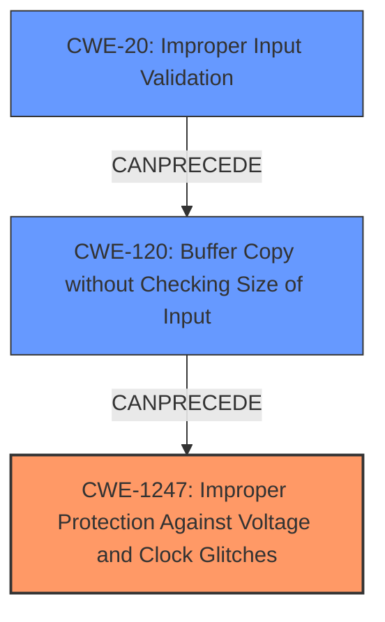

# Analysis Report for CVE-2021-33478

# Vulnerability Analysis Report: CVE-2021-33478

## Description


## Analysis (with Relationship Data)

# Summary
| CWE ID | CWE Name | Confidence | CWE Abstraction Level | CWE Vulnerability Mapping Label | CWE-Vulnerability Mapping Notes |
|---|---|---|---|---|---|
| CWE-1247 | Improper Protection Against Voltage and Clock Glitches | 0.8 | Base | Allowed | Primary CWE. The device does not contain or contains incorrectly implemented circuitry or sensors to detect and mitigate voltage and clock glitches and protect sensitive information or software contained on the device. |
| CWE-120 | Buffer Copy without Checking Size of Input ('Classic Buffer Overflow') | 0.6 | Base | Allowed-with-Review | Secondary CWE. The product copies data from a source buffer to a destination buffer without checking the size of the input, which can lead to a buffer overflow if the input is larger than the destination buffer. |
| CWE-20 | Improper Input Validation | 0.5 | Class | Discouraged | Secondary CWE. The product receives input or data, but it does not validate or incorrectly validates that the input has the properties that are required to process the data safely and correctly. |

## Evidence and Confidence

*   **Confidence Score:** 0.7
*   **Evidence Strength:** MEDIUM

## Relationship Analysis
The primary weakness is CWE-1247, which describes the **improper protection against voltage and clock glitches**. This can lead to an exploitable condition such as a **buffer overflow** (CWE-120) due to **improper input validation** (CWE-20) of crafted commands with parameters. The root cause is the missing or incorrect implementation of safeguards against voltage and clock glitches.



## Vulnerability Chain
The vulnerability chain starts with a **missing or incorrect implementation of circuitry or sensors to detect and mitigate voltage and clock glitches** (CWE-1247). This allows an attacker to manipulate the device's voltage/current for chip pins, potentially leading to a special boot mode. Once in this mode, **improper input validation** (CWE-20) of crafted commands with parameters could trigger a **buffer overflow** (CWE-120), resulting in arbitrary code execution.

## Summary of Analysis
The primary CWE is CWE-1247, which accurately reflects the root cause: the **improper protection against voltage and clock glitches**, and is supported by the description stating that exploitation is possible when an attacker can control the voltage/current for chip pins. The "Retriever Results" lists CWE-1247 with a high score. The "CVE Reference Links Content Summary" lists "Buffer Overflow (CWE-120)" and the vulnerability description mentions "crafted commands with parameters", suggesting **improper input validation** (CWE-20) could be a contributing factor.

The selection of CWE-1247 is at the optimal level of specificity, as it directly addresses the weakness in hardware-level protection mechanisms. While CWE-20 and CWE-120 are also relevant, they represent subsequent steps in the exploitation chain rather than the fundamental flaw.

Relevant CWE Information:

# Enhanced Context (25 CWEs)

## CWE-807: Reliance on Untrusted Inputs in a Security Decision
**Abstraction Level**: Base
**Similarity Score**: 0.77
**Source**: dense
This CWE was not selected because the issue is not directly about relying on untrusted inputs for security decisions.

## CWE-1289: Improper Validation of Unsafe Equivalence in Input
**Abstraction Level**: Base
**Similarity Score**: 0.76
**Source**: dense
This CWE was not selected because the specific type of input validation issue is not about validating equivalence to unsafe values.

## CWE-345: Insufficient Verification of Data Authenticity
**Abstraction Level**: Class
**Similarity Score**: 0.76
**Source**: dense
This CWE was not selected because the vulnerability is not about verifying the authenticity of data.

## CWE-303: Incorrect Implementation of Authentication Algorithm
**Abstraction Level**: Base
**Similarity Score**: 0.76
**Source**: dense
This CWE was not selected because the issue is not specifically related to the incorrect implementation of an authentication algorithm.

## CWE-1299: Missing Protection Mechanism for Alternate Hardware Interface
**Abstraction Level**: Base
**Similarity Score**: 0.76
**Source**: dense
This CWE was not selected because the primary issue is not the missing protection mechanism for alternate hardware interfaces.

## CWE-653: Improper Isolation or Compartmentalization
**Abstraction Level**: Class
**Similarity Score**: 0.75
**Source**: dense
This CWE was not selected because the vulnerability is not about improper isolation or compartmentalization.

## CWE-1220: Insufficient Granularity of Access Control
**Abstraction Level**: Base
**Similarity Score**: 0.75
**Source**: dense
This CWE was not selected because the issue is not about insufficient granularity of access control.

## CWE-280: Improper Handling of Insufficient Permissions or Privileges
**Abstraction Level**: Base
**Similarity Score**: 0.75
**Source**: dense
This CWE was not selected because the vulnerability is not about improper handling of insufficient permissions or privileges.

## CWE-799: Improper Control of Interaction Frequency
**Abstraction Level**: Class
**Similarity Score**: 0.75
**Source**: dense
This CWE was not selected because the issue is not directly related to improper control of interaction frequency.

## CWE-1391: Use of Weak Credentials
**Abstraction Level**: Class
**Similarity Score**: 0.75
**Source**: dense
This CWE was not selected because the vulnerability does not involve the use of weak credentials.

## CWE-190: Integer Overflow or Wraparound
**Abstraction Level**: Base
**Similarity Score**: 8429.89
**Source**: sparse
This CWE was not selected because the vulnerability is not directly related to integer overflows or wraparounds, although it could be a consequence of other weaknesses.

## CWE-1284: Improper Validation of Specified Quantity in Input
**Abstraction Level**: Base
**Similarity Score**: 8330.81
**Source**: sparse
This CWE was not selected because, while **improper input validation** is a factor, the more direct cause is lack of protection against voltage and clock glitches.

## CWE-119: Improper Restriction of Operations within the Bounds of a Memory Buffer
**Abstraction Level**: Class
**Similarity Score**: 8250.98
**Source**: sparse
CWE-119 was selected as a secondary CWE since a crafted command could result in a buffer overflow.

## CWE-125: Out-of-bounds Read
**Abstraction Level**: Base
**Similarity Score**: 8117.81
**Source**: sparse
This CWE was not selected because the vulnerability is more likely to be a buffer overflow (write) rather than an out-of-bounds read.

## CWE-22: Improper Limitation of a Pathname to a Restricted Directory ('Path Traversal')
**Abstraction Level**: Base
**Similarity Score**: 7984.43
**Source**: sparse
This CWE was not selected because the vulnerability does not involve path traversal.

## CWE-41: Improper Resolution of Path Equivalence
**Abstraction Level**: base
**Similarity Score**: 5.03
**Source**: graph
This CWE was not selected because the vulnerability does not involve path equivalence issues.

## CWE-120: Buffer Copy without Checking Size of Input ('Classic Buffer Overflow')
**Abstraction Level**: base
**Similarity Score**: 4.33
**Source**: graph
CWE-120 was selected as a secondary CWE since a crafted command could result in a buffer overflow.

## CWE-123: Write-what-where Condition
**Abstraction Level**: base
**Similarity Score**: 4.33
**Source**: graph
This CWE was not selected because, while code execution is achieved, the core vulnerability doesn't directly manifest as a write-what-where condition.

## CWE-22: Improper Limitation of a Pathname to a Restricted Directory ('Path Traversal')
**Abstraction Level**: base
**Similarity Score**: 4.33
**Source**: graph
This CWE was not selected because the vulnerability does not involve path traversal.

## CWE-770: Allocation of Resources Without Limits or Throttling
**Abstraction Level**: base
**Similarity Score**: 4.33
**Source**: graph
This CWE was not selected because the vulnerability is not directly related to resource allocation without limits or throttling.


## CWE Relationship Analysis

Current CWEs represent these abstraction levels: .


### Vulnerability Chain Analysis

**Chain starting from CWE-123:**
- 123 (Write-what-where Condition) - ROOT


**Chain starting from CWE-799:**
- 799 (Improper Control of Interaction Frequency) - ROOT


### CWE Relationship Diagram

```mermaid
graph TD
    classDef primary fill:#f96,stroke:#333,stroke-width:2px
    classDef secondary fill:#69f,stroke:#333
    classDef tertiary fill:#9e9,stroke:#333
```


*Report generated on 2025-04-02 15:29:26*
