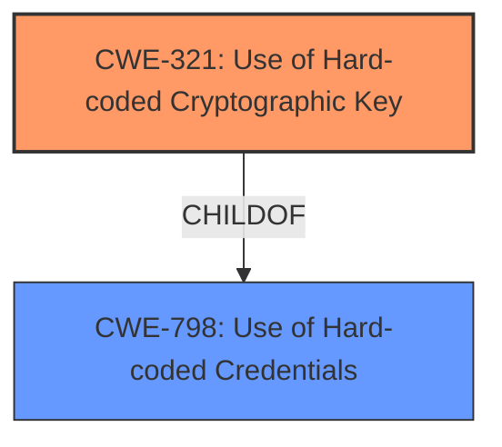

# Raw Analyzer Response for CVE-2021-33484

# Summary
| CWE ID | CWE Name | Confidence | CWE Abstraction Level | CWE Vulnerability Mapping Label | CWE-Vulnerability Mapping Notes |
|---|---|---|---|---|---|
| CWE-321 | Use of Hard-coded Cryptographic Key | 1 | Variant | Allowed | Primary CWE |
| CWE-798 | Use of Hard-coded Credentials | 0.9 | Base | Allowed | Secondary Candidate |

## Evidence and Confidence

*   **Confidence Score:** 0.95
*   **Evidence Strength:** HIGH

## Relationship Analysis
The primary CWE is CWE-321, a variant of CWE-798. CWE-321 is a more specific case of using hardcoded credentials, focusing specifically on cryptographic keys. The vulnerability description clearly states the **hardcoded IV** is used for encryption. Therefore, choosing CWE-321 over the more general CWE-798 provides a more accurate and granular representation of the vulnerability.

## Vulnerability Chain
The vulnerability chain starts with the **hardcoded IV**, which allows an attacker to decrypt data and spoof users.

## Summary of Analysis
The initial analysis focused on identifying the root cause of the vulnerability. The vulnerability description and CVE Reference Links Content Summary both point to the use of a **hardcoded IV** as the primary weakness. This leads directly to CWE-321: Use of Hard-coded Cryptographic Key, as it is a specific instance of using hardcoded credentials for cryptographic purposes.

The analysis is strongly supported by the provided evidence. The "Vulnerability Description Key Phrases" section explicitly mentions "**rootcause:** **hardcoded IV**". The "CVE Reference Links Content Summary" section states: "The application uses a hardcoded IV for encryption".

The graph relationships support the selection of CWE-321 as the primary CWE. CWE-321 is a child of CWE-798, making it a more specific and accurate representation of the vulnerability.

The selected CWEs are at the optimal level of specificity. CWE-321 is a Variant, which is a preferred level of abstraction for mapping to the root causes of vulnerabilities. It accurately represents the weakness and is supported by the evidence.

Relevant CWE Information:

# Enhanced Context (25 CWEs)
The following CWEs were identified as potentially relevant to this vulnerability:

## CWE-807: Reliance on Untrusted Inputs in a Security Decision
**Abstraction Level**: Base
**Similarity Score**: 0.78
**Source**: dense

**Description**:
The product uses a protection mechanism that relies on the existence or values of an input, but the input can be modified by an untrusted actor in a way that bypasses the protection mechanism.
**NOT USED**: The primary issue is the presence of a hardcoded key, not the reliance on untrusted inputs.

## CWE-1391: Use of Weak Credentials
**Abstraction Level**: Class
**Similarity Score**: 0.78
**Source**: dense

**Description**:
The product uses weak credentials (such as a default key or hard-coded password) that can be calculated, derived, reused, or guessed by an attacker.
**NOT USED**: Too general; CWE-321 is more specific.

## CWE-41: Improper Resolution of Path Equivalence
**Abstraction Level**: Base
**Similarity Score**: 0.78
**Source**: dense

**Description**:
The product is vulnerable to file system contents disclosure through path equivalence. Path equivalence involves the use of special characters in file and directory names. The associated manipulations are intended to generate multiple names for the same object.
**NOT USED**: Not relevant to the hardcoded key issue.

## CWE-472: External Control of Assumed-Immutable Web Parameter
**Abstraction Level**: Base
**Similarity Score**: 0.78
**Source**: dense

**Description**:
The web application does not sufficiently verify inputs that are assumed to be immutable but are actually externally controllable, such as hidden form fields.
**NOT USED**: While input validation is mentioned, the core issue is the hardcoded key.

## CWE-798: Use of Hard-coded Credentials
**Abstraction Level**: Base
**Similarity Score**: 0.78
**Source**: dense

**Description**:
The product contains hard-coded credentials, such as a password or cryptographic key.
**USED**: As the parent of CWE-321 and relevant due to the general use of hardcoded information.

## CWE-204: Observable Response Discrepancy
**Abstraction Level**: Base
**Similarity Score**: 0.78
**Source**: dense

**Description**:
The product provides different responses to incoming requests in a way that reveals internal state information to an unauthorized actor outside of the intended control sphere.
**NOT USED**: Not directly related to the root cause.

## CWE-425: Direct Request ('Forced Browsing')
**Abstraction Level**: Base
**Similarity Score**: 0.77
**Source**: dense

**Description**:
The web application does not adequately enforce appropriate authorization on all restricted URLs, scripts, or files.
**NOT USED**: Not directly related to the root cause.

## CWE-639: Authorization Bypass Through User-Controlled Key
**Abstraction Level**: Base
**Similarity Score**: 0.77
**Source**: dense

**Description**:
The system's authorization functionality does not prevent one user from gaining access to another user's data or record by modifying the key value identifying the data.
**NOT USED**: The authorization bypass is a consequence of the key, not the primary weakness.

## CWE-319: Cleartext Transmission of Sensitive Information
**Abstraction Level**: Base
**Similarity Score**: 0.77
**Source**: dense

**Description**:
The product transmits sensitive or security-critical data in cleartext in a communication channel that can be sniffed by unauthorized actors.
**NOT USED**: While related to encryption, the core issue is the hardcoded key.

## CWE-668: Exposure of Resource to Wrong Sphere
**Abstraction Level**: Class
**Similarity Score**: 0.77
**Source**: dense

**Description**:
The product exposes a resource to the wrong control sphere, providing unintended actors with inappropriate access to the resource.
**NOT USED**: Too general; CWE-321 is more specific.

## CWE-798: Use of Hard-coded Credentials
**Abstraction Level**: Base
**Similarity Score**: 6533.29
**Source**: sparse

**Description**:
The product contains hard-coded credentials, such as a password or cryptographic key.
**USED**: As the parent of CWE-321 and relevant due to the general use of hardcoded information.

## CWE-259: Use of Hard-coded Password
**Abstraction Level**: Variant
**Similarity Score**: 6206.14
**Source**: sparse

**Description**:
The product contains a hard-coded password, which it uses for its own inbound authentication or for outbound communication to external components.
**NOT USED**: The weakness is a hardcoded cryptographic key, not a password.

## CWE-321: Use of Hard-coded Cryptographic Key
**Abstraction Level**: Variant
**Similarity Score**: 5963.54
**Source**: sparse

**Description**:
The use of a hard-coded cryptographic key significantly increases the possibility that encrypted data may be recovered.
**USED**: The primary CWE.

## CWE-1391: Use of Weak Credentials
**Abstraction Level**: Class
**Similarity Score**: 5779.03
**Source**: sparse

**Description**:
The product uses weak credentials (such as a default key or hard-coded password) that can be calculated, derived, reused, or guessed by an attacker.
**NOT USED**: Too general; CWE-321 is more specific.

## CWE-327: Use of a Broken or Risky Cryptographic Algorithm
**Abstraction Level**: Class
**Similarity Score**: 5697.55
**Source**: sparse

**Description**:
The product uses a broken or risky cryptographic algorithm or protocol.
**NOT USED**: The issue is the hardcoded key, not the algorithm itself.

## CWE-471: Modification of Assumed-Immutable Data (MAID)
**Abstraction Level**: base
**Similarity Score**: 4.33
**Source**: graph

**Description**:
CWE-471: Modification of Assumed-Immutable Data (MAID)
**NOT USED**: Not directly related to the root cause.

## CWE-208: Observable Timing Discrepancy
**Abstraction Level**: base
**Similarity Score**: 4.33
**Source**: graph

**Description**:
CWE-208: Observable Timing Discrepancy
**NOT USED**: Not directly related to the root cause.

##