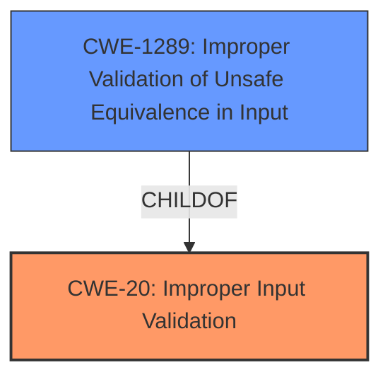

# Analysis for CVE-2021-33488

# Summary
| CWE ID | CWE Name | Confidence | CWE Abstraction Level | CWE Vulnerability Mapping Label | CWE-Vulnerability Mapping Notes |
|---|---|---|---|---|---|
| CWE-20 | Improper Input Validation | 0.9 | Class | Primary | Discouraged |
| CWE-1289 | Improper Validation of Unsafe Equivalence in Input | 0.7 | Base | Secondary | Allowed |

## Evidence and Confidence

*   **Confidence Score:** 0.8
*   **Evidence Strength:** HIGH

## Relationship Analysis
The primary CWE is CWE-20 **Improper Input Validation**, a Class-level CWE. While generally discouraged, it directly reflects the stated root cause. A more specific Base-level CWE, CWE-1289 **Improper Validation of Unsafe Equivalence in Input**, was considered and added as a secondary candidate. The relationship between CWE-20 and its children influenced this decision, aiming for a balance between accuracy and specificity.

## Vulnerability Chain
The vulnerability chain starts with **Improper Input Validation** (CWE-20) which leads to a redirect to a rogue OX Chat server.
  - Initial Flaw: **Improper Input Validation** (CWE-20)
  - Impact: User is redirected to rogue OX Chat server.

## Summary of Analysis
The initial analysis strongly pointed to CWE-20 **Improper Input Validation** as the primary weakness, supported by the description and the CVE reference summary which states `"weaknesses": ["Improper Input Validation (CWE-20)"]`. However, CWE-20 is a broad, Class-level CWE and is discouraged for use when a more specific CWE is available.

The vulnerability description states: "chat in OX App Suite 7.10.5 has **Improper Input Validation**. A user can be redirected to a rogue OX Chat server via a development-related hook."

The CVE Reference Links Content Summary adds: "The \"chat\" component contains development related hooks to provide the URL of the chat backend service. This can be used to redirect users to rogue OX Chat servers."

Given that the redirection is due to a **lack of validation** of the chat backend service URL, CWE-1289 **Improper Validation of Unsafe Equivalence in Input** was considered and added as a secondary candidate since the application **fails to validate that the provided URL is a safe and trusted one**.

CWE-20 remains the primary CWE due to the explicit mention of **Improper Input Validation** in the vulnerability description and CVE reference. However, CWE-1289 provides a more specific characterization of the vulnerability.

Relevant CWE Information:

# Enhanced Context (25 CWEs)

## CWE-1289: Improper Validation of Unsafe Equivalence in Input
**Abstraction Level**: Base
**Similarity Score**: 0.78
**Source**: dense

**Description**:
The product receives an input value that is used as a resource identifier or other type of reference, but it does not validate or incorrectly validates that the input is equivalent to a potentially-unsafe value.

**Mapping Guidance**:
- Usage: Allowed
- Rationale: This CWE entry is at the Base level of abstraction, which is a preferred level of abstraction for mapping to the root causes of vulnerabilities.

# Technical Explanation for Selected CWEs:

### CWE-20 Improper Input Validation

*   **Match:** The vulnerability description explicitly states the **root cause** is **Improper Input Validation**. The system fails to properly validate input, specifically the URL of the chat backend service, allowing redirection to a rogue server.
*   **Implication:** This allows an attacker to redirect users to a malicious server, potentially leading to disclosure of sensitive information or harassment.
*   **Relationship:** CWE-20 is a Class-level CWE and is the parent of many more specific input validation weaknesses.
*   **Guidance:** While CWE-20 is generally discouraged, its explicit mention in the vulnerability report makes it the appropriate primary choice. The guidance suggests looking at more specific children.
*   **Confidence:** 0.9

### CWE-1289 Improper Validation of Unsafe Equivalence in Input

*   **Match:** The application receives a URL for the chat backend service, which is a resource identifier. It **does not validate that the input is equivalent to a safe value**. This allows for redirection to an unsafe, attacker-controlled server.
*   **Implication:** As with CWE-20, this can lead to sensitive information disclosure or harassment.
*   **Relationship:** CWE-1289 is a child of CWE-20, providing a more specific description of the input validation failure.
*   **Guidance:** This is a Base-level CWE, which is a preferred level of abstraction.
*   **Confidence:** 0.7

### CWEs Considered but Not Used:
*   **CWE-116: Improper Encoding or Escaping of Output:** This CWE was considered, but it focuses on output escaping, which is not the primary issue here. The core problem is the lack of validation, not improper handling of output.
*   **CWE-1284: Improper Validation of Specified Quantity in Input:** This CWE focuses on the validation of quantities, which is not relevant to this vulnerability. The issue is with the validation of the URL itself, not a numerical quantity.
*   **CWE-287: Improper Authentication, CWE-1390: Weak Authentication:** These CWEs focus on authentication issues, which are not the primary concern in this vulnerability. The core issue is the **lack of input validation** on the chat server URL, not a failure in the authentication process itself. The user is being redirected to a rogue server due to the lack of validation, not due to a failure in authenticating to the legitimate server.