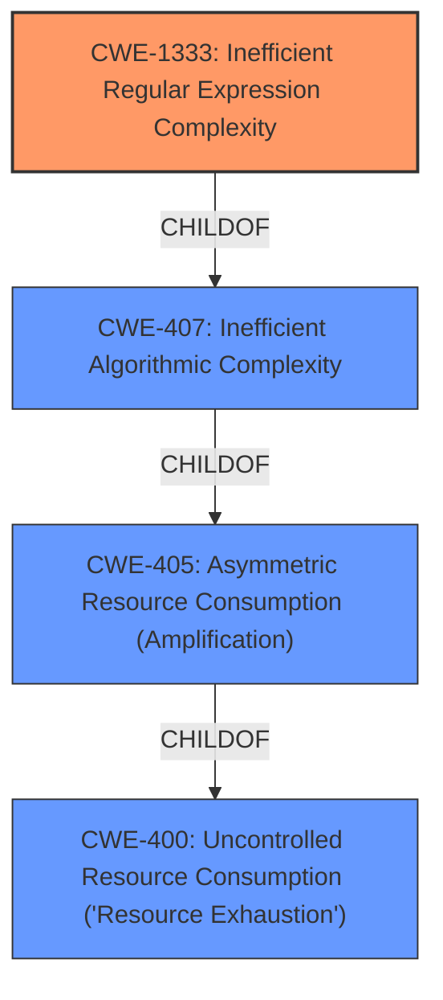

# Analysis Report for CVE-2021-33503

# Vulnerability Analysis Report: CVE-2021-33503

## Description


## Analysis (with Relationship Data)

# Summary
| CWE ID    | CWE Name                                                                   | Confidence | CWE Abstraction Level | CWE Vulnerability Mapping Label | CWE-Vulnerability Mapping Notes |
| :-------- | :------------------------------------------------------------------------- | :--------- | :-------------------- | :------------------------------ | :------------------------------ |
| CWE-1333  | Inefficient Regular Expression Complexity                                  | 1          | Base                  | Primary                         | Allowed                       |
| CWE-400 | Uncontrolled Resource Consumption ('Resource Exhaustion')   | 0.4          | Class                  | Secondary                      | Allowed-with-Review           |

## Evidence and Confidence

*   **Confidence Score:** 1
*   **Evidence Strength:** HIGH

## Relationship Analysis
The primary identified weakness is CWE-1333 (Base), which is a child of CWE-407 (Class). CWE-407 is, in turn, a child of CWE-405 (Class), which is a child of CWE-400 (Class). This indicates a hierarchical relationship where the specific issue of inefficient regular expression complexity leads to broader resource consumption problems.



## Vulnerability Chain
The vulnerability chain starts with a crafted URL containing many "@" characters. This input triggers **catastrophic backtracking** in the regular expression used for parsing the authority component of the URL (**CWE-1333**). The **catastrophic backtracking** leads to excessive CPU consumption, resulting in a denial-of-service condition (**CWE-400**).

## Summary of Analysis
The primary CWE selected is CWE-1333, "Inefficient Regular Expression Complexity," because the root cause of the vulnerability is **catastrophic backtracking** in a regular expression. This aligns directly with the CWE description and observed examples. The vulnerability description and CVE reference explicitly mention the use of a regular expression that exhibits **catastrophic backtracking** when parsing URLs with many "@" characters. This leads to excessive resource consumption and denial of service.

Evidence:

*   "When provided with a URL containing many @ characters in the authority component, the authority regular expression exhibits **catastrophic backtracking**, causing a denial of service"
*   "The vulnerability is due to a regular expression used for parsing the authority component of a URL, which exhibits catastrophic backtracking when provided with a URL containing many `@` characters."
*   "An attacker can cause a denial of service condition by providing a crafted URL with many `@` characters, leading to excessive resource consumption by the vulnerable parser."

CWE-400, "Uncontrolled Resource Consumption ('Resource Exhaustion')" was considered as a secondary CWE because the **catastrophic backtracking** directly leads to a denial-of-service condition, which is a form of resource exhaustion. The relationship between CWE-1333 and CWE-400 is that the inefficient regular expression complexity causes uncontrolled resource consumption.

The selection of CWE-1333 is at the optimal level of specificity, as it directly addresses the root cause of the vulnerability (inefficient regular expression). While CWE-400 describes the impact (denial of service), CWE-1333 explains why and how the denial of service occurs.
The high retriever score for CWE-1333 supports the decision.

Relevant CWE Information:

# Enhanced Context (25 CWEs)

## CWE-1333: Inefficient Regular Expression Complexity
**Abstraction Level**: Base
**Similarity Score**: 1.000
**Source**: alternate_terms

**Description**:
The product uses a regular expression with an inefficient, possibly exponential worst-case computational complexity that consumes excessive CPU cycles.

**Mapping Guidance**:
- Usage: Allowed
- Rationale: This CWE entry is at the Base level of abstraction, which is a preferred level of abstraction for mapping to the root causes of vulnerabilities.
**Observed Examples:**
- **CVE-2020-5243:** server allows ReDOS with crafted User-Agent strings, due to overlapping capture groups that cause excessive backtracking.
- **CVE-2021-21317:** npm package for user-agent parser prone to ReDoS due to overlapping capture groups
- **CVE-2019-16215:** Markdown parser uses inefficient regex when processing a message, allowing users to cause CPU consumption and delay preventing processing of other messages.

## CWE-400: Uncontrolled Resource Consumption ('Resource Exhaustion')
**Abstraction Level**: Class
**Description**:
The product does not properly control the consumption of resources, which can lead to denial of service, degraded performance, or other unintended consequences.

**Mapping Guidance**:
- Usage: Allowed-with-Review
- Rationale: This CWE entry is a Class and might have Base-level children that would be more appropriate
- Examine children of this entry to see if there is a better fit.


## CWE Relationship Analysis

Current CWEs represent these abstraction levels: .


### Vulnerability Chain Analysis

**Chain starting from CWE-400:**
- 400 (Uncontrolled Resource Consumption) - ROOT


**Chain starting from CWE-405:**
- 405 (Asymmetric Resource Consumption (Amplification)) - ROOT


### CWE Relationship Diagram

```mermaid
graph TD
    classDef primary fill:#f96,stroke:#333,stroke-width:2px
    classDef secondary fill:#69f,stroke:#333
    classDef tertiary fill:#9e9,stroke:#333
```


*Report generated on 2025-04-02 00:46:50*
