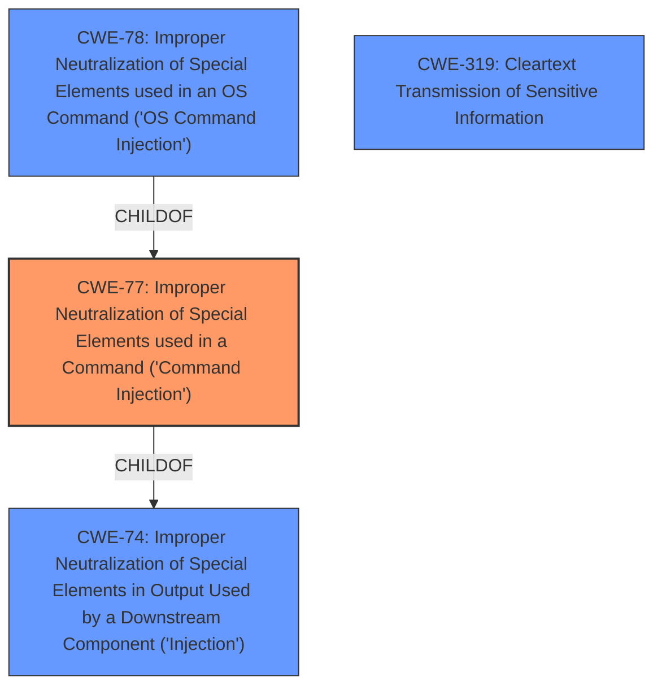

# Raw Analyzer Response for CVE-2021-33515

# Summary
| CWE ID | CWE Name | Confidence | CWE Abstraction Level | CWE Vulnerability Mapping Label | CWE-Vulnerability Mapping Notes |
|---|---|---|---|---|---|
| CWE-77 | Improper Neutralization of Special Elements used in a Command ('Command Injection') | 0.9 | Class | Allowed-with-Review | Primary CWE |
| CWE-319 | Cleartext Transmission of Sensitive Information | 0.7 | Base | Allowed | Secondary Candidate |

## Evidence and Confidence

*   **Confidence Score:** 0.8
*   **Evidence Strength:** HIGH

## Relationship Analysis
The primary CWE is CWE-77, a Class-level weakness describing improper neutralization of special elements in a command. CWE-77 is child of CWE-74 (Improper Neutralization of Special Elements in Output Used by a Downstream Component ('Injection')). CWE-78 is a more specific version of CWE-77, but because the vulnerability description does not specifically mention OS commands, CWE-77 is more appropriate. CWE-319 is included because the vulnerability allows command injection before the STARTTLS negotiation, thus sensitive information is transmitted in cleartext.

## Vulnerability Chain
The chain of weaknesses starts with **improper neutralization** of input, leading to **command injection**. The commands are injected before STARTTLS negotiation, resulting in **cleartext transmission of sensitive information**.

## Summary of Analysis
The primary weakness is **CWE-77 (Improper Neutralization of Special Elements used in a Command ('Command Injection'))**. The vulnerability description explicitly mentions "**command injection**" in the submission service of Dovecot. The CVE Reference Links Content Summary confirms that the root cause is a failure to properly sanitize data, allowing for command injection. The attacker injects commands before STARTTLS, which are then executed after TLS is established.

CWE-78 (Improper Neutralization of Special Elements used in an OS Command ('OS Command Injection')) was considered, but it is more specific than the provided information supports. The description does not explicitly state that the commands being injected are OS commands, thus a more general command injection CWE-77 is more appropriate.

CWE-319 (Cleartext Transmission of Sensitive Information) is included as a secondary weakness because the commands are injected *before* the STARTTLS negotiation, meaning sensitive information can be transmitted in cleartext. The vulnerability allows command injection *before* STARTTLS negotiation, thus sensitive information is transmitted in cleartext.

The selection of CWE-77 is at the optimal level of specificity because it directly reflects the **command injection** vulnerability described. The supporting evidence is strong, as the vulnerability description explicitly mentions command injection and the summary confirms the root cause. The relationships between the CWEs (CWE-77 being a child of CWE-74 and related to CWE-78) further support the decision.