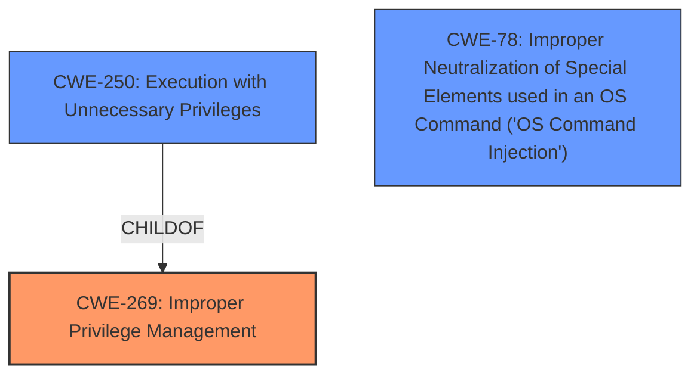

# Raw Analyzer Response for CVE-2021-33526

# Summary
| CWE ID | CWE Name | Confidence | CWE Abstraction Level | CWE Vulnerability Mapping Label | CWE-Vulnerability Mapping Notes |
|---|---|---|---|---|---|
| CWE-269 | Improper Privilege Management | 0.9 | Class | Primary | Allowed-with-Review, The vulnerability description indicates that a low privileged local attacker can send a command to the service which runs with NT AUTHORITY\SYSTEM privileges. The service then executes a malicious OpenVPN configuration resulting in arbitrary code execution with the privileges of the service. This indicates a privilege management issue.  |
| CWE-250 | Execution with Unnecessary Privileges | 0.7 | Base | Secondary | Allowed, The service runs with NT AUTHORITY\SYSTEM privileges which may be higher than necessary for its intended operations, which amplifies the impact of the vulnerability. |
| CWE-78 | Improper Neutralization of Special Elements used in an OS Command ('OS Command Injection') | 0.6 | Base | Secondary | Allowed, The service executes a malicious OpenVPN configuration, suggesting that the service does not properly neutralize special elements, which allows arbitrary code execution. |

## Evidence and Confidence

*   **Confidence Score:** 0.8
*   **Evidence Strength:** HIGH

## Relationship Analysis
The primary CWE is CWE-269, which is a Class-level CWE. The retriever results also suggest CWE-250 and CWE-78 as potential matches. CWE-250 is a child of CWE-269, representing a more specific case of improper privilege management where the process runs with unnecessary privileges. CWE-78 is related to command injection, which can be a consequence of improper input validation when executing the OpenVPN configuration.

## Vulnerability Chain
The vulnerability chain starts with the mbDIALUP service **running with NT AUTHORITY\SYSTEM privileges (CWE-250)**, a low privileged local attacker sends a command to the service which runs with NT AUTHORITY\SYSTEM privileges which **instructs it to execute a malicious OpenVPN configuration (CWE-78)**, which allows for **arbitrary code execution (CWE-269)**. The missing link is the lack of proper privilege management, **improper privilege management (CWE-269)**, which allows the low-privileged attacker to control the service.

## Summary of Analysis
Initial analysis considered the retriever results and the vulnerability description. The primary focus was on identifying the root cause. The key phrase "low privileged local attacker can send a command to the service running with NT AUTHORITY\SYSTEM instructing it to execute a malicous OpenVPN configuration resulting in arbitrary code execution" strongly indicates a privilege management issue.

The evidence from "CVE Reference Links Content Summary" states that the Root Cause of Vulnerability is **Improper Privilege Management (CWE-269)**.

CWE-269 is chosen as the primary CWE because it represents the core issue of the service running with elevated privileges and allowing a low-privileged user to execute commands. CWE-250 is a related CWE as it represents a specific type of privilege management issue (execution with unnecessary privileges) which may be present. CWE-78 is included as a secondary CWE because the OpenVPN configuration could be crafted to inject OS commands.

CWE-269 is at the Class level, but there isn't a more specific Base or Variant CWE that precisely fits the vulnerability. CWE-250 is a Base CWE, but it is too narrow on its own. CWE-78 is also a base CWE, but it is also too narrow on its own.

Relevant CWE Information:

# Enhanced Context (25 CWEs)
The following CWEs were identified as potentially relevant to this vulnerability:

## CWE-184: Incomplete List of Disallowed Inputs
**Abstraction Level**: Base
**Similarity Score**: 0.78
**Source**: dense

**Description**:
The product implements a protection mechanism that relies on a list of inputs (or properties of inputs) that are not allowed by policy or otherwise require other action to neutralize before additional processing takes place, but the list is incomplete.

**Mapping Guidance**:
- Usage: Allowed
- Rationale: This CWE entry is at the Base level of abstraction, which is a preferred level of abstraction for mapping to the root causes of vulnerabilities.

## CWE-807: Reliance on Untrusted Inputs in a Security Decision
**Abstraction Level**: Base
**Similarity Score**: 0.77
**Source**: dense

**Description**:
The product uses a protection mechanism that relies on the existence or values of an input, but the input can be modified by an untrusted actor in a way that bypasses the protection mechanism.

**Mapping Guidance**:
- Usage: Allowed
- Rationale: This CWE entry is at the Base level of abstraction, which is a preferred level of abstraction for mapping to the root causes of vulnerabilities.

## CWE-74: Improper Neutralization of Special Elements in Output Used by a Downstream Component ('Injection')
**Abstraction Level**: Class
**Similarity Score**: 0.77
**Source**: dense

**Description**:
The product constructs all or part of a command, data structure, or record using externally-influenced input from an upstream component, but it does not neutralize or incorrectly neutralizes special elements that could modify how it is parsed or interpreted when it is sent to a downstream component.

**Mapping Guidance**:
- Usage: Discouraged
- Rationale: CWE-74 is high-level and often misused when lower-level weaknesses are more appropriate.

## CWE-41: Improper Resolution of Path Equivalence
**Abstraction Level**: Base
**Similarity Score**: 0.77
**Source**: dense

**Description**:
The product is vulnerable to file system contents disclosure through path equivalence. Path equivalence involves the use of special characters in file and directory names. The associated manipulations are intended to generate multiple names for the same object.

**Mapping Guidance**:
- Usage: Allowed
- Rationale: This CWE entry is at the Base level of abstraction, which is a preferred level of abstraction for mapping to the root causes of vulnerabilities.

## CWE-345: Insufficient Verification of Data Authenticity
**Abstraction Level**: Class
**Similarity Score**: 0.77
**Source**: dense

**Description**:
The product does not sufficiently verify the origin or authenticity of data, in a way that causes it to accept invalid data.

**Mapping Guidance**:
- Usage: Discouraged
- Rationale: This CWE entry is a level-1 Class (i.e., a child of a Pillar). It might have lower-level children that would be more appropriate

## CWE-303: Incorrect Implementation of Authentication Algorithm
**Abstraction Level**: Base
**Similarity Score**: 0.77
**Source**: dense

**Description**:
The requirements for the product dictate the use of an established authentication algorithm, but the implementation of the algorithm is incorrect.

**Mapping Guidance**:
- Usage: Allowed
- Rationale: This CWE entry is at the Base level of abstraction, which is a preferred level of abstraction for mapping to the root causes of vulnerabilities.

## CWE-73: External Control of File Name or Path
**Abstraction Level**: Base
**Similarity Score**: 0.76
**Source**: dense

**Description**:
The product allows user input to control or influence paths or file names that are used in filesystem operations.

**Mapping Guidance**:
- Usage: Allowed
- Rationale: This CWE entry is at the Base level of abstraction, which is a preferred level of abstraction for mapping to the root causes of vulnerabilities.

## CWE-668: Exposure of Resource to Wrong Sphere
**Abstraction Level**: Class
**Similarity Score**: 0.76
**Source**: dense

**Description**:
The product exposes a resource to the wrong control sphere, providing unintended actors with inappropriate access to the resource.

**Mapping Guidance**:
- Usage: Discouraged
- Rationale: CWE-668 is high-level and is often misused as a catch-all when lower-level CWE IDs might be applicable. It is sometimes used for low-information vulnerability reports [REF-1287]. It is a level-1 Class (i.e., a child of a Pillar). It is not useful for trend analysis.

## CWE-472: External Control of Assumed-Immutable Web Parameter
**Abstraction Level**: Base
**Similarity Score**: 0.76
**Source**: dense

**Description**:
The web application does not sufficiently verify inputs that are assumed to be immutable but are actually externally controllable, such as hidden form fields.

**Mapping Guidance**:
- Usage: Allowed
- Rationale: This CWE entry is at the Base level of abstraction, which is a preferred level of abstraction for mapping to the root causes of vulnerabilities.

## CWE-75