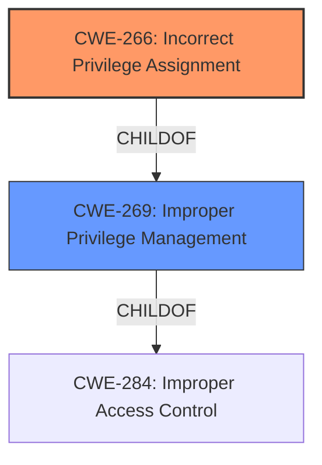

# Enhanced Analysis for CVE-2021-33538

# Summary
| CWE ID | CWE Name | Confidence | CWE Abstraction Level | CWE Vulnerability Mapping Label | CWE-Vulnerability Mapping Notes |
|---|---|---|---|---|---|
| CWE-266 | Incorrect Privilege Assignment | 0.9 | Base | Primary | Allowed |
| CWE-269 | Improper Privilege Management | 0.7 | Class | Secondary | Discouraged |

## Evidence and Confidence

*   **Confidence Score:** 0.8
*   **Evidence Strength:** HIGH

## Relationship Analysis
The primary relationship considered was the parent-child relationship between CWE-269 (Improper Privilege Management) and its children, particularly CWE-266 (Incorrect Privilege Assignment). Given the specifics of the vulnerability—that a low-privilege user can overwrite another user's password—CWE-266 is a more precise classification. The decision was influenced by the mapping guidance for CWE-269, which discourages its use when more specific children are applicable.



## Vulnerability Chain
The chain of events begins with **improper access control** (CWE-284), specifically **incorrect privilege assignment** (CWE-266). A low-privilege user exploits this flaw by sending a specially crafted username entry. This leads to the **overwrite of an existing user account password**, culminating in remote shell access to the device as that user.

## Summary of Analysis
The initial assessment focused on **improper access control**, as highlighted in the vulnerability description. However, a deeper analysis of the specific flaw led to the selection of CWE-266 (Incorrect Privilege Assignment) as the primary CWE, as it more accurately reflects the root cause of the vulnerability.

The vulnerability description states: "In Weidmueller Industrial WLAN devices in multiple versions an exploitable **improper access control** vulnerability exists in the iw_webs account settings functionality. A specially crafted user name entry can cause the overwrite of an existing user account password, resulting in remote shell access to the device as that user."

The selection of CWE-266 is based on the fact that the vulnerability allows a low-privilege user to perform actions that should be restricted to a higher-privilege user (overwriting passwords). The mapping guidance for CWE-269 (Improper Privilege Management) explicitly discourages its use when more specific children are applicable.

Relevant CWE Information:

# Enhanced Context (25 CWEs)
The following CWEs were identified as potentially relevant to this vulnerability:

## CWE-1289: Improper Validation of Unsafe Equivalence in Input
**Abstraction Level**: Base
**Similarity Score**: 0.80

## CWE-807: Reliance on Untrusted Inputs in a Security Decision
**Abstraction Level**: Base
**Similarity Score**: 0.78

## CWE-183: Permissive List of Allowed Inputs
**Abstraction Level**: Base
**Similarity Score**: 0.77

## CWE-184: Incomplete List of Disallowed Inputs
**Abstraction Level**: Base
**Similarity Score**: 0.77

## CWE-1288: Improper Validation of Consistency within Input
**Abstraction Level**: Base
**Similarity Score**: 0.77

## CWE-179: Incorrect Behavior Order: Early Validation
**Abstraction Level**: Base
**Similarity Score**: 0.76

## CWE-115: Misinterpretation of Input
**Abstraction Level**: Base
**Similarity Score**: 0.75

## CWE-138: Improper Neutralization of Special Elements
**Abstraction Level**: Class
**Similarity Score**: 0.75

## CWE-74: Improper Neutralization of Special Elements in Output Used by a Downstream Component ('Injection')
**Abstraction Level**: Class
**Similarity Score**: 0.75

## CWE-606: Unchecked Input for Loop Condition
**Abstraction Level**: Base
**Similarity Score**: 0.75

## CWE-190: Integer Overflow or Wraparound
**Abstraction Level**: Base
**Similarity Score**: 7866.26

## CWE-184: Incomplete List of Disallowed Inputs
**Abstraction Level**: Base
**Similarity Score**: 7767.41

## CWE-116: Improper Encoding or Escaping of Output
**Abstraction Level**: Class
**Similarity Score**: 7532.15

## CWE-22: Improper Limitation of a Pathname to a Restricted Directory ('Path Traversal')
**Abstraction Level**: Base
**Similarity Score**: 7511.49

## CWE-1284: Improper Validation of Specified Quantity in Input
**Abstraction Level**: Base
**Similarity Score**: 7454.27

## CWE-41: Improper Resolution of Path Equivalence
**Abstraction Level**: base
**Similarity Score**: 5.03

## CWE-78: Improper Neutralization of Special Elements used in an OS Command ('OS Command Injection')
**Abstraction Level**: base
**Similarity Score**: 5.03

## CWE-98: Improper Control of Filename for Include/Require Statement in PHP Program ('PHP Remote File Inclusion')
**Abstraction Level**: variant
**Similarity Score**: 4.40

## CWE-79: Improper Neutralization of Input During Web Page Generation ('Cross-site Scripting')
**Abstraction Level**: base
**Similarity Score**: 4.33

## CWE-190: Integer Overflow or Wraparound
**Abstraction Level**: base
**Similarity Score**: 4.33

## CWE-770: Allocation of Resources Without Limits or Throttling
**Abstraction Level**: base
**Similarity Score**: 4.33

## CWE-73: External Control of File Name or Path
**Abstraction Level**: base
**Similarity Score**: 4.33

## CWE-434: Unrestricted Upload of File with Dangerous Type
**Abstraction Level**: base
**Similarity Score**: 4.33

## CWE-681: Incorrect Conversion between Numeric Types
**Abstraction Level**: base
**Similarity Score**: 4.33

## CWE-22: Improper Limitation of a Pathname to a Restricted Directory ('Path Traversal')
**Abstraction Level**: base
**Similarity Score**: 4.33

### CWE-266: Incorrect Privilege Assignment
*   **Technical Explanation:** The vulnerability stems from the system incorrectly assigning privileges, allowing a low-privilege user to modify the password of another user. This is a direct violation of privilege separation, where different users should have distinct levels of access and control.
*   **Security Implications:** This allows an attacker with low privileges to escalate their access, potentially gaining complete control over the device by compromising a high-privilege account.
*   **Relationship:** This is a child of CWE-269 (Improper Privilege Management) and CWE-284 (Improper Access Control).
*   **Mapping Guidance:** The mapping guidance for CWE-269 discourages its use when more specific children are applicable, further justifying the selection of CWE-266.

### CWE-269: Improper Privilege Management
*   **Technical Explanation:** This CWE represents a broader class of vulnerabilities related to the incorrect management of privileges. While applicable, it is less specific than CWE-266.
*   **Security Implications:** Similar to CWE-266, this can lead to unauthorized access and control over system resources.
*   **Relationship:** This is a parent of CWE-266.
*   **Mapping Guidance:** The mapping guidance for CWE-269 discourages its use when more specific children are applicable.

### Other CWEs Considered But Not Used:
*   CWE-288 (Authentication Bypass Using an Alternate Path or Channel): While the vulnerability leads to unauthorized access, it is not achieved through bypassing authentication but rather by exploiting **incorrect privilege assignment**.
*   CWE-306 (Missing Authentication for Critical Function): Authentication is not missing; rather, the **privileges** associated with an authenticated user are incorrectly managed.
*   CWE-78 (Improper Neutralization of Special Elements used in an OS Command ('OS Command Injection')): This CWE is not relevant as the vulnerability does not involve command injection.
*   CWE-89 (Improper Neutralization of Special Elements used in an SQL Command ('SQL Injection')): This CWE is not relevant as the vulnerability does not involve SQL injection.
*   CWE-280 (Improper Handling of Insufficient Permissions or Privileges): This is about the software not handling cases where it doesn't have enough privileges. In this case, the software *grants* too much privilege.
*   CWE-20 (Improper Input Validation):


## CWE Relationship Analysis

Current CWEs represent these abstraction levels: .


### Vulnerability Chain Analysis

**Chain starting from CWE-288:**
- 288 (Authentication Bypass Using an Alternate Path or Channel) - ROOT


**Chain starting from CWE-115:**
- 115 (Misinterpretation of Input) - ROOT


### CWE Relationship Diagram

```mermaid
graph TD
    classDef primary fill:#f96,stroke:#333,stroke-width:2px
    classDef secondary fill:#69f,stroke:#333
    classDef tertiary fill:#9e9,stroke:#333
```